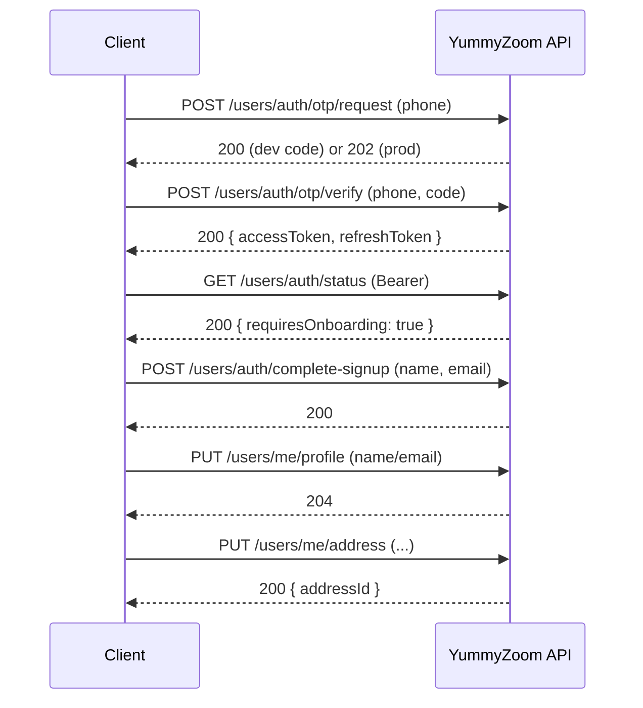

# Workflow: Complete Customer Onboarding

End-to-end flow to onboard a new customer using phone OTP, create their account, and capture basic profile details for a smooth first order experience.

## Overview

This workflow guides a client through:
- Phone OTP: request and verify to obtain bearer tokens
- Account creation: complete signup (creates the domain user)
- Profile setup: display name and email
- Primary address: create or update one primary address
- Optional enhancements: set password, register device for notifications

All authenticated calls require `Authorization: Bearer <access_token>`.

---

## Step 1 — Request OTP Code

Initiates the OTP flow and sends a one-time code to the provided phone number.

**`POST /api/v1/users/auth/otp/request`**

- Authorization: Public
- Content-Type: `application/json`

Request
```json
{
  "phoneNumber": "+15551234567"
}
```

Responses
- 200 OK (Development)
  ```json
  { "code": "123456" }
  ```
- 202 Accepted (Production) — code delivered via SMS
- 400 Bad Request — e.g., invalid phone format (`Phone.Invalid`)

Business rules
- Phone number is normalized to E.164. Invalid numbers are rejected.
- A backing identity record is ensured/created for the phone before issuing an OTP.

---

## Step 2 — Verify OTP and Sign In

Verifies the code and signs in, returning bearer tokens.

**`POST /api/v1/users/auth/otp/verify`**

- Authorization: Public
- Content-Type: `application/json`

Request
```json
{
  "phoneNumber": "+15551234567",
  "code": "123456"
}
```

Response — 200 OK
```json
{
  "tokenType": "Bearer",
  "accessToken": "<jwt>",
  "expiresIn": 3600,
  "refreshToken": "<token>"
}
```

Errors
- 400 Bad Request — validation (code must be 4–8 digits)
- 401 Unauthorized — invalid/expired code (`Otp.Invalid`)

Notes
- Internally confirms the phone on success.
- Whether onboarding is required is determined in subsequent step.

---

## Step 3 — Check Auth/Onboarding Status

Determines whether the signed-in user must complete signup.

**`GET /api/v1/users/auth/status`**

- Authorization: Required

Response — 200 OK
```json
{ "isNewUser": true, "requiresOnboarding": true }
```

Rule
- `requiresOnboarding: true` means the domain user does not yet exist and the client must call Complete Signup.

---

## Step 4 — Complete Signup (Create Account)

Creates the domain user profile after OTP sign-in. Idempotent: safe to call multiple times.

**`POST /api/v1/users/auth/complete-signup`**

- Authorization: Required
- Content-Type: `application/json`

Request
```json
{
  "name": "Jane Doe",
  "email": "jane@example.com"
}
```

Responses
- 200 OK — created or already existed (idempotent)
- 400 Bad Request — validation (name required; email must be valid)

Business rules
- Name is required (max 200). Email optional; validated if provided.
- Uses the authenticated identity (from OTP) as the account key; username is the phone (E.164) in OTP flow.

---

## Step 5 — Update Profile (Optional Refinement)

Allows editing name and optionally email after account creation.

**`PUT /api/v1/users/me/profile`**

- Authorization: Required
- Content-Type: `application/json`

Request
```json
{ "name": "Jane A. Doe", "email": "jane@example.com" }
```

Responses
- 204 No Content — updated
- 400 Bad Request — validation
- 404 Not Found — account not found (should not happen after signup)

Rules
- Requires completed signup. Name required; email optional/validated.

---

## Step 6 — Create or Update Primary Address

Creates the user’s primary address or updates the existing one. The MVP scope maintains exactly one address.

**`PUT /api/v1/users/me/address`**

- Authorization: Required
- Content-Type: `application/json`

Request
```json
{
  "street": "123 Market Street, Apt 4B",
  "city": "San Francisco",
  "state": "CA",
  "zipCode": "94105",
  "country": "US",
  "label": "Home",
  "deliveryInstructions": "Ring twice"
}
```

Response — 200 OK
```json
{ "addressId": "a1b2c3d4-e5f6-7890-abcd-ef1234567890" }
```

Validation rules
- Required: `street`, `city`, `zipCode`, `country`.
- Max lengths: street 255, city/state 100, zip 20, label 100, deliveryInstructions 500.
- Single-address policy: updates consolidate to one primary entry (extra addresses are removed).

---

## Optional Enhancements

### Set Initial Password (optional)

Adds a password to an OTP-created account.

**`POST /api/v1/users/auth/set-password`**

- Authorization: Required (Completed OTP)
- Body: `{ "newPassword": "SecurePassword123!" }`
- Responses: 204 No Content; 400 validation (min length 6)

### Register Device for Push (optional)

Registers a device token for notifications.

**`POST /api/v1/users/devices/register`**

- Authorization: Required
- Body
  ```json
  { "fcmToken": "<token>", "platform": "ios", "deviceId": "abc", "modelName": "iPhone 14" }
  ```
- Response: 204 No Content

---

## Completion Criteria

A customer is considered onboarded when:
- `GET /api/v1/users/auth/status` returns `{ "requiresOnboarding": false }`, and
- `GET /api/v1/users/me` returns profile information (and optionally an address).

Next step: proceed to placing an order — see `../03-Individual-Orders.md`.

---

## Consolidated Business Rules & Errors

- Phone OTP
  - Phone normalized to E.164; invalid → `Phone.Invalid` (400).
  - OTP code numeric 4–8 chars; invalid/expired → `Otp.Invalid` (401).
- Complete Signup
  - Idempotent: returns 200 if already completed.
  - Name required (≤200); email optional with format validation.
- Profile
  - Requires completed signup; updates name/email.
- Address
  - Maintains a single primary address; updates overwrite and consolidate.
- Password
  - Requires authenticated user from OTP; min length 6; sets password if none.
- Standard problem details used for errors: 400/401/404/409/500 via RFC 7807.

---

## Sequence Diagram


