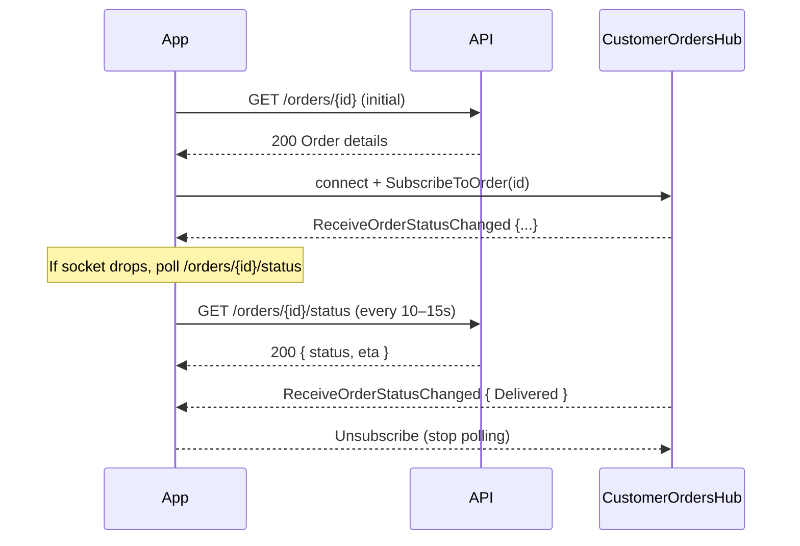

# Workflow: Order Tracking & Real‑time Updates

How customers track orders after placement using lightweight polling and SignalR real‑time events.

## Overview

- Track a single order via lightweight status endpoint and full detail endpoint
- Receive push updates over SignalR on the customer hub
- Fall back to efficient polling when sockets are unavailable
- See and paginate recent orders

All endpoints require `Authorization: Bearer <access_token>`.

---

## Order Status (Polling)

Lean status for frequent checks (e.g., every 10–15s when real‑time is unavailable).

**`GET /api/v1/orders/{orderId}/status`**

- Authorization: Required (Order owner)

Response — 200 OK
```json
{
  "orderId": "f47ac10b-58cc-4372-a567-0e02b2c3d479",
  "status": "Preparing",
  "lastUpdateTimestamp": "2025-09-27T18:25:43Z",
  "estimatedDeliveryTime": "2025-09-27T18:55:00Z"
}
```

Business rules
- Only the customer who placed the order (or restaurant staff) can access; unauthorized orders are masked as 404.
- Status values: `AwaitingPayment`, `Placed`, `Accepted`, `Preparing`, `ReadyForDelivery`, `Delivered`, `Cancelled`, `Rejected`.

---

## Order Details (On Demand)

Full snapshot including items and financials for detailed views.

**`GET /api/v1/orders/{orderId}`**

- Authorization: Required (Order owner)

Response — 200 OK
```json
{
  "order": {
    "orderId": "f47ac10b-58cc-4372-a567-0e02b2c3d479",
    "orderNumber": "ORD-2025-001234",
    "customerId": "9f54a6d8-...",
    "restaurantId": "a1b2c3d4-...",
    "status": "Preparing",
    "placementTimestamp": "2025-09-27T18:20:00Z",
    "lastUpdateTimestamp": "2025-09-27T18:25:43Z",
    "estimatedDeliveryTime": "2025-09-27T18:55:00Z",
    "actualDeliveryTime": null,
    "currency": "USD",
    "subtotalAmount": 28.50,
    "discountAmount": 0.00,
    "deliveryFeeAmount": 2.99,
    "tipAmount": 4.00,
    "taxAmount": 2.35,
    "totalAmount": 37.84,
    "appliedCouponId": null,
    "sourceTeamCartId": null,
    "deliveryAddress_Street": "123 Foodie Lane",
    "deliveryAddress_City": "Tastytown",
    "deliveryAddress_State": "CA",
    "deliveryAddress_Country": "USA",
    "deliveryAddress_PostalCode": "90210",
    "items": [
      {
        "orderItemId": "c111a222-b333-c444-d555-e666f777g888",
        "menuItemId": "m222b333-c444-d555-e666-f777g888h999",
        "name": "Margherita Pizza",
        "quantity": 1,
        "unitPriceAmount": 12.00,
        "lineItemTotalAmount": 12.00,
        "customizations": [
          {
            "groupName": "Crust",
            "choiceName": "Gluten-Free",
            "priceAdjustmentAmount": 2.50
          }
        ]
      },
      {
        "orderItemId": "d222b333-c444-d555-e666-f777g888h999",
        "menuItemId": "n333c444-d555-e666-f777-g888h999i000",
        "name": "Caesar Salad",
        "quantity": 1,
        "unitPriceAmount": 9.00,
        "lineItemTotalAmount": 9.00,
        "customizations": []
      }
    ]
  }
}
```

**Response Body Fields**

- `order` (object): The main order object.
  - `orderId` (string, UUID): Unique identifier for the order.
  - `orderNumber` (string): Human-readable order number.
  - `customerId` (string, UUID): ID of the customer who placed the order.
  - `restaurantId` (string, UUID): ID of the restaurant fulfilling the order.
  - `status` (string): Current status of the order (e.g., `Preparing`, `Delivered`).
  - `placementTimestamp` (string, ISO 8601): Timestamp when the order was placed.
  - `lastUpdateTimestamp` (string, ISO 8601): Timestamp of the last status update.
  - `estimatedDeliveryTime` (string, ISO 8601, nullable): The ETA for the delivery.
  - `actualDeliveryTime` (string, ISO 8601, nullable): Timestamp when the order was actually delivered.
  - `currency` (string): The ISO 4217 currency code for all monetary values in the order (e.g., "USD").
  - `subtotalAmount` (number): Cost of items before other charges.
  - `discountAmount` (number): Amount discounted, e.g., from a coupon.
  - `deliveryFeeAmount` (number): The fee for delivery.
  - `tipAmount` (number): The tip for the delivery driver.
  - `taxAmount` (number): The amount of tax applied.
  - `totalAmount` (number): The final amount charged.
  - `appliedCouponId` (string, UUID, nullable): ID of the coupon used, if any.
  - `sourceTeamCartId` (string, UUID, nullable): ID of the TeamCart this order originated from, if any.
  - `deliveryAddress_*`: A flattened snapshot of the delivery address fields.
- `items` (array): A list of `OrderItemDto` objects.
  - `orderItemId` (string, UUID): Unique identifier for this line item.
  - `menuItemId` (string, UUID): ID of the corresponding menu item.
  - `name` (string): The name of the menu item.
  - `quantity` (integer): The number of this item ordered.
  - `unitPriceAmount` (number): The price of a single unit of this item.
  - `lineItemTotalAmount` (number): The total price for this line item (`quantity` * `unitPrice`).
  - `customizations` (array): A list of `OrderItemCustomizationDto` objects.
    - `groupName` (string): The name of the customization group (e.g., "Size", "Crust").
    - `choiceName` (string): The name of the selected option (e.g., "Large", "Gluten-Free").
    - `priceAdjustmentAmount` (number, nullable): The cost difference for this choice.

---

## Recent Orders (History)

**`GET /api/v1/orders/my?pageNumber=1&pageSize=10`**

Retrieves a paginated list of the current customer's recent orders, sorted with the newest first. This endpoint is ideal for displaying order history screens.

- Authorization: Required
- Query Parameters:
  - `pageNumber` (integer, optional, default: 1): The page number to retrieve.
  - `pageSize` (integer, optional, default: 10): The number of orders per page.

Response — 200 OK
```json
{
  "items": [
    {
      "orderId": "f47ac10b-58cc-4372-a567-0e02b2c3d479",
      "orderNumber": "ORD-2025-001234",
      "status": "Delivered",
      "placementTimestamp": "2025-09-27T18:20:00Z",
      "restaurantId": "a1b2c3d4-e5f6-7890-abcd-ef1234567890",
      "customerId": "9f54a6d8-b3e4-4b40-9b60-d3a25a3e1c7a",
      "totalAmount": 37.84,
      "totalCurrency": "USD",
      "itemCount": 2
    },
    {
      "orderId": "e36bb20a-47dd-4261-b458-1f03c3d4e580",
      "orderNumber": "ORD-2025-001233",
      "status": "Cancelled",
      "placementTimestamp": "2025-09-26T12:05:10Z",
      "restaurantId": "b2c3d4e5-f6a7-8901-bcde-f1234567890a",
      "customerId": "9f54a6d8-b3e4-4b40-9b60-d3a25a3e1c7a",
      "totalAmount": 25.50,
      "totalCurrency": "USD",
      "itemCount": 1
    }
  ],
  "pageNumber": 1,
  "totalPages": 5,
  "totalCount": 48
}
```

**Response Body Fields**

- `items` (array): An array of `OrderSummaryDto` objects for the current page.
  - `orderId` (string, UUID): Unique identifier for the order.
  - `orderNumber` (string): Human-readable order number.
  - `status` (string): The final or current status of the order.
  - `placementTimestamp` (string, ISO 8601): Timestamp when the order was placed.
  - `restaurantId` (string, UUID): ID of the restaurant that fulfilled the order.
  - `customerId` (string, UUID): ID of the customer.
  - `totalAmount` (number): The final total amount of the order.
  - `totalCurrency` (string): The currency code for the total amount.
  - `itemCount` (integer): The total number of individual items in the order.
- `pageNumber` (integer): The current page number.
- `totalPages` (integer): The total number of pages available.
- `totalCount` (integer): The total number of orders in the customer's history.

---

## Real‑time Updates (SignalR)

Subscribe to receive push updates for a specific order.

- Hub: `wss://<host>/hubs/customer-orders`
- Method: `SubscribeToOrder(orderId)` (requires authentication; authorization enforces order ownership)
- Server events (method names):
  - `ReceiveOrderPlaced`
  - `ReceiveOrderPaymentSucceeded`
  - `ReceiveOrderPaymentFailed`
  - `ReceiveOrderStatusChanged`

Event payload (OrderStatusBroadcastDto)
```json
{
  "orderId": "f47ac10b-58cc-4372-a567-0e02b2c3d479",
  "orderNumber": "ORD-2025-001234",
  "status": "Preparing",
  "restaurantId": "a1b2c3d4-e5f6-7890-abcd-ef1234567890",
  "lastUpdateTimestamp": "2025-09-27T18:25:43Z",
  "estimatedDeliveryTime": "2025-09-27T18:55:00Z",
  "actualDeliveryTime": null,
  "deliveredAt": null,
  "occurredOnUtc": "2025-09-27T18:25:43Z",
  "eventId": "3a1d8a22-..."
}
```

Client example (JavaScript)
```javascript
import * as signalR from "@microsoft/signalr";
const connection = new signalR.HubConnectionBuilder()
  .withUrl("https://api.yourhost.com/hubs/customer-orders", {
    accessTokenFactory: () => accessToken
  })
  .withAutomaticReconnect()
  .build();

connection.on("ReceiveOrderStatusChanged", dto => {
  // Update UI based on dto.status, dto.estimatedDeliveryTime, etc.
});

await connection.start();
await connection.invoke("SubscribeToOrder", orderId);
```

Authorization rules
- Auth required; `SubscribeToOrder` enforces MustBeOrderOwner. Unauthorized subscriptions are rejected.

---

## Polling Strategy

- Prefer SignalR when available; otherwise poll `/status` every 10–15 seconds.
- Use full `GET /orders/{orderId}` sparingly (screen opens, significant state changes).
- Stop polling or unsubscribe from hub after `Delivered`, `Cancelled`, or `Rejected`.

---

## Business Rules Summary

- Access Control
  - All order queries require authentication; data limited to the order owner (or restaurant staff in staff apps).
  - Unauthorized access is represented as 404 (not found) for privacy.
- Status Semantics
  - `AwaitingPayment` → `Placed` → `Accepted` → `Preparing` → `ReadyForDelivery` → `Delivered`.
  - `Cancelled` and `Rejected` are terminal states.
- Real‑time
  - Events are per‑order group; join one order id per live view.
  - Event payloads are immutable snapshots with timestamps and event id.

---

## Error Handling

Standard RFC 7807 problem details with 400/404/409/500.
- Common: `GetOrderStatus.NotFound`, `GetOrderById.NotFound` (masked unauthorized or missing orders)

---

## Sequence Diagram



---

## Related Docs

- Placing orders: `../03-Individual-Orders.md`
- TeamCart conversion: `./02-TeamCart-Collaborative-Ordering.md`
- Authentication for tokens: `../01-Authentication-and-Profile.md`
