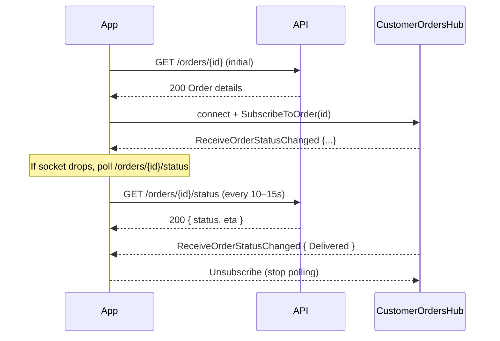

# Workflow: Order Tracking & Real‑time Updates

How customers track orders after placement using lightweight polling and SignalR real‑time events.

## Overview

- Track a single order via lightweight status endpoint and full detail endpoint
- Receive push updates over SignalR on the customer hub
- Fall back to efficient polling when sockets are unavailable
- See and paginate recent orders

All endpoints require `Authorization: Bearer <access_token>`.

---

## Order Status (Polling)

Lean status for frequent checks (e.g., every 10–15s when real‑time is unavailable).

**`GET /api/v1/orders/{orderId}/status`**

- Authorization: Required (Order owner)

Response — 200 OK
```json
{
  "orderId": "f47ac10b-58cc-4372-a567-0e02b2c3d479",
  "status": "Preparing",
  "lastUpdateTimestamp": "2025-09-27T18:25:43Z",
  "estimatedDeliveryTime": "2025-09-27T18:55:00Z"
}
```

Business rules
- Only the customer who placed the order (or restaurant staff) can access; unauthorized orders are masked as 404.
- Status values: `AwaitingPayment`, `Placed`, `Accepted`, `Preparing`, `ReadyForDelivery`, `Delivered`, `Cancelled`, `Rejected`.

---

## Order Details (On Demand)

Full snapshot including items and financials for detailed views.

**`GET /api/v1/orders/{orderId}`**

- Authorization: Required (Order owner)

Response — 200 OK (excerpt)
```json
{
  "order": {
    "orderId": "f47ac10b-58cc-4372-a567-0e02b2c3d479",
    "orderNumber": "ORD-2025-001234",
    "customerId": "9f54...",
    "restaurantId": "a1b2...",
    "status": "Preparing",
    "placementTimestamp": "2025-09-27T18:20:00Z",
    "lastUpdateTimestamp": "2025-09-27T18:25:43Z",
    "estimatedDeliveryTime": "2025-09-27T18:55:00Z",
    "subtotalAmount": 28.50,
    "subtotalCurrency": "USD",
    "discountAmount": 0.00,
    "discountCurrency": "USD",
    "deliveryFeeAmount": 2.99,
    "deliveryFeeCurrency": "USD",
    "tipAmount": 4.00,
    "tipCurrency": "USD",
    "taxAmount": 0.00,
    "taxCurrency": "USD",
    "totalAmount": 35.49,
    "totalCurrency": "USD",
    "appliedCouponId": null,
    "sourceTeamCartId": null,
    "items": [
      {
        "orderItemId": "c111...",
        "menuItemId": "m222...",
        "name": "Margherita Pizza",
        "quantity": 1,
        "unitPriceAmount": 12.00,
        "unitPriceCurrency": "USD",
        "lineItemTotalAmount": 12.00,
        "lineItemTotalCurrency": "USD",
        "customizations": []
      }
    ]
  }
}
```

---

## Recent Orders (History)

**`GET /api/v1/orders/my?pageNumber=1&pageSize=10`** — Paginated, newest first.

- Authorization: Required
- Returns an array of `OrderSummary` objects with minimal fields for list screens.

---

## Real‑time Updates (SignalR)

Subscribe to receive push updates for a specific order.

- Hub: `wss://<host>/hubs/customer-orders`
- Method: `SubscribeToOrder(orderId)` (requires authentication; authorization enforces order ownership)
- Server events (method names):
  - `ReceiveOrderPlaced`
  - `ReceiveOrderPaymentSucceeded`
  - `ReceiveOrderPaymentFailed`
  - `ReceiveOrderStatusChanged`

Event payload (OrderStatusBroadcastDto)
```json
{
  "orderId": "f47ac10b-58cc-4372-a567-0e02b2c3d479",
  "orderNumber": "ORD-2025-001234",
  "status": "Preparing",
  "restaurantId": "a1b2c3d4-e5f6-7890-abcd-ef1234567890",
  "lastUpdateTimestamp": "2025-09-27T18:25:43Z",
  "estimatedDeliveryTime": "2025-09-27T18:55:00Z",
  "actualDeliveryTime": null,
  "deliveredAt": null,
  "occurredOnUtc": "2025-09-27T18:25:43Z",
  "eventId": "3a1d8a22-..."
}
```

Client example (JavaScript)
```javascript
import * as signalR from "@microsoft/signalr";
const connection = new signalR.HubConnectionBuilder()
  .withUrl("https://api.yourhost.com/hubs/customer-orders", {
    accessTokenFactory: () => accessToken
  })
  .withAutomaticReconnect()
  .build();

connection.on("ReceiveOrderStatusChanged", dto => {
  // Update UI based on dto.status, dto.estimatedDeliveryTime, etc.
});

await connection.start();
await connection.invoke("SubscribeToOrder", orderId);
```

Authorization rules
- Auth required; `SubscribeToOrder` enforces MustBeOrderOwner. Unauthorized subscriptions are rejected.

---

## Polling Strategy

- Prefer SignalR when available; otherwise poll `/status` every 10–15 seconds.
- Use full `GET /orders/{orderId}` sparingly (screen opens, significant state changes).
- Stop polling or unsubscribe from hub after `Delivered`, `Cancelled`, or `Rejected`.

---

## Business Rules Summary

- Access Control
  - All order queries require authentication; data limited to the order owner (or restaurant staff in staff apps).
  - Unauthorized access is represented as 404 (not found) for privacy.
- Status Semantics
  - `AwaitingPayment` → `Placed` → `Accepted` → `Preparing` → `ReadyForDelivery` → `Delivered`.
  - `Cancelled` and `Rejected` are terminal states.
- Real‑time
  - Events are per‑order group; join one order id per live view.
  - Event payloads are immutable snapshots with timestamps and event id.

---

## Error Handling

Standard RFC 7807 problem details with 400/404/409/500.
- Common: `GetOrderStatus.NotFound`, `GetOrderById.NotFound` (masked unauthorized or missing orders)

---

## Sequence Diagram



---

## Related Docs

- Placing orders: `../03-Individual-Orders.md`
- TeamCart conversion: `./02-TeamCart-Collaborative-Ordering.md`
- Authentication for tokens: `../01-Authentication-and-Profile.md`
