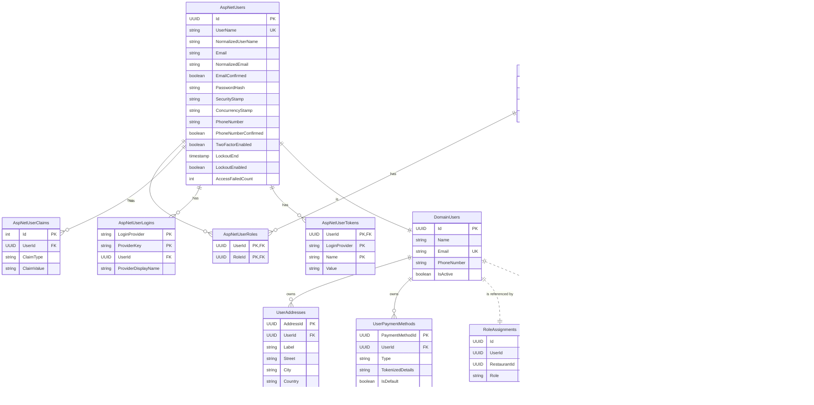

The diagram illustrates the tables, columns, primary keys (PK), foreign keys (FK), unique constraints (UK), and relationships. Comments within the diagram explain specific design choices like owned types, which are a key feature of Domain-Driven Design (DDD) implemented with EF Core.

**This diagram serves as a blueprint for the database schema. This diagram should be kept up-to-date as the model evolves.**

### Database Schema (Mermaid ER Diagram)

### Key Changes and Rationale

1. **Dotted Lines for Aggregate References**: The relationships from `RoleAssignments` to `DomainUsers`, and from `UserDeviceSessions` to both `DomainUsers` and `Devices`, are now shown with **dotted lines (`||..||`)**. This visually represents that they are references by ID only, without a database-level foreign key constraint, correctly adhering to the DDD principle.
2. **Solid Lines for Enforced Constraints**:
    * Relationships *within* the ASP.NET Identity schema (e.g., `AspNetUserClaims` to `AspNetUsers`) remain solid as they have enforced FKs.
    * The link between an aggregate root and its owned entities (e.g., `DomainUsers` to `UserAddresses`) also remains solid, as this is a strong, composition-based relationship enforced by an FK.
3. **Shared Primary Key**: The `AspNetUsers` and `DomainUsers` one-to-one relationship (`||--||`) is kept as a solid line because they are linked by a shared primary key, representing two facets of the same core entity, rather than one aggregate referencing another distinct aggregate.
