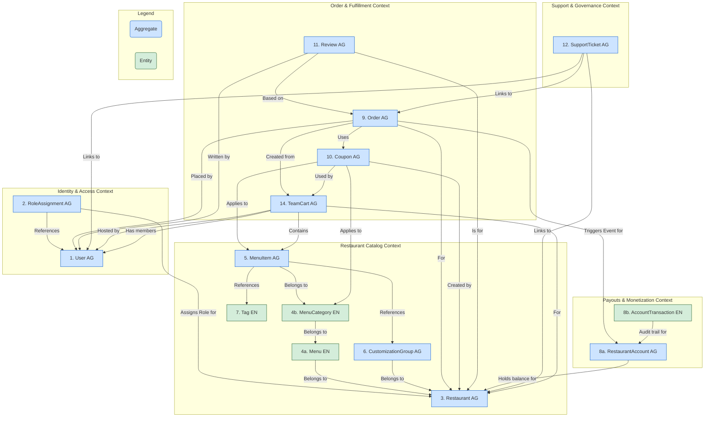

## YummyZoom Domain Design

This document outlines the domain design for the YummyZoom platform, focusing on the aggregates and entities that encapsulate the core business logic and data structures. The design follows Domain-Driven Design (DDD) principles, ensuring that each object is cohesive, encapsulated, and adheres to its own invariants.

### Domain Objects and Their Detailed Structures

#### 1. `User` Aggregate

* **Aggregate Root:** `User`
* **Description:** Represents an individual's identity on the platform. A `User` is always a **customer** by default. This aggregate is solely responsible for managing personal identity, authentication credentials, and customer-specific data like addresses and payment methods.
* **Entities/Value Objects (VOs) within:**
  * `User` (Entity - Root):
    * `UserID` (Identifier)
    * `Name`
    * `Email` (Unique identifier for login)
    * `PhoneNumber` (Optional)
    * `IsActive` (Boolean)
  * `Address` (List of Child Entities):
    * `AddressID` (Identifier)
    * `Street`, `City`, `State`, `ZipCode`, `Country`
    * `Label` (e.g., "Home", "Work")
    * `DeliveryInstructions` (Optional)
  * `PaymentMethod` (List of Child Entities):
    * `PaymentMethodID` (Identifier)
    * `Type` (e.g., "Card", "PayPal")
    * `TokenizedDetails` (e.g., Stripe token, last 4 digits)
    * `IsDefault` (Boolean)
* **Invariants:**
  * `Email` must be unique across all users (enforced by application service/database).
  * When a new `PaymentMethod` is added as default, all others must be marked as not default.
  * A `User` is considered a customer by their very existence; no special flag is needed.
* **References to other aggregates (by ID):**
  * None.

---

#### 2. `RoleAssignment` Aggregate

* **Aggregate Root:** `RoleAssignment`
* **Description:** A dedicated aggregate that explicitly links a `User` to a `Restaurant` with a specific role. This is the authoritative source for determining a user's permissions and responsibilities within the context of a restaurant.
* **Entities/Value Objects (VOs) within:**
  * `RoleAssignment` (Entity - Root):
    * `RoleAssignmentID` (Identifier)
    * `UserID` (Identifier, reference to the `User` aggregate)
    * `RestaurantID` (Identifier, reference to the `Restaurant` aggregate)
    * `Role` (Enum: `Owner`, `Staff`)
* **Invariants:**
  * The combination of `UserID`, `RestaurantID` must be unique. A user can only have one role per restaurant.
  * A `RoleAssignment` must contain a valid, non-null `UserID` and `RestaurantID`.
  * The `Role` must be a valid value from the defined enum (e.g., `Owner`, `Staff`).
* **References to other aggregates (by ID):**
  * `UserID` (references `User`)
  * `RestaurantID` (references `Restaurant`)

---

#### 3. `Restaurant` Aggregate

* **Aggregate Root:** `Restaurant`
* **Description:** A lean aggregate representing the restaurant as a legal and operational entity. Its data changes infrequently.
* **Entities/Value Objects (VOs) within:**
  * `Restaurant` (Entity - Root):
    * `RestaurantID` (Identifier)
    * `Name`
    * `LogoURL`
    * `Description`
    * `CuisineType` (String or list of strings)
    * `Location` (`Address` VO - The physical address)
    * `ContactInfo` (VO: `PhoneNumber`, `Email`)
    * `BusinessHours` (VO or structured data)
    * `IsVerified` (Boolean - Admin controlled)
    * `IsAcceptingOrders` (Boolean - Owner/Staff controlled master switch)
* **Invariants:**
  * `Name` and `Location` are mandatory.
  * If `IsAcceptingOrders` is false, no orders can be created for this restaurant.
* **References to other aggregates (by ID):**
  * None.

---

#### 4. `Menu` & `MenuCategory` (Independent Entities)

* **Design Rationale:** Following performance analysis, the original monolithic `Menu` aggregate has been split. `Menu` and `MenuCategory` are now modeled as independent domain entities, serving as organizational tools rather than consistency boundaries. They do not contain collections of their children; relationships are maintained via ID references.

* **`Menu` (Independent Entity):**
  * **Description:** An organizational entity that groups `MenuCategory`s. Represents a named collection like "Lunch Menu" or "All Day Menu".
  * **Structure:** `MenuID`, `RestaurantID`, `Name`, `Description`, `IsEnabled`.

* **`MenuCategory` (Independent Entity):**
  * **Description:** An organizational entity that groups `MenuItem`s. Represents a section like "Appetizers" or "Desserts".
  * **Structure:** `MenuCategoryID`, `MenuID`, `Name`, `DisplayOrder`.

---

#### 5. `MenuItem` Aggregate

* **Aggregate Root:** `MenuItem`
* **Description:** The primary transactional boundary for a single saleable item. This allows for frequent, high-performance updates (e.g., changing availability) without loading an entire menu.
* **Entities/Value Objects (VOs) within:**
  * `MenuItem` (Entity - Root):
    * `MenuItemID` (Identifier)
    * `RestaurantID` (Reference)
    * `MenuCategoryID` (Reference)
    * `Name`, `Description`, `ImageURL`
    * `BasePrice` (Money VO)
    * `IsAvailable` (Boolean - The frequently updated "out of stock" flag)
    * `AppliedCustomizations` (List of VOs referencing `CustomizationGroupID`)
    * `DietaryTagIDs` (List of `TagID`s)
* **Invariants:** `BasePrice` cannot be negative; `Name` must be unique within its `MenuCategory` (enforced by Application Service).
* **References to other aggregates/entities (by ID):** `RestaurantID`, `MenuCategoryID`, `CustomizationGroupID` (list), `TagID` (list).

---

#### 6. `CustomizationGroup` Aggregate

* **Aggregate Root:** `CustomizationGroup`
* **Description:** Manages a self-contained, reusable set of choices (e.g., sizes, toppings). This allows an owner to define an option once and apply it to many menu items.
* **Entities/Value Objects (VOs) within:**
  * `CustomizationGroup` (Entity - Root):
    * `GroupID` (Identifier)
    * `RestaurantID` (Identifier)
    * `GroupName` (Internal name, e.g., "Standard Toppings")
    * `MinSelections`, `MaxSelections` (Integers)
  * `CustomizationChoice` (List of Child Entities):
    * `ChoiceID` (Identifier)
    * `Name` (e.g., "Medium", "Extra Cheese")
    * `PriceAdjustment` (Money VO, can be zero)
    * `IsDefault` (Boolean)
    * `DisplayOrder` (Integer)
* **Invariants:** `MaxSelections` >= `MinSelections`; `Choice.Name` must be unique within the group; `DisplayOrder` must be non-negative.
* **References to other aggregates (by ID):** `RestaurantID`.

---

#### 7. `Tag` (Independent Entity)

* **Description:** A simple, centrally defined entity for classification (e.g., "Vegetarian", "Spicy"). It does not require the overhead of an aggregate as its invariants are simple.
* **Structure:**
  * `TagID` (Identifier)
  * `TagName` (String, e.g., "Gluten-Free")
  * `TagDescription` (Optional)
  * `TagCategory` (String, e.g., "Dietary", "Cuisine")
* **Invariants:** `TagName` must be unique across the entire system.

---

#### 8. `RestaurantAccount` Aggregate

* **Aggregate Root:** `RestaurantAccount`
* **Description:** A lean aggregate that manages a restaurant's *current financial balance* and payout settings. It is designed to be small and highly performant for frequent financial operations, decoupling it from the full transaction history.
* **Entities/Value Objects (VOs) within:**
  * `RestaurantAccount` (Entity - Root):
    * `RestaurantAccountID` (Identifier)
    * `RestaurantID` (Identifier, links to the `Restaurant` aggregate)
    * `CurrentBalance` (Money VO - A stateful property, not calculated on the fly)
    * `PayoutMethodDetails` (VO - Stores tokenized bank info, etc.)
* **Invariants:**
  * A `PayoutSettlement` transaction cannot be for an amount greater than the `CurrentBalance` at the time of the transaction.
  * The `CurrentBalance` is modified directly by behavior-driven methods.
* **Behavior and Events:**
  * Methods like `RecordRevenue(amount, orderId)` and `SettlePayout(amount)` directly modify the `CurrentBalance`.
  * Upon successful state change, it raises specific domain events like `RevenueRecorded` or `PayoutSettled`, which are used to create the audit trail.
* **References to other aggregates (by ID):**
  * `RestaurantID`

---

#### 9. `AccountTransaction` (Independent Entity)

* **Type:** Independent Entity
* **Description:** An immutable, historical record of a single financial event that has occurred on a `RestaurantAccount`. It serves as the official audit log and is created in response to domain events.
* **Structure:**
  * `AccountTransactionID` (Identifier)
  * `RestaurantAccountID` (Identifier, links to the `RestaurantAccount` aggregate)
  * `Type` (Enum: `OrderRevenue`, `PlatformFee`, `RefundDeduction`, `PayoutSettlement`, `ManualAdjustment`)
  * `Amount` (Money VO) - Positive for credits, negative for debits.
  * `Timestamp`
  * `RelatedOrderID` (Identifier, optional) - Links the transaction to a specific order for auditing.
  * `Notes` (String, optional) - For manual adjustment reasons, etc.
* **Creation Note:** This entity is not part of the `RestaurantAccount` aggregate's boundary. It is created and persisted by an event handler in the Application Layer that subscribes to events like `RevenueRecorded` or `PayoutSettled`.
* **Invariants:**
  * The `Amount` for a `PlatformFee` or `RefundDeduction` must be negative.
  * The `Amount` for an `OrderRevenue` must be positive.
* **References to other aggregates (by ID):**
  * `RestaurantAccountID`
  * `RelatedOrderID` (references `Order`)

---

#### 10. `Order` Aggregate

* **Aggregate Root:** `Order`
* **Description:** Represents a customer's confirmed request for items from a restaurant. It is a transactional, immutable record of a purchase, ensuring historical accuracy.
* **Entities/Value Objects (VOs) within:**
  * `Order` (Entity - Root):
    * `OrderID` (Identifier)
    * `OrderNumber` (Human-readable sequence)
    * `Status` (Enum: Placed, Accepted, Preparing, ReadyForDelivery, Delivered, Cancelled, Rejected)
    * `PlacementTimestamp`
    * `LastUpdateTimestamp`
    * `EstimatedDeliveryTime` (Timestamp or Duration)
    * `SpecialInstructions` (From customer)
    * `DeliveryAddress` (`Address` VO - A snapshot of the customer's chosen address)
    * **Financials (Money VOs):**
      * `Subtotal` (Sum of all line items)
      * `DiscountAmount`
      * `DeliveryFee`
      * `TipAmount`
      * `TaxAmount` (If applicable)
      * `TotalAmount` (The final amount charged)
  * `OrderItem` (List of Child Entities):
    * `OrderItemID` (Identifier)
    * `Snapshot_MenuItemID` (ID of the original `MenuItem`)
    * `Snapshot_ItemName`
    * `Snapshot_BasePriceAtOrder` (Money VO)
    * `Quantity`
    * `SelectedCustomizations` (List of `OrderItemCustomization` VOs):
      * `Snapshot_CustomizationGroupName`
      * `Snapshot_ChoiceName`
      * `Snapshot_ChoicePriceAdjustmentAtOrder` (Money VO)
    * `LineItemTotal` (Money VO - `(BasePrice + sum of Adjustments) * Quantity`)
  * `PaymentTransaction` (List of Child Entities):
    * `TransactionID` (Identifier)
    * `PaymentMethodType` (Enum: CreditCard, PayPal, ApplePay, GooglePay, CashOnDelivery)
    * `PaymentMethodDisplay` (String, optional, e.g., "Visa **** 4242")
    * `Type` (Enum: Payment, Refund)
    * `Amount` (Money VO)
    * `Status` (Enum: Pending, Succeeded, Failed)
    * `Timestamp`
    * `PaymentGatewayReferenceID` (Optional)
* **Invariants:**
  * `TotalAmount` must strictly equal `Subtotal - DiscountAmount + TaxAmount + DeliveryFee + TipAmount`.
  * `Subtotal` must equal the sum of all `OrderItem.LineItemTotal`s.
  * Order status transitions must be enforced by methods on the aggregate root (e.g., `accept()`, `markAsPreparing()`) to ensure a valid lifecycle. An order cannot be accepted if its status is not `Placed`.
  * An order cannot be created with a negative `TotalAmount`.
* **References to other aggregates (by ID):**
  * `CustomerID` (`UserID` of the customer).
  * `RestaurantID` (The restaurant fulfilling the order).
  * `AppliedCouponIDs` (List of `CouponID`s used).

---

#### 11. `Coupon` Aggregate

* **Aggregate Root:** `Coupon`
* **Description:** Manages a promotional coupon, its rules, validity, and global usage. Per-user usage is managed externally.
* **Entities/Value Objects (VOs) within:**
  * `Coupon` (Entity - Root):
    * `CouponID` (Identifier)
    * `RestaurantID` (Identifier, links to the owning `Restaurant`)
    * `Code` (String - what the customer enters, unique per restaurant)
    * `Description`
    * `Type` (Enum: Percentage, FixedAmount, FreeItem)
    * `Value` (Decimal for percentage, Money VO for fixed amount, `MenuItemID` for free item)
    * `AppliesTo` (VO):
      * `Scope` (Enum: WholeOrder, SpecificItems, SpecificCategories)
      * `ItemIDs` (List of `MenuItemID`s if `Scope` is SpecificItems)
      * `CategoryIDs` (List of `MenuCategoryID`s if `Scope` is SpecificCategories)
    * `MinOrderAmount` (Money VO, optional condition for applicability)
    * `ValidityStartDate` & `ValidityEndDate`
    * `TotalUsageLimit` (Integer, optional)
    * `CurrentTotalUsageCount` (Integer)
    * `IsEnabled` (Boolean)
    * `UsageLimitPerUser` (Interger)
* **Invariants:**
  * `Code` must be unique within the scope of its `RestaurantID`.
  * `ValidityEndDate` must be after `ValidityStartDate`.
  * `CurrentTotalUsageCount` cannot exceed `TotalUsageLimit`.
  * The `incrementUsageCount()` method must check the `TotalUsageLimit` before incrementing.
* **References to other aggregates (by ID):**
  * `RestaurantID`
  * `AppliesTo.ItemIDs` (List of `MenuItemID`s)
  * `AppliesTo.CategoryIDs` (List of `MenuCategoryID`s)

*(**Note on Per-User Tracking:** A separate, simple data store (e.g., a `CouponUsages` table) with the structure `(UserID, CouponID, OrderID)` will be managed by the Application Service to enforce per-user limits. This is not part of the `Coupon` aggregate's transactional boundary.)*

---

#### 12. `Review` Aggregate

* **Aggregate Root:** `Review`
* **Description:** Captures authentic customer feedback and ratings for a restaurant, anchored to a completed order.
* **Entities/Value Objects (VOs) within:**
  * `Review` (Entity - Root):
    * `ReviewID` (Identifier)
    * `OrderID` (Identifier, ensures review authenticity)
    * `CustomerID` (`UserID` of the reviewer)
    * `RestaurantID` (The restaurant being reviewed)
    * `Rating` (Integer, 1-5)
    * `Comment` (Text, optional)
    * `SubmissionTimestamp`
    * `IsModerated` (Boolean)
    * `IsHidden` (Boolean)
    * `Reply` (Text, optional)
* **Invariants:**
  * `Rating` must be an integer between 1 and 5 (inclusive).
  * A `Review` must be linked to a valid `OrderID`, `CustomerID`, and `RestaurantID`.
* **References to other aggregates (by ID):**
  * `OrderID`
  * `CustomerID` (`UserID`)
  * `RestaurantID`

---

#### 13. `SupportTicket` Aggregate

* **Aggregate Root:** `SupportTicket`
* **Description:** Represents a single, trackable case or issue raised by a user, a restaurant, or the system itself. It manages the entire lifecycle of the issue from submission to resolution.
* **Entities/Value Objects (VOs) within:**
  * `SupportTicket` (Entity - Root):
    * `TicketID` (Identifier)
    * `TicketNumber` (Human-readable sequence)
    * `Subject` (String)
    * `Status` (Enum: `Open`, `InProgress`, `PendingCustomerResponse`, `Resolved`, `Closed`)
    * `Priority` (Enum: `Low`, `Normal`, `High`, `Urgent`)
    * `Type` (Enum: `RefundRequest`, `AccountIssue`, `RestaurantReactivation`, `GeneralInquiry`)
    * `SubmissionTimestamp`
    * `LastUpdateTimestamp`
    * `AssignedToAdminID` (`AdminID`, optional - links to the admin working on it)
  * `ContextLink` (List of Value Objects):
    * `EntityType` (Enum: `User`, `Order`, `Restaurant`, `Review`)
    * `EntityID` (Identifier of the linked entity)
    * *This flexible structure allows a single ticket to be linked to both the customer (`User`) who reported an issue and the `Order` it relates to.*
  * `TicketMessage` (List of Child Entities):
    * `MessageID` (Identifier)
    * `AuthorID` (`UserID` or `AdminID`)
    * `AuthorType` (Enum: `Customer`, `RestaurantOwner`, `Admin`)
    * `MessageText` (String)
    * `Timestamp`
    * `IsInternalNote` (Boolean - for admin-only comments)
* **Invariants:**
  * A ticket must have at least one `ContextLink` to be meaningful.
  * Only an `Admin` can change the `Status` to `Resolved` or `Closed`.
  * `TicketMessage`s are immutable once added.
* **References to other aggregates (by ID):**
  * `ContextLink.EntityID` (references `User`, `Order`, `Restaurant`, etc.)
  * `AssignedToAdminID`
  * `TicketMessage.AuthorID`

---

#### 14. `TeamCart` Aggregate

* **Aggregate Root:** `TeamCart`
* **Description:** Represents a collaborative shopping cart where multiple users can add items before converting to a final Order. It manages the entire lifecycle of team-based ordering, from creation and member invitation through item selection, payment collection, and final conversion to an Order.
* **Entities/Value Objects (VOs) within:**
  * `TeamCart` (Entity - Root):
    * `TeamCartID` (Identifier)
    * `RestaurantID` (Identifier, links to the `Restaurant` aggregate)
    * `HostUserID` (Identifier, links to the `User` who created the cart)
    * `Status` (Enum: `Open`, `AwaitingPayments`, `ReadyToConfirm`, `Converted`, `Expired`)
    * `ShareToken` (`ShareableLinkToken` VO - Used for inviting others)
    * `Deadline` (DateTime, optional - When the cart will close)
    * `CreatedAt` (DateTime)
    * `ExpiresAt` (DateTime)
    * `TipAmount` (Money VO)
    * `AppliedCouponID` (Identifier, optional - links to the `Coupon` aggregate)
    * `DiscountAmount` (Money VO)
  * `TeamCartMember` (List of Child Entities):
    * `MemberID` (Identifier)
    * `UserID` (Identifier, links to the `User` aggregate)
    * `Name` (String - Display name)
    * `Role` (Enum: `Host`, `Guest`)
  * `TeamCartItem` (List of Child Entities):
    * `ItemID` (Identifier)
    * `AddedByUserID` (Identifier, links to the `User` who added the item)
    * `Snapshot_MenuItemID` (ID of the original `MenuItem`)
    * `Snapshot_MenuCategoryID` (ID of the original `MenuCategory`)
    * `Snapshot_ItemName` (String)
    * `Snapshot_BasePriceAtOrder` (Money VO)
    * `Quantity` (Integer)
    * `LineItemTotal` (Money VO)
    * `SelectedCustomizations` (List of `TeamCartItemCustomization` VOs):
      * `Snapshot_CustomizationGroupName` (String)
      * `Snapshot_ChoiceName` (String)
      * `Snapshot_ChoicePriceAdjustmentAtOrder` (Money VO)
  * `MemberPayment` (List of Child Entities):
    * `PaymentID` (Identifier)
    * `UserID` (Identifier, links to the `User` making the payment)
    * `Amount` (Money VO)
    * `Method` (Enum: `Online`, `CashOnDelivery`)
    * `Status` (Enum: `Pending`, `CommittedToCOD`, `PaidOnline`, `Failed`)
    * `OnlineTransactionID` (String, optional - for online payments)
    * `CreatedAt` (DateTime)
    * `UpdatedAt` (DateTime)
* **Invariants:**
  * Every team cart must have exactly one Host who cannot be removed.
  * Members can only be added when the cart is in Open status.
  * Payment amount must match the total of items added by that member.
  * All online payments must be completed before the cart can transition to ReadyToConfirm.
  * Only the host can modify financial details (tip, coupons).
  * Cart must be in ReadyToConfirm status to be converted to an Order.
* **References to other aggregates (by ID):**
  * `RestaurantID` (references `Restaurant`)
  * `HostUserID` (references `User`)
  * `TeamCartMember.UserID` (references `User`)
  * `TeamCartItem.Snapshot_MenuItemID` (references `MenuItem`)
  * `TeamCartItem.Snapshot_MenuCategoryID` (references `MenuCategory`)
  * `AppliedCouponID` (references `Coupon`)

---

### System-Wide Domain Object Relationship Diagram

This diagram illustrates all major domain objects, grouped into their logical Bounded Contexts. It shows how they are decoupled and relate to one another primarily through ID references. (AG = Aggregate, EN = Entity).

---

### Read Models & Lookup Tables (CQRS Approach)

To optimize for frequent read operations and to handle cross-aggregate checks efficiently, the system will employ several read models. These are denormalized data structures, typically simple database tables, that are updated by event handlers listening to domain events from the write-side aggregates. They do not belong to the Domain Layer but are critical for system performance.

| Read Model / Lookup Table | Description | Triggering Domain Events | Purpose & Use Case |
| :--- | :--- | :--- | :--- |
| **`RestaurantReviewSummary`** | A table with `RestaurantID`, `AverageRating`, and `TotalRatingCount`. | `ReviewSubmitted` | To display a restaurant's rating on its page instantly, without querying and calculating from all `Review` aggregates. |
| **`CouponUsage`** | A simple table with `(UserID, CouponID, OrderID)`. | `OrderPlacedWithCoupon` | To quickly check if a user has already used a coupon with a per-user limit. The Application Service queries this *before* attempting to apply the coupon. |
| **`FullMenuView`** | A denormalized JSON document or set of tables containing a restaurant's complete menu structure. | `MenuItemCreated`, `MenuItemUpdated`, `MenuCategoryCreated`, `MenuEnabled`, etc. | To provide a lightning-fast, pre-compiled view of a restaurant's menu for the customer-facing app, avoiding complex joins across multiple tables on every page load. |
| **`RestaurantSearchIndex`** | A search engine document (e.g., in Elasticsearch) containing restaurant name, cuisine types, location, and key menu items. | `RestaurantCreated`, `RestaurantUpdated`, `MenuItemCreated` | To power the main search and discovery feature, allowing users to find restaurants by name, cuisine, or even specific dishes. |
