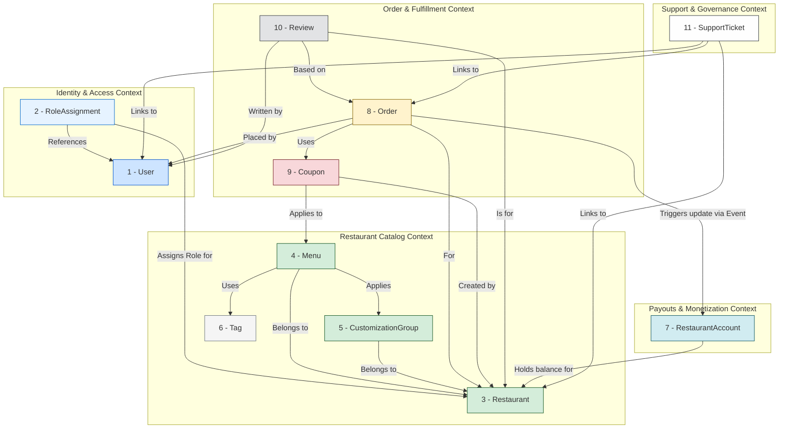

## Determine aggregates and refine relationships

### Proposed Aggregates and Their Detailed Structures

#### 1. `User` Aggregate

* **Aggregate Root:** `User`
* **Description:** Represents an individual's identity on the platform. A `User` is always a **customer** by default. This aggregate is solely responsible for managing personal identity, authentication credentials, and customer-specific data like addresses and payment methods.
* **Entities/Value Objects (VOs) within:**
  * `User` (Entity - Root):
    * `UserID` (Identifier)
    * `Name`
    * `Email` (Unique identifier for login)
    * `PhoneNumber` (Optional)
    * `IsActive` (Boolean)
  * `Address` (List of Child Entities):
    * `AddressID` (Identifier)
    * `Street`, `City`, `State`, `ZipCode`, `Country`
    * `Label` (e.g., "Home", "Work")
    * `DeliveryInstructions` (Optional)
  * `PaymentMethod` (List of Child Entities):
    * `PaymentMethodID` (Identifier)
    * `Type` (e.g., "Card", "PayPal")
    * `TokenizedDetails` (e.g., Stripe token, last 4 digits)
    * `IsDefault` (Boolean)
* **Invariants:**
  * `Email` must be unique across all users.
  * A `User` is considered a customer by their very existence; no special flag is needed.
* **References to other aggregates (by ID):**
  * None. This aggregate is now fully independent and does not hold references to `Restaurant` or other business domains.

---

#### 2. `RoleAssignment` Aggregate

* **Aggregate Root:** `RoleAssignment`
* **Description:** A dedicated aggregate that explicitly links a `User` to a `Restaurant` with a specific role. This is the authoritative source for determining a user's permissions and responsibilities within the context of a restaurant.
* **Entities/Value Objects (VOs) within:**
  * `RoleAssignment` (Entity - Root):
    * `RoleAssignmentID` (Identifier)
    * `UserID` (Identifier, reference to the `User` aggregate)
    * `RestaurantID` (Identifier, reference to the `Restaurant` aggregate)
    * `Role` (Enum: `Owner`, `Staff`)
* **Invariants:**
  * The combination of `UserID`, `RestaurantID`, and `Role` must be unique. (A user cannot be assigned the same role twice for the same restaurant).
  * A `RoleAssignment` must contain a valid, non-null `UserID` and `RestaurantID`.
  * The `Role` must be a valid value from the defined enum (e.g., `Owner`, `Staff`).
* **References to other aggregates (by ID):**
  * `UserID` (references `User`)
  * `RestaurantID` (references `Restaurant`)

---

#### 3. `Restaurant` Aggregate

* **Aggregate Root:** `Restaurant`
* **Description:** This aggregate is now lean and focused. It represents the restaurant as a legal and operational entity. Its data changes infrequently.
* **Entities/Value Objects (VOs) within:**
  * `Restaurant` (Entity - Root):
    * `RestaurantID` (Identifier)
    * `Name`
    * `LogoURL`
    * `Description`
    * `CuisineType` (String or list of strings)
    * `Location` (`Address` VO - The physical address)
    * `ContactInfo` (VO: `PhoneNumber`, `Email`)
    * `BusinessHours` (VO or structured data)
    * `IsVerified` (Boolean - Admin controlled)
    * `IsAcceptingOrders` (Boolean - Owner/Staff controlled toggle for "closing" the restaurant temporarily)
* **Invariants:**
  * `Name` and `Location` are mandatory.
  * `IsAcceptingOrders` is the master switch; if false, no orders can be created for this restaurant, regardless of menu status.
* **References to other aggregates (by ID):**
  * None. It is referenced *by* other aggregates.

---

#### 4. `Menu` Aggregate

* **Aggregate Root:** `Menu`
* **Description:** Represents a single, complete menu (e.g., "Lunch Menu," "Dinner Menu"). It is the primary transactional boundary for a restaurant's staff when managing what is for sale and its availability.
* **Entities/Value Objects (VOs) within:**
  * `Menu` (Entity - Root):
    * `MenuID` (Identifier)
    * `RestaurantID` (Identifier, links back to the `Restaurant`)
    * `Name` (e.g., "All Day Menu")
    * `Description` (Optional, e.g., "Served from 11 AM to 9 PM")
    * `IsEnabled` (Boolean - To activate/deactivate entire menus, e.g., a "Holiday Menu")
  * `MenuCategory` (List of Child Entities):
    * `CategoryID` (Identifier)
    * `Name` (e.g., "Appetizers", "Main Courses", "Desserts")
    * `DisplayOrder` (Integer for sorting)
  * `MenuItem` (List of Child Entities, nested under a `MenuCategory`):
    * `MenuItemID` (Identifier)
    * `Name`
    * `Description`
    * `BasePrice` (Money VO)
    * `ImageURL`
    * `IsAvailable` (Boolean - The "out of stock" toggle. This is the most frequently updated field.)
    * `DietaryTagIDs` (List of `TagID`s)
    * `AppliedCustomizations` (List of `AppliedCustomization` VOs):
      * `CustomizationGroupID` (Identifier, reference to the `CustomizationGroup` aggregate)
      * `DisplayTitle` (String, e.g., "Choose Your Spice Level", "Add Toppings")
      * `DisplayOrder` (Integer)
* **Invariants:**
  * A `MenuItem` must belong to a `MenuCategory`.
  * `MenuItem.BasePrice` cannot be negative.
  * `MenuItem.Name` must be unique within its `MenuCategory`.
* **References to other aggregates (by ID):**
  * `RestaurantID`
  * `MenuItem.DietaryTagIDs` (List of `TagID`s)
  * `AppliedCustomizations.CustomizationGroupID` (List of `CustomizationGroupID`s)

---

#### 5. `CustomizationGroup` Aggregate

* **Aggregate Root:** `CustomizationGroup`
* **Description:** Manages a self-contained, reusable set of choices (e.g., sizes, toppings, add-ons). This allows an owner to define an option once and apply it to many menu items.
* **Entities/Value Objects (VOs) within:**
  * `CustomizationGroup` (Entity - Root):
    * `GroupID` (Identifier)
    * `RestaurantID` (Identifier, ensures options are scoped to the correct restaurant)
    * `GroupName` (Internal name, e.g., "Standard Toppings", "Pizza Sizes")
    * `MinSelections` (Integer)
    * `MaxSelections` (Integer)
  * `CustomizationChoice` (List of Child Entities):
    * `ChoiceID` (Identifier)
    * `Name` (e.g., "Medium", "Extra Cheese", "Spicy")
    * `PriceAdjustment` (Money VO, can be zero)
    * `IsDefault` (Boolean)
* **Invariants:**
  * `GroupName` must be unique within the `Restaurant`.
  * `MaxSelections` must be greater than or equal to `MinSelections`.
  * `Choice.Name` must be unique within the group.
* **References to other aggregates (by ID):**
  * `RestaurantID`

---

#### 6. `Tag` Aggregate

* **Aggregate Root:** `Tag`
* **Description:** Manages centrally defined tags (e.g., for dietary preferences, cuisine styles) that can be applied across the system for classification, discovery, and filtering.
* **Entities/Value Objects (VOs) within:**
  * `Tag` (Entity - Root):
    * `TagID` (Identifier)
    * `TagName` (String, e.g., "Vegetarian", "Gluten-Free", "Spicy")
    * `TagDescription` (Optional)
    * `TagCategory` (String, e.g., "Dietary", "Cuisine", "SpiceLevel")
* **Invariants:**
  * `TagName` must be unique across the entire system to ensure consistency.
* **References to other aggregates (by ID):**
  * None. It is a self-contained, lookup-style aggregate.

---

#### 7. `RestaurantAccount` Aggregate

* **Aggregate Root:** `RestaurantAccount`
* **Description:** Represents the financial ledger for a single restaurant on the YummyZoom platform. It is the authoritative source for a restaurant's earnings, fees, and balance. It operates within its own "Payouts" bounded context.
* **Entities/Value Objects (VOs) within:**
  * `RestaurantAccount` (Entity - Root):
    * `RestaurantAccountID` (Identifier)
    * `RestaurantID` (Identifier, links to the `Restaurant` aggregate)
    * `CurrentBalance` (Money VO) - The amount the platform currently owes the restaurant.
    * `PayoutMethodDetails` (VO) - Stores details for payouts (e.g., tokenized bank account info, PayPal email). For MVP, this can be a simple text field.
  * `AccountTransaction` (List of Child Entities):
    * `TransactionID` (Identifier)
    * `Type` (Enum: `OrderRevenue`, `PlatformFee`, `RefundDeduction`, `PayoutSettlement`, `ManualAdjustment`)
    * `Amount` (Money VO) - Positive for credits (revenue), negative for debits (fees, payouts).
    * `Timestamp`
    * `RelatedOrderID` (Identifier, optional) - Links the transaction to a specific order for auditing.
* **Invariants:**
  * The `CurrentBalance` must always equal the sum of all `AccountTransaction` amounts. This is the aggregate's primary consistency rule.
  * A `PayoutSettlement` transaction cannot be for an amount greater than the `CurrentBalance` at the time of the transaction.
  * The `Amount` for a `PlatformFee` or `RefundDeduction` must be negative.
  * The `Amount` for an `OrderRevenue` must be positive.
* **References to other aggregates (by ID):**
  * `RestaurantID`
  * `AccountTransaction.RelatedOrderID` (references `Order`)

---

#### 8. `Order` Aggregate

* **Aggregate Root:** `Order`
* **Description:** Represents a customer's confirmed request for items from a restaurant. It is a transactional, immutable record of a purchase, ensuring historical accuracy.
* **Entities/Value Objects (VOs) within:**
  * `Order` (Entity - Root):
    * `OrderID` (Identifier)
    * `OrderNumber` (Human-readable sequence)
    * `Status` (Enum: Placed, Accepted, Preparing, ReadyForDelivery, Delivered, Cancelled, Rejected)
    * `PlacementTimestamp`
    * `LastUpdateTimestamp`
    * `EstimatedDeliveryTime` (Timestamp or Duration)
    * `SpecialInstructions` (From customer)
    * `DeliveryAddress` (`Address` VO - A snapshot of the customer's chosen address)
    * **Financials (Money VOs):**
      * `Subtotal` (Sum of all line items)
      * `DiscountAmount`
      * `DeliveryFee`
      * `TipAmount`
      * `TaxAmount` (If applicable)
      * `TotalAmount` (The final amount charged)
  * `OrderItem` (List of Child Entities):
    * `OrderItemID` (Identifier)
    * `Snapshot_MenuItemID` (ID of the original `MenuItem`)
    * `Snapshot_ItemName`
    * `Snapshot_BasePriceAtOrder` (Money VO)
    * `Quantity`
    * `SelectedCustomizations` (List of `OrderItemCustomization` VOs):
      * `Snapshot_CustomizationGroupName`
      * `Snapshot_ChoiceName`
      * `Snapshot_ChoicePriceAdjustmentAtOrder` (Money VO)
    * `LineItemTotal` (Money VO - `(BasePrice + sum of Adjustments) * Quantity`)
  * `PaymentTransaction` (List of Child Entities):
    * `TransactionID` (Identifier)
    * `PaymentMethodType` (Enum: CreditCard, PayPal, ApplePay, GooglePay, CashOnDelivery)
    * `PaymentMethodDisplay` (String, optional, e.g., "Visa **** 4242")
    * `Type` (Enum: Payment, Refund)
    * `Amount` (Money VO)
    * `Status` (Enum: Pending, Succeeded, Failed)
    * `Timestamp`
    * `PaymentGatewayReferenceID` (Optional)
* **Invariants:**
  * `TotalAmount` must strictly equal `Subtotal - DiscountAmount + TaxAmount + DeliveryFee + TipAmount`.
  * `Subtotal` must equal the sum of all `OrderItem.LineItemTotal`s.
  * Order status transitions must be enforced by methods on the aggregate root (e.g., `accept()`, `markAsPreparing()`) to ensure a valid lifecycle. An order cannot be accepted if its status is not `Placed`.
  * An order cannot be created with a negative `TotalAmount`.
* **References to other aggregates (by ID):**
  * `CustomerID` (`UserID` of the customer).
  * `RestaurantID` (The restaurant fulfilling the order).
  * `AppliedCouponIDs` (List of `CouponID`s used).

---

#### 9. `Coupon` Aggregate

* **Aggregate Root:** `Coupon`
* **Description:** Manages a promotional coupon, its rules, validity, and global usage. Per-user usage is managed externally.
* **Entities/Value Objects (VOs) within:**
  * `Coupon` (Entity - Root):
    * `CouponID` (Identifier)
    * `RestaurantID` (Identifier, links to the owning `Restaurant`)
    * `Code` (String - what the customer enters, unique per restaurant)
    * `Description`
    * `Type` (Enum: Percentage, FixedAmount, FreeItem)
    * `Value` (Decimal for percentage, Money VO for fixed amount, `MenuItemID` for free item)
    * `AppliesTo` (VO):
      * `Scope` (Enum: WholeOrder, SpecificItems, SpecificCategories)
      * `ItemIDs` (List of `MenuItemID`s if `Scope` is SpecificItems)
      * `CategoryIDs` (List of `MenuCategoryID`s if `Scope` is SpecificCategories)
    * `MinOrderAmount` (Money VO, optional condition for applicability)
    * `ValidityStartDate` & `ValidityEndDate`
    * `TotalUsageLimit` (Integer, optional)
    * `CurrentTotalUsageCount` (Integer)
    * `IsEnabled` (Boolean)
    * `UsageLimitPerUser` (Interger)
* **Invariants:**
  * `Code` must be unique within the scope of its `RestaurantID`.
  * `ValidityEndDate` must be after `ValidityStartDate`.
  * `CurrentTotalUsageCount` cannot exceed `TotalUsageLimit`.
  * The `incrementUsageCount()` method must check the `TotalUsageLimit` before incrementing.
* **References to other aggregates (by ID):**
  * `RestaurantID`
  * `AppliesTo.ItemIDs` (List of `MenuItemID`s)
  * `AppliesTo.CategoryIDs` (List of `MenuCategoryID`s)

*(**Note on Per-User Tracking:** A separate, simple data store (e.g., a `CouponUsages` table) with the structure `(UserID, CouponID, OrderID)` will be managed by the Application Service to enforce per-user limits. This is not part of the `Coupon` aggregate's transactional boundary.)*

---

#### 10. `Review` Aggregate

* **Aggregate Root:** `Review`
* **Description:** Captures authentic customer feedback and ratings for a restaurant, anchored to a completed order.
* **Entities/Value Objects (VOs) within:**
  * `Review` (Entity - Root):
    * `ReviewID` (Identifier)
    * `OrderID` (Identifier, ensures review authenticity)
    * `CustomerID` (`UserID` of the reviewer)
    * `RestaurantID` (The restaurant being reviewed)
    * `Rating` (Integer, 1-5)
    * `Comment` (Text, optional)
    * `SubmissionTimestamp`
    * `IsModerated` (Boolean)
    * `IsHidden` (Boolean)
    * `Reply` (Text, optional)
* **Invariants:**
  * `Rating` must be an integer between 1 and 5 (inclusive).
  * A `Review` must be linked to a valid `OrderID`, `CustomerID`, and `RestaurantID`.
* **References to other aggregates (by ID):**
  * `OrderID`
  * `CustomerID` (`UserID`)
  * `RestaurantID`

---

#### 11. `SupportTicket` Aggregate

* **Aggregate Root:** `SupportTicket`
* **Description:** Represents a single, trackable case or issue raised by a user, a restaurant, or the system itself. It manages the entire lifecycle of the issue from submission to resolution.
* **Entities/Value Objects (VOs) within:**
  * `SupportTicket` (Entity - Root):
    * `TicketID` (Identifier)
    * `TicketNumber` (Human-readable sequence)
    * `Subject` (String)
    * `Status` (Enum: `Open`, `InProgress`, `PendingCustomerResponse`, `Resolved`, `Closed`)
    * `Priority` (Enum: `Low`, `Normal`, `High`, `Urgent`)
    * `Type` (Enum: `RefundRequest`, `AccountIssue`, `RestaurantReactivation`, `GeneralInquiry`)
    * `SubmissionTimestamp`
    * `LastUpdateTimestamp`
    * `AssignedToAdminID` (`AdminID`, optional - links to the admin working on it)
  * `ContextLink` (List of Value Objects):
    * `EntityType` (Enum: `User`, `Order`, `Restaurant`, `Review`)
    * `EntityID` (Identifier of the linked entity)
    * *This flexible structure allows a single ticket to be linked to both the customer (`User`) who reported an issue and the `Order` it relates to.*
  * `TicketMessage` (List of Child Entities):
    * `MessageID` (Identifier)
    * `AuthorID` (`UserID` or `AdminID`)
    * `AuthorType` (Enum: `Customer`, `RestaurantOwner`, `Admin`)
    * `MessageText` (String)
    * `Timestamp`
    * `IsInternalNote` (Boolean - for admin-only comments)
* **Invariants:**
  * A ticket must have at least one `ContextLink` to be meaningful.
  * Only an `Admin` can change the `Status` to `Resolved` or `Closed`.
  * `TicketMessage`s are immutable once added.
* **References to other aggregates (by ID):**
  * `ContextLink.EntityID` (references `User`, `Order`, `Restaurant`, etc.)
  * `AssignedToAdminID`
  * `TicketMessage.AuthorID`

---

### 1. System-Wide Aggregate Relationship Diagram (Final)

This diagram illustrates all **11 aggregates**, grouped into their logical Bounded Contexts. It shows how they are decoupled and relate to one another primarily through ID references and domain events.

---
