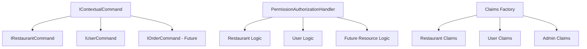

# Authorization Pattern in YummyZoom

## Overview

YummyZoom implements a **generic, contextual authorization system** that provides fine-grained, resource-aware security controls. The system seamlessly handles multiple resource types (restaurants, users, etc.) while maintaining type safety and extensibility.

### Key Features

- **Generic Resource Authorization**: Single authorization infrastructure supporting any resource type
- **Contextual Permissions**: Role-based access scoped to specific resources
- **Claims-Based Security**: Automatic claims generation and validation
- **Type-Safe Commands**: Strongly-typed command interfaces for each resource type
- **Extensible Design**: Easy to add new resource types and authorization rules
- **Full Backward Compatibility**: Existing restaurant authorization unchanged

---

## System Architecture

### 1. **Authentication Foundation**
- **ASP.NET Core Identity**: Manages user authentication, passwords, and global roles
- **ApplicationUser**: Identity entity for authentication
- **User Aggregate**: Domain entity for business logic

### 2. **Authorization Components**



### 3. **Core Interfaces**

#### Base Interface
```csharp
public interface IContextualCommand
{
    string ResourceType { get; }
    string ResourceId { get; }
}
```

#### Resource-Specific Interfaces
```csharp
// Restaurant commands
public interface IRestaurantCommand : IContextualCommand
{
    RestaurantId RestaurantId { get; }
    
    string IContextualCommand.ResourceType => "Restaurant";
    string IContextualCommand.ResourceId => RestaurantId.Value.ToString();
}

// User commands
public interface IUserCommand : IContextualCommand
{
    UserId UserId { get; }
    
    string IContextualCommand.ResourceType => "User";
    string IContextualCommand.ResourceId => UserId.Value.ToString();
}
```

---

## How Claims-Based Authorization Works

### 1. **Claims Generation**

Claims are automatically generated during user authentication:

```csharp
// Restaurant permissions (from RoleAssignment entities)
"permission:RestaurantOwner:restaurant-123"
"permission:RestaurantStaff:restaurant-456"

// User permissions (automatic self-ownership)
"permission:UserOwner:user-789"

// Admin permissions (wildcard access)
"permission:UserAdmin:*
```

### 2. **Authorization Flow**

1. **Command Dispatch**: User sends a command implementing `IContextualCommand`
2. **Policy Check**: Authorization pipeline checks required policy
3. **Claims Validation**: Handler verifies user has required permission claim
4. **Resource Context**: Permission checked against specific resource ID
5. **Business Rules**: Additional rules applied (e.g., owners can do staff actions)

### 3. **Permission Format**

All permissions follow the pattern: `"Role:ResourceId"`

- **Exact Match**: `"RestaurantOwner:restaurant-123"` grants owner access to specific restaurant
- **Self-Access**: `"UserOwner:user-456"` grants user access to their own data  
- **Wildcard**: `"UserAdmin:*"` grants admin access to all users

---

## How to Protect Commands with Authorization

### Restaurant Commands

```csharp
[Authorize(Policy = Policies.MustBeRestaurantOwner)]
public record UpdateRestaurantCommand(
    Guid RestaurantId,
    string Name,
    string Description
) : IRequest<Result<Unit>>, IRestaurantCommand
{
    RestaurantId IRestaurantCommand.RestaurantId => 
        Domain.RestaurantAggregate.ValueObjects.RestaurantId.Create(RestaurantId);
}
```

### User Commands

```csharp
[Authorize(Policy = Policies.MustBeUserOwner)]
public record UpdateUserProfileCommand(
    Guid UserId,
    string FirstName,
    string LastName
) : IRequest<Result<Unit>>, IUserCommand
{
    UserId IUserCommand.UserId => 
        Domain.UserAggregate.ValueObjects.UserId.Create(UserId);
}
```

### Unprotected Commands

```csharp
// No authorization attribute = no authorization required
public record GetPublicDataCommand() : IRequest<Result<PublicData>>;
```

### Global Role-Based Commands

```csharp
[Authorize(Roles = Roles.Administrator)]
public record PurgeSystemDataCommand : IRequest<Result<Unit>>;
```

---

## Available Policies and Roles

### Current Policies
```csharp
// Restaurant policies
public const string MustBeRestaurantOwner = nameof(MustBeRestaurantOwner);
public const string MustBeRestaurantStaff = nameof(MustBeRestaurantStaff);

// User policies  
public const string MustBeUserOwner = nameof(MustBeUserOwner);

// System policies
public const string CanPurge = nameof(CanPurge);
```

### Current Roles
```csharp
// Global roles
public const string User = nameof(User);
public const string Administrator = nameof(Administrator);

// Restaurant roles (contextual)
public const string RestaurantOwner = nameof(RestaurantOwner);
public const string RestaurantStaff = nameof(RestaurantStaff);

// User roles (contextual)
public const string UserOwner = nameof(UserOwner);
public const string UserAdmin = nameof(UserAdmin);
```

### Business Rules

1. **Restaurant Owners** can perform all staff actions
2. **Users** can access their own data automatically
3. **Administrators** can access any user data via wildcard permissions
4. **Resource isolation** prevents cross-resource permission bleeding

---

## How to Add a New Contextual Resource Type

### Step 1: Create Resource Interface

```csharp
// Example: Order commands
public interface IOrderCommand : IContextualCommand
{
    OrderId OrderId { get; }
    
    string IContextualCommand.ResourceType => "Order";
    string IContextualCommand.ResourceId => OrderId.Value.ToString();
}
```

### Step 2: Add Role Constants

```csharp
// In SharedKernel/Constants/Roles.cs
public const string OrderOwner = nameof(OrderOwner);
public const string OrderManager = nameof(OrderManager);
```

### Step 3: Add Policy Constants

```csharp
// In SharedKernel/Constants/Policies.cs  
public const string MustBeOrderOwner = nameof(MustBeOrderOwner);
public const string MustBeOrderManager = nameof(MustBeOrderManager);
```

### Step 4: Register Policies

```csharp
// In Infrastructure/DependencyInjection.cs
builder.Services.AddAuthorizationBuilder()
    .AddPolicy(Policies.MustBeOrderOwner, policy =>
        policy.AddRequirements(new HasPermissionRequirement(Roles.OrderOwner)))
    .AddPolicy(Policies.MustBeOrderManager, policy =>
        policy.AddRequirements(new HasPermissionRequirement(Roles.OrderManager)));
```

### Step 5: Add Authorization Logic

```csharp
// In PermissionAuthorizationHandler.cs
switch (resource.ResourceType)
{
    case "Restaurant":
        HandleRestaurantAuthorization(context, requirement, resource);
        break;
    case "User":
        HandleUserAuthorization(context, requirement, resource);
        break;
    case "Order":
        HandleOrderAuthorization(context, requirement, resource);  // Add this
        break;
}

private void HandleOrderAuthorization(
    AuthorizationHandlerContext context,
    HasPermissionRequirement requirement,
    IContextualCommand resource)
{
    // Business rule: Order managers can perform owner actions
    if (requirement.Role == Roles.OrderOwner)
    {
        var managerPermission = $"{Roles.OrderManager}:{resource.ResourceId}";
        if (context.User.HasClaim("permission", managerPermission))
        {
            context.Succeed(requirement);
        }
    }
}
```

### Step 6: Add Claims Generation

```csharp
// In YummyZoomClaimsPrincipalFactory.cs
protected override async Task<ClaimsIdentity> GenerateClaimsAsync(ApplicationUser user)
{
    var identity = await base.GenerateClaimsAsync(user);

    // Add restaurant permissions (existing)
    // Add user permissions (existing)
    
    // Add order permissions (new)
    var orderAssignments = await _orderAssignmentRepository.GetByUserIdAsync(domainUserId);
    foreach (var assignment in orderAssignments)
    {
        var roleConstant = assignment.Role switch
        {
            OrderRole.Owner => Roles.OrderOwner,
            OrderRole.Manager => Roles.OrderManager,
            _ => assignment.Role.ToString()
        };
        
        var claimValue = $"{roleConstant}:{assignment.OrderId.Value}";
        identity.AddClaim(new Claim("permission", claimValue));
    }

    return identity;
}
```

### Step 7: Create Commands

```csharp
[Authorize(Policy = Policies.MustBeOrderOwner)]
public record UpdateOrderCommand(
    Guid OrderId,
    OrderStatus Status
) : IRequest<Result<Unit>>, IOrderCommand
{
    OrderId IOrderCommand.OrderId => Domain.OrderAggregate.ValueObjects.OrderId.Create(OrderId);
}
```

---

## Testing Your Authorization

### Unit Tests
```csharp
[Test]
public async Task OrderCommand_WithOrderOwner_ShouldSucceed()
{
    // Arrange
    var userId = await RunAsOrderOwnerAsync("owner@test.com", _orderId);
    var command = new UpdateOrderCommand(_orderId, OrderStatus.Completed);

    // Act  
    var result = await SendAsync(command);

    // Assert
    result.ShouldBeSuccessful();
}
```

### Integration Tests
```csharp
[Test] 
public async Task IdentityService_OrderAuthorization_ShouldWorkCorrectly()
{
    // Arrange
    var userId = await RunAsOrderOwnerAsync("owner@test.com", _orderId);
    var identityService = GetRequiredService<IIdentityService>();
    var command = new UpdateOrderCommand(_orderId, OrderStatus.Completed);

    // Act
    var authorized = await identityService.AuthorizeAsync(
        userId.ToString(), 
        "MustBeOrderOwner", 
        command);

    // Assert
    authorized.Should().BeTrue();
}
```

---

## Advanced Scenarios

### Cross-Resource Authorization

```csharp
// User must own both the restaurant AND the order
[Authorize(Policy = Policies.MustBeRestaurantOwner)]
[Authorize(Policy = Policies.MustBeOrderOwner)]
public record TransferOrderCommand(
    Guid RestaurantId,
    Guid OrderId,
    Guid TargetRestaurantId
) : IRequest<Result<Unit>>, IRestaurantCommand, IOrderCommand
{
    RestaurantId IRestaurantCommand.RestaurantId => 
        RestaurantId.Create(RestaurantId);
    OrderId IOrderCommand.OrderId => 
        OrderId.Create(OrderId);
}
```

### Custom Authorization Logic

```csharp
// For complex scenarios, create custom authorization handlers
public class ComplexOrderAuthorizationHandler : 
    AuthorizationHandler<ComplexOrderRequirement, ComplexOrderCommand>
{
    protected override Task HandleRequirementAsync(
        AuthorizationHandlerContext context,
        ComplexOrderRequirement requirement,
        ComplexOrderCommand resource)
    {
        // Custom business logic
        // Multiple resource checks
        // Temporal constraints
        // etc.
    }
}
```

### Performance Considerations

- **Claims Caching**: Claims are generated once per login session
- **Efficient Lookups**: Authorization handler uses simple string comparisons
- **Batch Operations**: Multiple commands of same type are efficiently processed
- **Resource Isolation**: No performance impact between different resource types

---

## Migration and Backward Compatibility

### Existing Code
All existing restaurant authorization code works unchanged:
- Same command interfaces
- Same authorization attributes  
- Same test patterns
- Same claims format

### New Code
Simply implement `IContextualCommand` via the appropriate resource interface:
- `IRestaurantCommand` for restaurant operations
- `IUserCommand` for user operations
- Custom interfaces for new resource types

---

## Best Practices

### Security
- ✅ Always use resource-specific interfaces (`IRestaurantCommand`, `IUserCommand`)
- ✅ Apply authorization attributes to all sensitive commands
- ✅ Use constants from `Policies.cs` and `Roles.cs` - never magic strings
- ✅ Test both positive and negative authorization scenarios

### Performance  
- ✅ Leverage claims caching (automatic)
- ✅ Use specific policies rather than complex custom logic
- ✅ Batch similar operations when possible

### Maintainability
- ✅ Document new policies and business rules
- ✅ Follow naming conventions (`MustBe{Resource}{Role}`)
- ✅ Keep authorization logic in the handler, not in commands
- ✅ Write comprehensive tests for new authorization scenarios

### Extensibility
- ✅ Use the generic `IContextualCommand` pattern for new resources
- ✅ Add resource-type-specific business rules in the authorization handler
- ✅ Consider future resource types when designing new commands
- ✅ Maintain separation between authentication and authorization concerns

---

## Troubleshooting

### Common Issues

**403 Forbidden Errors**
- Check if user has required claims: `"permission:Role:ResourceId"`
- Verify policy is registered in DI
- Ensure command implements correct interface
- Check authorization attribute is applied

**Claims Not Generated**
- Verify role assignments exist in database
- Check claims factory includes your resource type
- Ensure user has logged in since role assignment

**Tests Failing**  
- Use `using static Testing;` in test files
- Inherit from `BaseTestFixture`
- Include proper using statements for `ApplicationUser`
- Set up test data with `SetupForAuthorizationTestsAsync()`

### Debug Commands

```bash
# Test authorization in isolation
dotnet test --filter "UserCommandAuthorizationTests"

# Test mixed scenarios  
dotnet test --filter "MixedResourceAuthorizationTests"

# Test specific policy
dotnet test --filter "RestaurantOwner"
```

---

## Future Enhancements

The system is designed to easily support:

- **Hierarchical Permissions**: Parent-child resource relationships
- **Temporal Authorization**: Time-based access controls  
- **External Authorization**: Integration with external permission systems
- **Audit Trail**: Comprehensive authorization logging
- **Dynamic Policies**: Runtime policy configuration
- **Resource Sharing**: Cross-tenant resource access

The generic contextual authorization system provides a solid foundation for any authorization requirements while maintaining simplicity and type safety.
