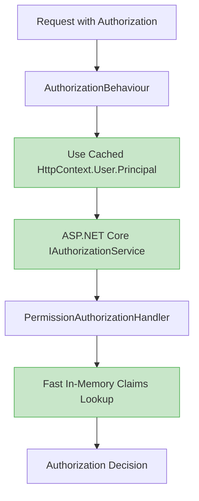
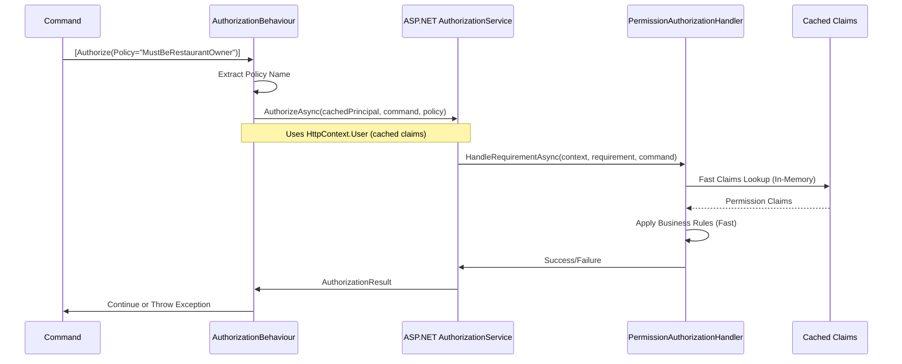
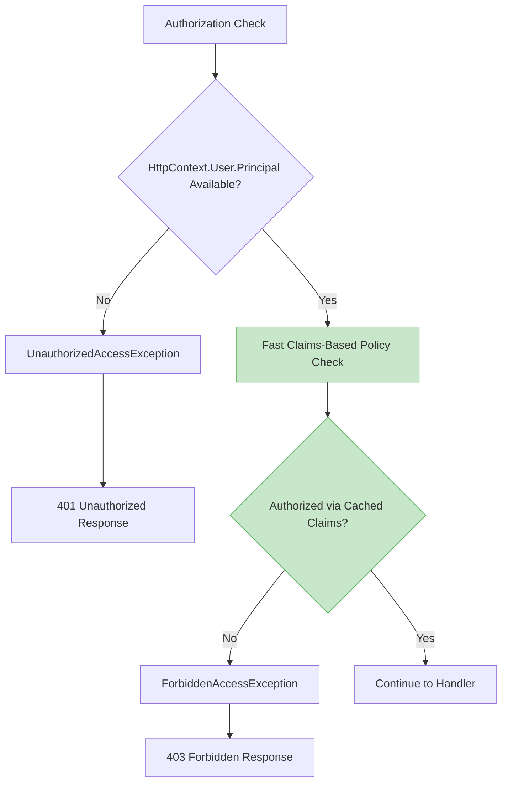

# YummyZoom Enhanced Authorization Flow - Performance Optimized

## Enhanced Authorization Flow Diagram (Zero DB Queries During Authorization)

```mermaid
flowchart TD
    %% User Request
    A[User Sends Request] --> B[HTTP Request with Auth Cookie/JWT]
    
    %% Authentication Check
    B --> C{Authenticated?}
    C -->|No| D[Return 401 Unauthorized]
    C -->|Yes| E[Extract Cached User Claims from HttpContext.User]
    
    %% Claims Already Available (Generated During Login)
    E --> F[Claims Available in Memory]
    F --> G["Cached Claims:<br/>permission:RestaurantOwner:123<br/>permission:UserOwner:456<br/>permission:UserAdmin:*"]
    
    %% Command Processing
    G --> H[MediatR Pipeline Starts]
    H --> I[AuthorizationBehaviour Intercepts]
    
    %% Authorization Attribute Check
    I --> J{Has Authorize Attribute?}
    J -->|No| K[Continue to Handler]
    J -->|Yes| L[Extract Authorization Attributes]
    
    %% Enhanced Authentication Check
    L --> M{User.Principal Available?}
    M -->|No| N[Throw UnauthorizedAccessException]
    M -->|Yes| O[Process Authorization with Cached Claims]
    
    %% Role-based vs Policy-based
    O --> P{Has Roles?}
    P -->|Yes| Q[Check Role Membership in Cached Claims]
    Q --> R{User in Role?}
    R -->|No| S[Throw ForbiddenAccessException]
    R -->|Yes| T[Continue to Policy Check]
    
    P -->|No| T[Check Policies]
    T --> U{Has Policies?}
    U -->|No| K
    U -->|Yes| V[Process Each Policy]
    
    %% Enhanced Policy Processing (No IdentityService)
    V --> W[Get Policy Name from Attribute]
    W --> X["Example: 'MustBeRestaurantOwner'"]
    X --> Y[Check if Command implements IContextualCommand]
    Y --> Z{Is IContextualCommand?}
    Z -->|Yes| AA[Pass Command as Resource]
    Z -->|No| BB[Pass null as Resource]
    
    %% Direct ASP.NET Core Authorization (No Database Queries)
    AA --> CC[Call IAuthorizationService.AuthorizeAsync DIRECTLY]
    BB --> CC
    CC --> DD[Use Cached HttpContext.User.Principal - NO DB QUERIES]
    DD --> EE[ASP.NET Core AuthorizationService]
    
    %% ASP.NET Core Authorization (Enhanced)
    EE --> FF[Look up Policy by Name]
    FF --> GG["Find Policy: 'MustBeRestaurantOwner'"]
    GG --> HH[Get Policy Requirements]
    HH --> II["Requirement: HasPermissionRequirement('RestaurantOwner')"]
    
    %% Handler Selection
    II --> JJ[Find Handlers for Requirement Type]
    JJ --> KK[PermissionAuthorizationHandler Selected]
    
    %% Enhanced Handler Execution (Fast Claims Lookup)
    KK --> LL[HandleRequirementAsync Called]
    LL --> MM[Extract Resource Info from Cached Claims]
    MM --> NN{Resource Type?}
    
    %% Resource-Specific Logic (No DB Queries)
    NN -->|Restaurant| OO[HandleRestaurantAuthorization]
    NN -->|User| PP[HandleUserAuthorization]
    NN -->|Other| QQ[Generic Permission Check]
    
    %% Fast Permission Checking (Memory Only)
    OO --> RR[Build Required Permission String]
    PP --> RR
    QQ --> RR
    RR --> SS["Format: 'Role:ResourceId'<br/>Example: 'RestaurantOwner:restaurant-123'"]
    
    %% Fast Claim Verification (In-Memory)
    SS --> TT[Check Cached User Claims - FAST LOOKUP]
    TT --> UU{Has Exact Permission Claim?}
    UU -->|Yes| VV[context.Succeed]
    UU -->|No| WW[Apply Business Rules - Fast Claim Checks]
    
    %% Enhanced Business Rules (All In-Memory)
    WW --> XX{Restaurant Owner can do Staff actions?}
    XX -->|Yes| VV
    XX -->|No| YY{User accessing own data?}
    YY -->|Yes| VV
    YY -->|No| ZZ{Admin wildcard permission?}
    ZZ -->|Yes| VV
    ZZ -->|No| AAA[Authorization Failed]
    
    %% Final Decision
    VV --> BBB[Return Success to AuthorizationService]
    AAA --> CCC[Return Failure to AuthorizationService]
    
    BBB --> DDD[IAuthorizationService returns Success]
    CCC --> EEE[IAuthorizationService returns Failure]
    
    DDD --> FFF[AuthorizationBehaviour continues]
    EEE --> S
    
    FFF --> K[Continue to Command Handler]
    K --> GGG[Execute Business Logic]
    GGG --> HHH[Return Response]
    
    %% Error Flows
    N --> III[Return 401 Response]
    S --> JJJ[Return 403 Response]
    
    %% Styling
    classDef userAction fill:#e1f5fe
    classDef authProcess fill:#f3e5f5
    classDef policyProcess fill:#e8f5e8
    classDef handlerProcess fill:#fff3e0
    classDef decision fill:#ffebee
    classDef error fill:#ffcdd2
    classDef success fill:#c8e6c9
    classDef performance fill:#e8f5e8,stroke:#4caf50,stroke-width:3px
    
    class A,B userAction
    class C,E,F,G authProcess
    class W,X,Y,Z,AA,BB,CC,DD,EE,FF,GG,HH,II,JJ,KK policyProcess
    class LL,MM,NN,OO,PP,QQ,RR,SS,TT,UU,VV,WW,XX,YY,ZZ handlerProcess
    class J,M,P,R,U decision
    class D,N,S,AAA,CCC,EEE,III,JJJ error
    class BBB,DDD,FFF,K,GGG,HHH success
    class KKK performance
```

## Key Performance Improvements

### 1. Enhanced Authentication Phase (Claims Generated Once)

```mermaid
graph LR
    A[User Login] --> B[Validate Credentials]
    B --> C[Create ApplicationUser]
    C --> D[YummyZoomClaimsPrincipalFactory]
    D --> E[Query RoleAssignments from DB ONCE]
    E --> F[Generate Permission Claims]
    F --> G[Cache Claims in JWT/Cookie]
    G --> H[Claims Available for ALL Future Requests]
    
    style E fill:#ffcdd2,stroke:#f44336
    style F fill:#c8e6c9,stroke:#4caf50
    style G fill:#c8e6c9,stroke:#4caf50
    style H fill:#c8e6c9,stroke:#4caf50
```

### 2. Enhanced Authorization Pipeline (Zero DB Queries)

### 3. Enhanced Command Authorization Flow

## Enhanced Error Handling Flow

