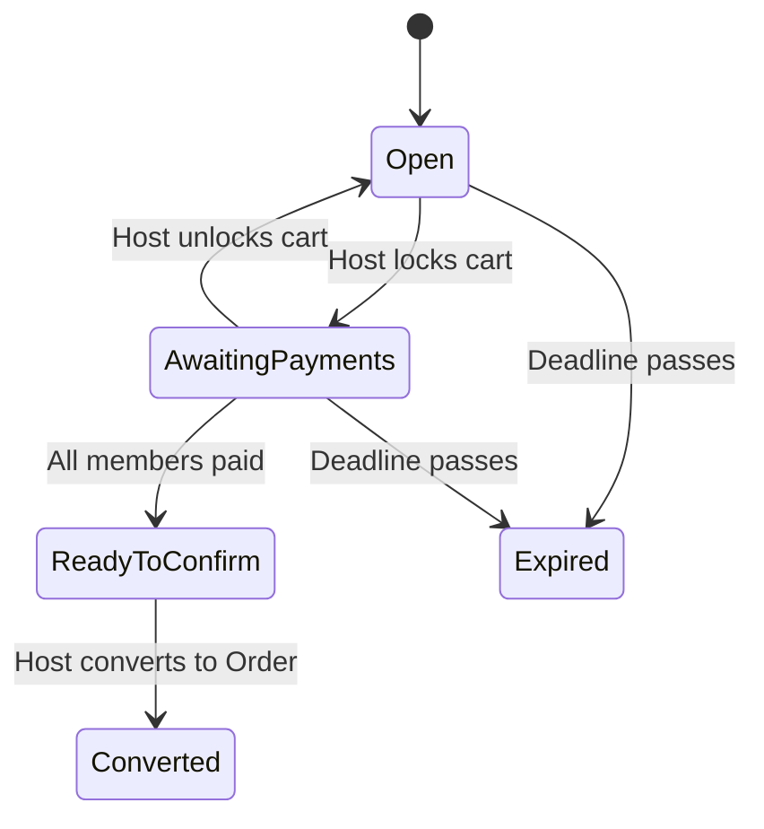

## **YummyZoom API Documentation: Creation Guidelines**

### **Part 1: Core Principles**

These principles should guide every piece of documentation you write.

1.  **Write for the External Developer:** The audience is a developer consuming your API. They do not know and should not need to know about internal concepts like "Aggregates," "Domain Events," or "Clean Architecture." Your job is to translate this internal complexity into a simple, external contract.

2.  **The Documentation IS the Contract:** Treat the documentation as the single source of truth for the API's behavior. It must be precise, unambiguous, and kept in sync with the application.

3.  **Structure by User Journey:** Organize documentation around features and workflows (e.g., "Placing an Order," "Managing a Menu"). This is how developers think and build. Use your `Features-Design.md` as the map.

4.  **Be Explicit and Exhaustive:** Never assume the client will "figure it out." Explicitly state every parameter, every possible response code, every business rule, and the exact structure of every JSON object.

5.  **Consistency is Key:** Every endpoint, model, and guide must follow the same format. This predictability makes the documentation easy to navigate and consume. Use the templates provided in Part 3.

6. **Embrace Brevity and Clarity:** Technical documentation must be efficient. Developers are looking for specific answers quickly.
    *   **Be Concise:** Avoid long, narrative paragraphs, marketing language, and verbose explanations. Get straight to the point.
    *   **Be Direct:** Use active voice (e.g., "The endpoint returns a user object") instead of passive voice (e.g., "A user object is returned by the endpoint").
    *   **Be Scannable:** Use bullet points, tables, and bold text to structure information so it can be understood at a glance.

### **Part 2: Documentation Structure (The Series)**

To create a linkable series, structure your documentation into a hierarchy of Markdown files. This structure is ideal for platforms like GitBook, Docusaurus, MkDocs, or even a well-organized folder in a Git repository.

```
/Docs/API-Documentation/
├── 00-Introduction.md
├── 01-Getting-Started.md
├── 02-Authentication.md
├── 03-Core-Concepts.md
├── 04-Real-time-Events-API.md
├── API-Reference/
│   ├── Customer/
│   │   ├── 01-User-Profile.md
│   │   ├── 02-Restaurants-and-Menus.md
│   │   ├── 03-Orders.md
│   │   ├── 04-Reviews.md
│   │   └── Workflows/
│   │       └── 01-TeamCart-Group-Order.md
│   ├── Restaurant/
│   │   ├── 01-Restaurant-Profile.md
│   │   ├── 02-Menu-Management.md
│   │   ├── 03-Order-Management.md
│   │   ├── 04-Coupon-Management.md
│   │   └── Workflows/
│   │       └── 01-Restaurant-Onboarding.md
│   └── Admin/
│       ├── 01-Platform-Management.md
│       └── ...
└── Appendices/
    ├── 01-Error-Codes.md
    ├── 02-Rate-Limiting.md
    └── 03-Changelog.md
```

### **Part 3: Content Templates & Style Guide**

Use these templates rigorously to ensure consistency across all documents. You don't have to follow these templates 100%, but you should follow the principles.

---

#### **Template 1: API Endpoint**

Use this template for documenting every single RESTful endpoint.

````markdown
# METHOD /path/to/endpoint

A concise, one-sentence description of what this endpoint does.

- **Authorization:** `[Public | Authenticated User | Restaurant Owner | Admin]`
- **Scope (if applicable):** `[e.g., orders:write]`

---

### Request

#### Path Parameters

| Parameter | Type   | Description                               |
| --------- | ------ | ----------------------------------------- |
| `orderId` | `UUID` | The unique identifier of the order.       |

#### Query Parameters

| Parameter | Type      | Description                                          | Default |
| --------- | --------- | ---------------------------------------------------- | ------- |
| `page`    | `integer` | The page number for pagination.                      | `1`     |
| `status`  | `string`  | Filter orders by status. See status enum for values. | `null`  |

#### Request Body

```json
{
  "totalAmount": {
    "amount": 55.50,
    "currency": "USD"
  },
  "deliveryAddress": {
    "street": "123 Foodie Lane",
    "city": "Tastytown",
    "state": "CA",
    "zipCode": "90210",
    "country": "USA",
    "deliveryInstructions": "Leave at the front door."
  },
  "items": [
    {
      "menuItemId": "a1b2c3d4-...",
      "quantity": 1,
      // ... other item fields
    }
  ]
}
```

**Field Descriptions:**

| Field                 | Type     | Required | Description                                                                                                   |
| --------------------- | -------- | -------- | ------------------------------------------------------------------------------------------------------------- |
| `totalAmount`         | `Money`  | Yes      | The final calculated total for the order. See [Core Concepts](./03-Core-Concepts.md) for the Money object structure. |
| `deliveryAddress`     | `Address`| Yes      | A snapshot of the delivery address. See [Core Concepts](./03-Core-Concepts.md) for the Address object structure. |
| `items`               | `array`  | Yes      | An array of order items.                                                                                      |
| `items[].menuItemId`  | `UUID`   | Yes      | The ID of the menu item being ordered.                                                                        |

---

### Response

#### ✅ 201 Created

```json
{
  "orderId": "f47ac10b-58cc-4372-a567-0e02b2c3d479",
  "orderNumber": "YZ-1024",
  "status": "Placed",
  "placedAt": "2023-10-27T10:00:00Z"
}
```

**Field Descriptions:**

| Field         | Type     | Description                                               |
| ------------- | -------- | --------------------------------------------------------- |
| `orderId`     | `UUID`   | The unique identifier for the newly created order.        |
| `orderNumber` | `string` | The human-readable identifier for the order.              |
| `status`      | `string` | The initial status of the order, always `Placed`.         |
| `placedAt`    | `string` | The ISO 8601 timestamp of when the order was placed.      |

#### ❌ Error Responses

- **400 Bad Request:** The request body is malformed or failed validation. The response body will contain a detailed error object.
- **401 Unauthorized:** The request lacks valid authentication credentials.
- **403 Forbidden:** The authenticated user does not have permission to perform this action.
- **404 Not Found:** A referenced resource (e.g., a `menuItemId`) does not exist.

See the [Error Codes Appendix](./Appendices/01-Error-Codes.md) for detailed error object structures.

---

### Business Rules & Validations

- The `totalAmount` must be the exact sum of `subtotal - discountAmount + taxAmount + deliveryFee + tipAmount`. The server will reject the request if this calculation is incorrect.
- An order cannot be placed for a restaurant where `isAcceptingOrders` is `false`.
- All `menuItemId`s in the order must belong to the same restaurant.

---

### Example

**Request (cURL)**
```bash
curl -X POST \
  https://api.yummyzoom.com/v1/orders \
  -H 'Authorization: Bearer <YOUR_JWT_TOKEN>' \
  -H 'Content-Type: application/json' \
  -d '{ ... request body ... }'
```
````

---

#### **Template 2: Real-time Events API (SignalR Hub)**

Create one file (`04-Real-time-Events-API.md`) for all real-time contracts.

````markdown
# Real-time Events API

The YummyZoom platform uses a real-time API powered by SignalR for instant updates on key events. This allows clients to provide a live, interactive experience without polling.

### Connecting to the Hub

- **Hub Endpoint:** `wss://api.yummyzoom.com/hubs/notifications`
- **Authentication:** The connection must be authenticated. Include the JWT bearer token in the connection negotiation request.
  - **Example (JavaScript Client):**
    ```javascript
    const connection = new signalR.HubConnectionBuilder()
        .withUrl("https://api.yummyzoom.com/hubs/notifications", {
            accessTokenFactory: () => your_jwt_token
        })
        .build();
    ```

---

### Server-to-Client Events

These are messages the server will push to connected clients. Your application should register handlers for these event names.

#### `OrderStatusChanged`

- **Description:** Fired when an order's status is updated by the restaurant or an admin.
- **Audience:** The customer who placed the order and the restaurant staff/owner.
- **Payload:**
  ```json
  {
    "orderId": "f47ac10b-58cc-4372-a567-0e02b2c3d479",
    "newStatus": "Preparing",
    "previousStatus": "Accepted",
    "updatedAt": "2023-10-27T10:05:00Z"
  }
  ```

#### `TeamCartUpdated`

- **Description:** Fired when a TeamCart is modified (e.g., a member joins, an item is added, status changes).
- **Audience:** All members currently part of the TeamCart session.
- **Payload:**
  ```json
  {
    "teamCartId": "c1a2b3d4-...",
    "eventType": "MemberJoined" | "ItemAdded" | "CartLocked",
    "updatedAt": "2023-10-27T11:30:00Z",
    "data": {
      // Event-specific data, e.g., the member who joined or the item that was added.
      // Document the structure for each eventType.
    }
  }
  ```
  
*(Continue listing all server-to-client events here)*

---

### Client-to-Server Invocations

These are methods the client can call on the server over the real-time connection.

#### `JoinTeamCartSession`

- **Description:** Informs the server that the client wants to receive real-time updates for a specific TeamCart. This should be called after a user successfully joins a cart.
- **Parameters:**
  1. `teamCartId` (`UUID`): The ID of the TeamCart to subscribe to.
- **Returns:** `void` (or a confirmation `Task` that can be awaited).
````

---

#### **Template 3: Workflow Guide**

Use this for multi-step processes like `TeamCart` or `RestaurantRegistration`.

````markdown
# Workflow: TeamCart (Group Order)

This guide walks through the entire lifecycle of creating and completing a group order using the TeamCart feature.

### Overview

The process involves a "Host" creating a cart, sharing it with "Guests," collecting items and payments, and finally converting the cart into a single standard `Order`.

**State Diagram:**



### Step-by-Step Process

1.  **Create the TeamCart (Host):**
    The host initiates the process by sending a request to `POST /api/v1/team-carts`. This creates the cart in an `Open` state and returns a unique `shareToken`.
    
    [🔗 See `POST /api/v1/team-carts` endpoint documentation](./../03-Orders.md#post-apiv1team-carts)

2.  **Share and Join (Guests):**
    The host shares the `shareToken` with guests. Guests use this token to join the cart by calling `POST /api/v1/team-carts/{id}/join`. All members will receive real-time updates via the [Notifications Hub](./../../04-Real-time-Events-API.md).

3.  **Add Items (All Members):**
    While the cart is `Open`, any member can add, update, or remove their own items using the `POST /api/v1/team-carts/{id}/items` endpoint.

4.  **Lock and Pay (Host & Guests):**
    When ready, the host locks the cart by calling `PUT /api/v1/team-carts/{id}/lock`. The status moves to `AwaitingPayments`. Guests can then submit their payments.

5.  **Convert to Order (Host):**
    Once all payments are confirmed, the status changes to `ReadyToConfirm`. The host can then make a final call to `POST /api/v1/team-carts/{id}/convert` to transform the TeamCart into a standard `Order` that is sent to the restaurant.
````

---

#### **Style Guide**

-   **Tone:** Professional, direct, and clear. Keep it simple and concise.
-   **JSON Fields:** Use `camelCase`.
-   **Dates and Times:** Use ISO 8601 format (`YYYY-MM-DDTHH:MM:SSZ`).
-   **IDs:** Clearly state when an ID is a `UUID`.
-   **Code Blocks:** Use syntax highlighting for JSON, cURL, and JavaScript.
-   **Emphasis:** Use `**bold**` for key terms and `*italic*` for emphasis. Use `` `backticks` `` for inline code, field names, and enum values.
-   **Cross-Linking:** Liberally link between documents (e.g., from an endpoint to a Core Concept or a Workflow).

---

### **The Optimal Documentation Creation Process**

This process is divided into four phases, moving from foundational concepts to complex, feature-specific workflows.

#### **Phase 1: The Foundation (Global Concepts)**

**Goal:** Establish the universal rules of engagement for the API. A developer should be able to read these documents and successfully authenticate and understand common data structures without knowing anything about specific features yet.

1.  **`03-Core-Concepts.md`:** Start here. Define the universal, reusable models first.
    *   **Why:** These objects (`Money`, `Address`) and principles (`Error Handling`, `Pagination`) will be referenced by nearly every endpoint. Defining them upfront prevents repetition and ensures consistency. The `Error Handling` section is especially critical.

2.  **`02-Authentication.md`:** Document the entire authentication flow next.
    *   **Why:** No developer can use the majority of your API without a valid token. This is the gateway to everything else. It's a hard prerequisite.

3.  **`00-Introduction.md` & `01-Getting-Started.md`:** Write the welcome mat and the "Hello, World!" tutorial.
    *   **Why:** With authentication and core concepts defined, you can now write a simple, complete tutorial (e.g., "Authenticate, then fetch your user profile"). This provides immediate value and proves the foundational docs are correct and usable.

4.  **`04-Real-time-Events-API.md`:** Document the SignalR hub connection and authentication.
    *   **Why:** The connection process is a foundational concept. Document this *before* the specific features that use it. You don't need to list all the events yet, but the "How to Connect" section should be completed.

#### **Phase 2: The Core User Journey (Customer Happy Path)**

**Goal:** Document the most critical end-to-end workflow of the application: a customer successfully placing an order. This provides the most important piece of documentation for many client developers.

5.  **`API-Reference/Customer/02-Restaurants-and-Menus.md`:** Document the read-only endpoints for browsing.
    *   **Why:** This is the first step a customer takes. These endpoints are typically simpler (GET requests) and are a prerequisite for placing an order.

6.  **`API-Reference/Customer/03-Orders.md`:** Document the `POST /orders` endpoint in extreme detail. Then, document the endpoints for viewing order history and status.
    *   **Why:** This is the transactional heart of the application. Getting this right is paramount. You will heavily reference the `Core Concepts` document here.

7.  **`API-Reference/Customer/01-User-Profile.md`:** Document user profile, address, and payment method management.
    *   **Why:** This is a supporting part of the core journey. A user needs to manage their addresses before they can place an order easily.

#### **Phase 3: The Provider Side & Complex Workflows**

**Goal:** Document the other side of the marketplace (restaurants) and tackle the more complex, multi-step features.

8.  **`API-Reference/Restaurant/03-Order-Management.md`:** Document how restaurants receive and update orders.
    *   **Why:** This is the direct counterpart to the customer placing an order. It's crucial to document the order status state machine here (e.g., `Placed` -> `Accepted` -> `Preparing`). You should also update the `Real-time-Events-API.md` with the `OrderStatusChanged` event at this stage.

9.  **`API-Reference/Restaurant/02-Menu-Management.md`:** Document the full CRUD for menus, categories, items, and customizations.
    *   **Why:** This is the most significant feature for restaurants after order management. It's a large but straightforward set of CRUD endpoints.

10. **`API-Reference/Customer/Workflows/01-TeamCart-Group-Order.md`:** Write the workflow guide for TeamCart.
    *   **Why:** Now that basic ordering and real-time events are documented, you have all the building blocks to explain this complex feature. Document the individual endpoints it requires and update the `Real-time-Events-API.md` with TeamCart-specific events.

11. **`API-Reference/Restaurant/Workflows/01-Restaurant-Onboarding.md`:** Write the workflow guide for new restaurant registration.
    *   **Why:** This is another complex, stateful process. It's self-contained and can be documented once the core provider features are done.

#### **Phase 4: Completion and Polish**

**Goal:** Fill in the remaining features and add the final polish with appendices.

12. **Document Remaining Features:** Complete the ancillary API reference documents.
    *   `API-Reference/Customer/04-Reviews.md`
    *   `API-Reference/Restaurant/01-Restaurant-Profile.md`
    *   `API-Reference/Restaurant/04-Coupon-Management.md`
    *   `API-Reference/Admin/...`

13. **Write the Appendices:** Finalize the reference materials.
    *   `Appendices/01-Error-Codes.md`: Consolidate all error codes documented along the way into one master list.
    *   `Appendices/02-Rate-Limiting.md`
    *   `Appendices/03-Changelog.md`: Start this file now and keep it updated as the API evolves.

14. **Final Review:** Read the entire documentation series from start to finish from the perspective of a new developer. Check for broken links, inconsistencies, and unclear explanations. Ensure the "Getting Started" guide works perfectly.