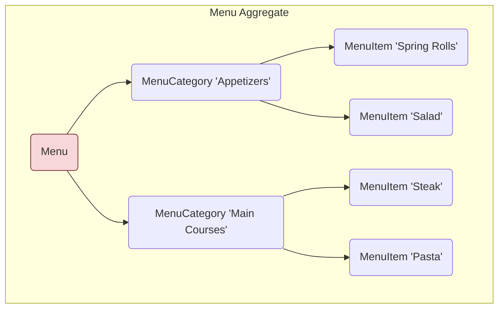
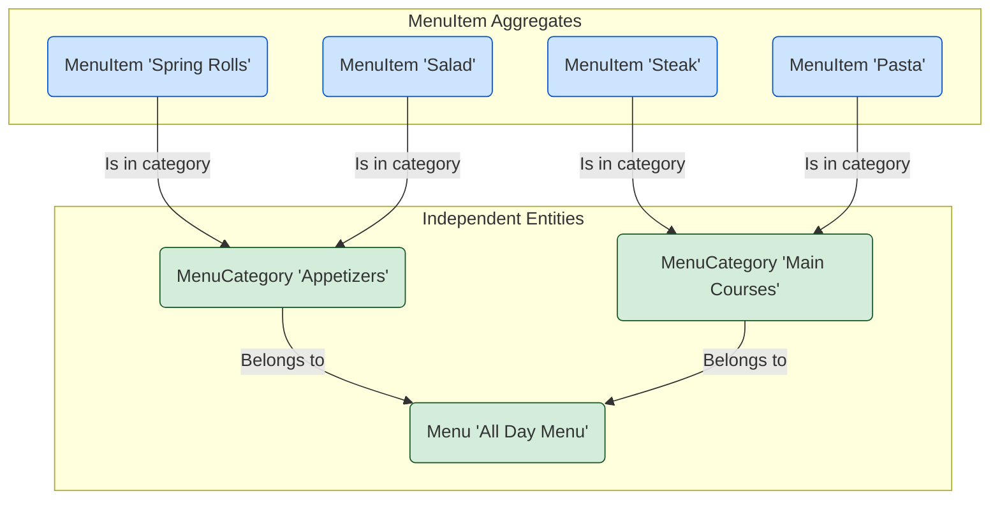

**The short answer is: Yes, you absolutely should be concerned.** The initial design is a great starting point, but analyzing the boundaries for potential performance issues due to size is a crucial next step.

### General Principles for Aggregate Boundaries

1. **The Golden Rule:** An aggregate's boundary should be the smallest possible unit that can guarantee **transactional consistency**. If you can change one part without needing another part to be consistent *in the same transaction*, they likely don't belong in the same aggregate.
2. **Performance Matters:** The primary reason to keep aggregates small is performance. Every time you need to execute a command on an aggregate, you must load the **entire** aggregate (the root and all its child entities/VOs) from the database into memory. If an aggregate contains a list of thousands of child entities, this becomes prohibitively slow and memory-intensive.
3. **Concurrency:** Large aggregates increase the chance of optimistic concurrency conflicts. If two users try to perform different operations that touch the same large aggregate (e.g., one user updates the restaurant's description while another marks a menu item as "out of stock"), one of them will fail. Smaller, more focused aggregates reduce this contention.

---

### Analysis of YummyZoom Aggregate Boundaries

Let's review the aggregates from your design, specifically looking for ones with potentially large collections of child entities.

#### Aggregates That Are Well-Designed (No Concern)

* **`User`**: A user might have a handful of `Addresses` and `PaymentMethods`. It's highly unlikely this list will grow into the hundreds. Loading a user with 10 addresses is trivial. The boundary is correct because adding a new default payment method requires the list of other methods to be present to unset their default status. **This aggregate is fine.**
* **`Order`**: An order contains `OrderItems`. Even a very large order will have dozens of items, not thousands. The entire order *is* a single transaction, so all its items must be loaded together to calculate totals and validate the state. **This aggregate is perfectly sized.**
* **`SupportTicket`**: A ticket contains `TicketMessages`. While a very long-running ticket could accumulate 50-100 messages, this is still a manageable number to load. The context of the entire conversation is needed to add a new message or resolve the ticket. **This aggregate is acceptable.**
* **`RoleAssignment`, `Tag`, `Coupon`, `Review`**: These have no or very small, bounded child collections. **They are fine.**

---

#### Problematic Aggregates That Need Refactoring

Here are the two aggregates in the current design that are major performance risks.

#### 1. `Menu` Aggregate

* **The Problem:** The `Menu` aggregate contains `MenuCategory`, which in turn contains a list of `MenuItems`. A large restaurant could easily have hundreds of menu items across all its categories. The most frequent operation for a restaurant staff member will be toggling `MenuItem.IsAvailable` (the "out of stock" switch).
* **The Impact:** According to the current design, to mark a single steak as "out of stock," the system would have to:
    1. Load the entire `Menu` aggregate from the database.
    2. This includes loading **all categories** and **all menu items** (appetizers, desserts, drinks, etc.) into memory.
    3. Find the specific item, change its boolean flag.
    4. Save the entire, massive object graph back to the database.
* **The Root Cause:** The transactional boundary is too large. Marking "Steak Frites" as unavailable has no transactional dependency on "Cheesecake" or "Iced Tea". They can be modified independently.
* **The Solution: Promote `MenuItem` to an Aggregate Root.**
    A `MenuItem` is the true consistency boundary for its own availability and price.

    **Proposed Refactoring:**
    1. **`MenuItem` becomes an Aggregate Root.**
        * `MenuItemID` (Identifier)
        * `RestaurantID`
        * `MenuCategoryID` (Reference to its category for grouping)
        * `Name`, `Description`, `BasePrice`, `ImageURL`, `IsAvailable`, etc.
        * It can still reference `CustomizationGroupID`s and `TagID`s.
    2. **`MenuCategory` becomes a simple entity (or even just a lookup table).**
        * It's now primarily for grouping and display purposes. It doesn't need to be an aggregate. It just has an `ID`, `RestaurantID`, `Name`, and `DisplayOrder`.
    3. **`Menu` becomes a simple entity.**
        * Its purpose is to define a collection for presentation (e.g., "Lunch Menu").
        * It would contain `MenuID`, `RestaurantID`, `Name`, and a **list of `MenuCategoryID`s**. It no longer contains the items directly.

    **Result:** To mark an item as "out of stock", you now load **only that single `MenuItem` aggregate**. This is dramatically more efficient and scalable.

#### 2. `RestaurantAccount` Aggregate

* **The Problem:** This aggregate contains a list of all `AccountTransaction`s. For a successful restaurant, this list will grow by hundreds or thousands of entries every month. After a year, it could contain tens of thousands of child entities.
* **The Impact:** The invariant `CurrentBalance must always equal the sum of all AccountTransaction amounts` is a death sentence for performance. To add a single new transaction (e.g., revenue from one order), the system would have to:
    1. Load the `RestaurantAccount` root.
    2. Load **every single transaction the restaurant has ever had** from the database into memory.
    3. Add the new transaction to the list.
    4. Recalculate the `CurrentBalance` by summing the entire list.
    5. Save the `RestaurantAccount` and the new `AccountTransaction` child.
    This is completely unworkable.
* **The Root Cause:** The invariant is incorrectly defined. The `CurrentBalance` does not need to be derived by summing the entire history on every command. It can be a stateful property that is updated atomically.
* **The Solution: Decouple the Balance from the Transaction History.**

    **Proposed Refactoring:**
    1. **`RestaurantAccount` Aggregate is simplified.**
        * It still has `RestaurantAccountID`, `RestaurantID`, `PayoutMethodDetails`.
        * It keeps `CurrentBalance` as a property.
        * **Crucially, it REMOVES the `List<AccountTransaction>` child entities.**
    2. **The `ApplyTransaction` logic changes.**
        * The aggregate gets a method like `public Result RecordRevenue(Money amount, OrderId orderId)`.
        * This method simply does `CurrentBalance += amount;`.
        * It then raises a domain event: `AccountTransactionRecorded(TransactionID, Type, Amount, RelatedOrderID)`.
    3. **`AccountTransaction` becomes its own, separate entity (not part of any aggregate).**
        * It's a historical record, an audit log.
        * An event handler listening for `AccountTransactionRecorded` will be responsible for creating and saving this `AccountTransaction` entity to the database.

    **Result:** To record revenue from an order, you load the very small `RestaurantAccount` aggregate (with just a few properties), update the balance, and save it. The creation of the historical transaction record happens asynchronously or in the same database transaction but outside the aggregate's boundary. This is extremely fast and scalable.

### Summary of Recommendations

| Aggregate | Original Design Issue | Recommendation |
| :--- | :--- | :--- |
| **`User`** | None | Keep as is. Boundary is correct. |
| **`Menu`** | **Too Large.** Contains all `MenuItems`. Unbounded growth and poor performance for frequent updates. | **Split the Aggregate.** Promote `MenuItem` to be its own Aggregate Root. `Menu` and `MenuCategory` become simpler entities for grouping. |
| **`RestaurantAccount`** | **Too Large.** Contains all `AccountTransactions`. Unbounded growth will make it impossible to load. | **Shrink the Aggregate.** Remove the `List<AccountTransaction>`. Manage `CurrentBalance` as a stateful property and use domain events to create `AccountTransaction`s as separate historical records. |
| **All Others** | None | Keep as is. Boundaries are correct. |

---
---

Ok, those are serious concerns.
First, we consider the refactoring of the Menu Aggregate.
As you proposed, the MenuItem should become a separate aggregate. But then what happens to the Menu and MenuCategory? Should they be merged with the Restaurant, or it still be the Menu aggregate contains many MenuCategory?
And I don't really familiar with the concept of lookup table or read models inside the Domain. There are some that needed in the YummyZoom system which are the CouponUsage to check if a user has used a coupon, the RatingSummary to provide the average rating and number of ratings for a restaurant,... Are they belongs to the Domain layer or because they are read models or lookup tables then they should be placed some where else?

Excellent questions. You are now delving into the practical, real-world trade-offs of DDD and system architecture. Let's break this down into two parts.

---

### Part 1: Refactoring the `Menu`, `MenuCategory`, and `MenuItem` Relationship

Your instinct is correct. If `MenuItem` becomes an aggregate, the roles of `Menu` and `MenuCategory` must change. Here’s the recommended approach:

**Do NOT merge them into the `Restaurant` aggregate.** This would recreate the exact same problem: a bloated `Restaurant` aggregate that is slow to load and prone to concurrency issues. A restaurant owner changing their phone number should not require loading all their menus and categories into memory.

**Instead, `Menu` and `MenuCategory` become simpler, independent entities.** They are no longer part of a deep, nested aggregate. Their job is now purely **organizational**. They exist to group `MenuItem`s for presentation to the customer.

Here is the "Before" vs. "After" structure:

#### Before (The Problematic Design)

A single, large `Menu` aggregate that contains everything.

*To change "Steak", you have to load the entire graph.*

#### After (The Recommended, Performant Design)

We now have multiple, smaller, independent entities and aggregates linked by ID.

**The New Roles:**

1. **`MenuItem` (Aggregate Root):**
    * This is the transactional boundary for everything related to a single saleable item: its price, availability, description, customizations, etc.
    * It contains a `MenuCategoryID` reference to know which category it belongs to for display purposes.
    * **The Command:** `MarkMenuItemAsOutOfStockCommand` now loads **only one small `MenuItem` aggregate**.

2. **`MenuCategory` (Simple Entity - NOT an Aggregate):**
    * Its sole purpose is to group `MenuItem`s.
    * It has an `ID`, a `Name` ("Appetizers"), a `DisplayOrder`, and a `MenuID` reference to link it to a specific menu.
    * It **does not** contain a list of `MenuItems`. The link is the other way around.

3. **`Menu` (Simple Entity - NOT an Aggregate):**
    * Its sole purpose is to group `MenuCategory`s.
    * It has an `ID`, a `Name` ("Lunch Menu"), and a `RestaurantID` reference.
    * It **does not** contain a list of `MenuCategory`s. Again, the link is the other way around.

This design is highly performant and scalable. All entities are small and can be managed independently.

---

### Part 2: Read Models, Lookup Tables, and Their Place

This is a fantastic question that leads us directly to a core architectural pattern often used with DDD: **Command Query Responsibility Segregation (CQRS)**.

**The Principle:**

* The **Domain Layer** (with its rich aggregates) is optimized for **Commands (writes)**. Its job is to enforce complex business rules, protect invariants, and guarantee consistency. It can be slow to query because it's not designed for that.
* **Read Models / Lookup Tables** are optimized for **Queries (reads)**. Their only job is to provide data for display as fast as possible. They are often denormalized, simple tables that are easy and cheap to query.

**Where do they belong? They do NOT belong in the Domain Layer.**

* **Domain Layer:** Is for the **write model**. It contains the aggregates that *produce* the facts (domain events).
* **Application/Infrastructure Layers:** Are for the **read model**. They contain the queries and event handlers that *consume* the facts to build and maintain these fast lookup tables.

Let's look at your examples:

#### `RatingSummary`

* **The Need:** When a customer views a restaurant page, we need to show "4.5 stars (1,234 ratings)" instantly. Calculating this on the fly by querying all 1,234 reviews is too slow.
* **The Solution (CQRS):**
    1. **Domain Event:** The `Review` aggregate, when created, raises a `ReviewSubmitted(RestaurantId, Rating)` event.
    2. **Event Handler (Application/Infrastructure Layer):** A dedicated class, `RestaurantRatingSummaryUpdater`, listens for this `ReviewSubmitted` event.
    3. **Read Model (Persistence Layer):** There is a simple table called `RestaurantRatingSummaries` with columns like `RestaurantID`, `AverageRating`, `TotalRatingCount`.
    4. **The Logic:** When the handler receives the event, it loads the *single* `RestaurantRatingSummary` for that `RestaurantId`, updates the `AverageRating` and increments the `TotalRatingCount`, and saves it. This is a very fast operation.
* **Conclusion:** `RatingSummary` is a **Read Model**. It lives outside the Domain Layer and is updated asynchronously by an event handler. The `Restaurant` aggregate knows nothing about it.

#### `CouponUsage`

* **The Need:** Before applying a coupon to an order, the system must check if this specific user has already used this coupon (if there's a per-user limit).
* **The Problem with putting it in an aggregate:**
  * You can't put it in the `Coupon` aggregate, because then you'd have to load a list of potentially millions of `(UserID, OrderID)` pairs just to increment the global usage count.
  * You can't put it in the `User` aggregate, because a user might use hundreds of coupons over time, bloating the user object.
* **The Solution (Lookup Table):**
    1. **Domain Event:** The `Order` aggregate, when created successfully using a coupon, raises an `OrderPlacedWithCoupon(OrderID, UserID, CouponID)` event.
    2. **Event Handler (Application/Infrastructure Layer):** A handler listens for this event.
    3. **Lookup Table (Persistence Layer):** A very simple, highly-indexed table called `CouponUsages` exists with columns `UserID`, `CouponID`, `OrderID`.
    4. **The Write Logic:** The event handler simply inserts a new row into this table.
    5. **The Read Logic:** The `ApplyCouponCommandHandler` in the **Application Layer** will *first* perform a quick query on the `CouponUsages` table (`SELECT 1 FROM CouponUsages WHERE UserID = @userId AND CouponID = @couponId`). If a record exists, it immediately returns an error *before* ever trying to modify the `Order` aggregate.
* **Conclusion:** `CouponUsage` is a classic **Lookup Table**. It's managed outside the core aggregates and is used by the Application Layer to enforce a specific cross-aggregate rule.

---
---

So you mean the MenuCategory and Menu should become simple entities, so they don't belong to any aggregate, which make them belong to the application/infrastructure as lookup tables, not in the domain?

That's a very sharp question, and it gets to a subtle but important distinction in DDD. Let me clarify.

No, that's not quite what I mean. **`Menu` and `MenuCategory` should absolutely still be part of your Domain Layer.**

They just won't be Aggregate Roots, nor will they be child entities inside another aggregate. They will be **independent, root-level entities within the Domain Layer.**

Let's refine the terminology:

* **Aggregate Root:** A special kind of entity that acts as the entry point and consistency boundary for a cluster of objects. Examples: `User`, `Order`, `MenuItem` (in the new design).
* **Entity:** An object with a distinct identity that is not an aggregate root. It can be a *child entity* (like `OrderItem` inside `Order`) or an *independent entity*.
* **Lookup Table / Read Model:** A data structure, typically in the persistence layer, optimized for fast reads. It is a **consequence** of domain activity, not part of the domain's decision-making logic itself. It's often managed by handlers in the Application or Infrastructure layers.

### The Correct Place for `Menu` and `MenuCategory`

`Menu` and `MenuCategory` are not just for reading. They have their own identity, their own (simple) lifecycle, and they are part of the core business vocabulary. A restaurant owner needs to be able to **Create, Update, and Delete** them. These are **Commands**, and therefore the logic for handling them belongs in the Domain.

Think about the use cases:

* A restaurant owner wants to create a new category called "Holiday Specials".
* An owner wants to rename the "Appetizers" category to "Starters".
* An owner wants to delete the "Lunch Menu" entirely.

These actions require business logic, even if it's simple:

* You must validate the `Name` isn't empty.
* You probably need to check that a `Menu` or `MenuCategory` belongs to the correct `RestaurantID` before allowing a change.
* You might have a rule that you can't delete a `MenuCategory` if it still has `MenuItem`s assigned to it.

This logic is domain logic. Therefore, `Menu` and `_MenuCategory` must be defined in the **Domain Layer**.

### How They Differ from Aggregates

The key difference is that they **don't enforce complex transactional invariants over a graph of objects.**

* When you update a `MenuCategory`'s name, you are only changing the `MenuCategory`. You don't need to load any `MenuItem`s to ensure consistency. You are operating on that single entity.
* Because they are simple, they don't need the formal "Aggregate Root" pattern with private setters, `IReadOnlyList`, and complex factories. They can be modeled as simpler public classes that the Application Service interacts with directly via a repository.

### Visualizing the Layers

Here's how the different concepts map to the layers in the new, refactored design:

| Concept | Type | Belongs in Layer | Reason |
| :--- | :--- | :--- | :--- |
| `MenuItem` | **Aggregate Root** | **Domain** | Has complex business logic and invariants (price, availability, customizations). Transactional boundary. |
| `Menu` | **Independent Entity** | **Domain** | Core business concept. Has its own identity and lifecycle (Create/Update/Delete). Subject of commands. |
| `MenuCategory` | **Independent Entity** | **Domain** | Core business concept. Has its own identity and lifecycle. Subject of commands. |
| `RatingSummary` | **Read Model** | **Application/Infrastructure** | Denormalized data for fast queries. Populated by event handlers. Not part of command logic. |
| `CouponUsage` | **Lookup Table** | **Application/Infrastructure** | A simple log used by the Application Service to check a business rule before executing a command. |

So, to be precise:

* **The Domain Layer will contain:** `MenuItem` (Aggregate), `Menu` (Entity), `MenuCategory` (Entity), `Restaurant` (Aggregate), `User` (Aggregate), etc.
* **The Application Layer will use repositories** to fetch and save all of these: `IMenuItemRepository`, `IMenuRepository`, `IMenuCategoryRepository`.
* **The Application Layer will also contain handlers** that listen to domain events and update read models/lookup tables (like `RatingSummary` and `CouponUsage`) that live in the **Persistence/Infrastructure Layer**.

---
---

Of course. Here is the outline for the refactored design, splitting the monolithic `Menu` aggregate into smaller, more focused domain objects.

---

### Refactored `Menu` Domain: Outline & Structure

The core principle is to promote `MenuItem` to an Aggregate Root and downgrade `Menu` and `MenuCategory` to simpler, independent entities.

#### 1. `MenuItem` (New Aggregate Root)

This is now the central, transactional unit for a saleable item.

* **File Path:** `src/Domain/MenuItemAggregate/MenuItem.cs` (Note the new folder)
* **Class Definition:** `public sealed class MenuItem : AggregateRoot<MenuItemId, Guid>`
* **Description:** Represents a single, saleable item offered by a restaurant. It is the consistency boundary for its own price, availability, description, and associated customizations.
* **Properties:**
  * `MenuItemId Id` (Primary Key)
  * `RestaurantId RestaurantId` (Reference to owning restaurant)
  * `MenuCategoryId MenuCategoryId` (Reference to its organizational category)
  * `string Name`
  * `string Description`
  * `Money BasePrice`
  * `bool IsAvailable` (The frequently updated "out of stock" flag)
  * `string? ImageUrl`
  * `IReadOnlyList<TagId> DietaryTagIds`
  * `IReadOnlyList<AppliedCustomization> AppliedCustomizations`
* **Key Methods:**
  * `public static Result<MenuItem> Create(...)`: Validates inputs and creates a new item.
  * `public Result UpdateDetails(...)`: Changes name, description.
  * `public Result UpdatePrice(Money newPrice)`: Updates the price, enforcing invariants (e.g., must be positive).
  * `public Result MarkAsAvailable()`: Sets `IsAvailable = true`. Raises `MenuItemAvailabilityChanged` event.
  * `public Result MarkAsUnavailable()`: Sets `IsAvailable = false`. Raises `MenuItemAvailabilityChanged` event.
  * `public Result AssignToCategory(MenuCategoryId newCategoryId)`: Changes the item's category.
* **Domain Events Raised:**
  * `MenuItemCreated`
  * `MenuItemPriceChanged`
  * `MenuItemAvailabilityChanged`
  * `MenuItemAssignedToCategory`

#### 2. `Menu` (Independent Entity)

This is now a simple organizational entity.

* **File Path:** `src/Domain/Menu/Menu.cs`
* **Class Definition:** `public sealed class Menu : Entity<MenuId>`
* **Description:** Represents a named collection of categories, like "Lunch Menu" or "Dinner Menu". Its purpose is purely for grouping and presentation.
* **Properties:**
  * `MenuId Id` (Primary Key)
  * `RestaurantId RestaurantId` (Reference to owning restaurant)
  * `string Name`
  * `string Description`
  * `bool IsEnabled`
* **Notable Change:** It **no longer** contains a `List<MenuCategory>`. The relationship is defined in `MenuCategory`.

#### 3. `MenuCategory` (Independent Entity)

Also a simple organizational entity.

* **File Path:** `src/Domain/Menu/MenuCategory.cs`
* **Class Definition:** `public sealed class MenuCategory : Entity<MenuCategoryId>`
* **Description:** Represents a named section within a menu, like "Appetizers" or "Main Courses". Its purpose is to group `MenuItem`s for display.
* **Properties:**
  * `MenuCategoryId Id` (Primary Key)
  * `MenuId MenuId` (Reference to its parent menu)
  * `string Name`
  * `int DisplayOrder`
* **Notable Change:** It **no longer** contains a `List<MenuItem>`. The relationship is defined in `MenuItem`.

---

### Notable Considerations & Impacts

1. **New Folder Structure:** The domain will be reorganized. The old `MenuAggregate` folder is removed. We will have:
    * `src/Domain/MenuItemAggregate/`: For the new `MenuItem` aggregate and its related VOs/events.
    * `src/Domain/Menu/`: For the simple `Menu` and `MenuCategory` entities and their VOs.

2. **Repository Changes:** You will need to change your repository interfaces and implementations.
    * **REMOVE:** `IMenuRepository` (as it was an aggregate repository).
    * **ADD:**
        * `IMenuItemRepository`: To load and save the `MenuItem` aggregate.
        * `IMenuRepository`: A new, simpler repository for the `Menu` entity.
        * `IMenuCategoryRepository`: A new, simpler repository for the `MenuCategory` entity.

3. **Application Service Logic:** The logic in the Application Layer will change significantly.
    * **Old Way:** `menu.AddItemToCategory(...)`
    * **New Way:**
        1. The `AddItemCommandHandler` receives `(RestaurantId, MenuCategoryId, Name, Price, ...)`.
        2. It uses the `IMenuCategoryRepository` to load the `MenuCategory` to ensure it exists and belongs to the correct restaurant.
        3. It calls `MenuItem.Create(...)` to create the new aggregate.
        4. It uses `IMenuItemRepository.Add(newItem)` to save the new `MenuItem` aggregate.
    * This new logic is more explicit but correctly separates the concerns.

4. **Enforcing Uniqueness:**
    * **`MenuItem` name uniqueness within a `MenuCategory`** can no longer be checked inside an aggregate. This check must now be done in the **Application Service** before creating the `MenuItem`. The service will query the `IMenuItemRepository`: `DoesItemWithNameExistInCategory(name, categoryId)`. This is a common pattern when breaking up aggregates.
    * Similarly, `MenuCategory` name uniqueness within a `Menu` is checked by the Application Service.

5. **Querying for a Menu's Content:**
    * Displaying a full menu for a customer is now a **query-side operation**.
    * You will create a query handler that:
        1. Loads the `Menu` and its associated `MenuCategory` entities.
        2. For each `MenuCategoryId`, it queries the `IMenuItemRepository` to get all `MenuItem`s with that `categoryId`.
    * This is a perfect use case for a **denormalized Read Model** to make this lightning fast, but starting with direct repository queries is fine.

This refactoring correctly aligns the transactional boundaries with the business operations, leading to a much more performant, scalable, and less contentious domain model.

---
---

Of course. Here is the outline for the refactored design, which decouples the `RestaurantAccount`'s balance management from its transaction history, creating a far more performant and scalable model.

---

### Refactored Payouts Domain: Outline & Structure

The key change is that `RestaurantAccount` no longer contains a list of transactions. `AccountTransaction` becomes a separate, independent entity created in response to domain events.

#### 1. `RestaurantAccount` (Lean Aggregate Root)

This aggregate is now small and focused on managing the current balance and payout settings.

* **File Path:** `src/Domain/RestaurantAccount/RestaurantAccount.cs` (Note the folder name change to reflect it's the primary concept in this context).
* **Class Definition:** `public sealed class RestaurantAccount : AggregateRoot<RestaurantAccountId, Guid>`
* **Description:** The authoritative source for a restaurant's current financial balance and payout configuration. Its boundary is small to ensure high performance for frequent financial operations.
* **Properties:**
  * `RestaurantAccountId Id` (Primary Key)
  * `RestaurantId RestaurantId`
  * `Money CurrentBalance` (A stateful property, no longer calculated)
  * `PayoutMethodDetails? PayoutMethodDetails`
* **Notable Change:** The `IReadOnlyList<AccountTransaction> Transactions` property and the private `_transactions` field are **completely removed**.
* **Key Methods (Refactored):**
  * `public static Result<RestaurantAccount> Create(...)`: Unchanged. Creates an account with a zero balance.
  * `public Result RecordRevenue(Money amount, OrderId orderId)`:
    * Checks if `amount` is positive.
    * **Directly modifies the balance:** `CurrentBalance += amount;`.
    * **Raises a domain event:** `AddDomainEvent(new RevenueRecorded(Id, amount, orderId))`.
  * `public Result RecordPlatformFee(Money feeAmount, OrderId orderId)`:
    * Checks if `feeAmount` is negative.
    * **Directly modifies the balance:** `CurrentBalance += feeAmount;`.
    * **Raises a domain event:** `AddDomainEvent(new PlatformFeeRecorded(Id, feeAmount, orderId))`.
  * `public Result SettlePayout(Money payoutAmount)`:
    * Checks if `CurrentBalance >= payoutAmount`.
    * **Directly modifies the balance:** `CurrentBalance -= payoutAmount;`.
    * **Raises a domain event:** `AddDomainEvent(new PayoutSettled(Id, payoutAmount, CurrentBalance))`.
  * `public Result MakeManualAdjustment(Money adjustment, string reason, AdminId adminId)`: A new method for explicit corrections.
    * **Directly modifies the balance:** `CurrentBalance += adjustment;`.
    * **Raises a domain event:** `AddDomainEvent(new ManualAdjustmentMade(Id, adjustment, reason, adminId))`.
* **Domain Events Raised (Refactored):**
  * `RestaurantAccountCreated` (Unchanged)
  * `PayoutMethodUpdated` (Unchanged)
  * **NEW/RENAMED Events:** `RevenueRecorded`, `PlatformFeeRecorded`, `RefundDeducted`, `PayoutSettled`, `ManualAdjustmentMade`. These events are more specific and carry all the data needed to create a historical `AccountTransaction` record. The generic `TransactionAdded` event is removed.

#### 2. `AccountTransaction` (Independent Domain Entity)

This is now a separate, root-level entity representing an immutable historical record.

* **File Path:** `src/Domain/AccountTransaction/AccountTransaction.cs`
* **Class Definition:** `public sealed class AccountTransaction : Entity<AccountTransactionId>`
* **Description:** An immutable, historical record of a single financial event that has occurred on a `RestaurantAccount`. It is created by event handlers and serves as the audit log.
* **Properties:**
  * `AccountTransactionId Id` (Primary Key)
  * `RestaurantAccountId RestaurantAccountId` (Reference to the account it belongs to)
  * `TransactionType Type`
  * `Money Amount`
  * `DateTime Timestamp`
  * `OrderId? RelatedOrderId`
  * `string? Notes` (e.g., for manual adjustment reasons)
* **Key Methods:**
  * `public static Result<AccountTransaction> Create(...)`: A simple factory for creating a new transaction record. It still validates that the amount matches the type (e.g., revenue is positive).

---

### Notable Considerations & Impacts

1. **New Folder Structure:** The domain will be reorganized to reflect the new boundaries.
    * `src/Domain/RestaurantAccount/`: For the `RestaurantAccount` aggregate.
    * `src/Domain/AccountTransaction/`: For the independent `AccountTransaction` entity.

2. **New Repositories & Event Handlers:**
    * The `IRestaurantAccountRepository` remains but will be simpler.
    * **ADD:** `IAccountTransactionRepository` to save and query the new independent `AccountTransaction` entities.
    * **ADD:** Event Handlers (e.g., `RevenueRecordedHandler`) in the Application/Infrastructure layer. Each handler will subscribe to a specific financial event, create an `AccountTransaction` entity, and save it using the new repository.

3. **Removal of Invariant:** The invariant `CurrentBalance must equal the sum of all transactions` is **removed from the aggregate**. This is the entire point of the refactoring. The consistency is now guaranteed by the atomic nature of the command/event flow, not by a costly real-time calculation.

4. **Application Service Responsibility:** The Application Layer is now responsible for orchestrating the creation of the audit trail via event handlers. This is a standard and robust CQRS-like pattern.

5. **Auditing and Reporting:** Queries for transaction history are now much simpler and more efficient. They will be directed at the `IAccountTransactionRepository` and can include flexible filtering (e.g., by date range, by type) without ever needing to load the `RestaurantAccount` aggregate itself. This is a massive performance win.

6. **Data Migration:** If this change is applied to a system with existing data, a one-time migration script will be necessary. The script would iterate through each existing `RestaurantAccount`, calculate its final `CurrentBalance`, and set that value on the newly structured `RestaurantAccount` table. The old transaction data would be moved to the new `AccountTransactions` table.

---
---

### A Heuristic for When to Choose Which

Here is a simple mental checklist you can use going forward:

**Use an AGGREGATE when you can say "Yes" to these:**

* Does this object control the existence and lifecycle of other child objects? (`Order` controls its `OrderItems`).
* If I change a property on this object or one of its children, do I need to update other objects *within this boundary* in the same transaction to maintain a valid state? (Changing `OrderItem.Quantity` requires recalculating `Order.TotalAmount`).
* Is it a clear transactional unit from the business's perspective?

**Use an INDEPENDENT ENTITY when you can say "Yes" to these:**

* Is this a core concept in the business language? (`MenuCategory` is).
* Does it have its own unique identity and lifecycle (it can be created, updated, deleted)?
* Can I change it without needing to immediately and transactionally update other domain objects? (Changing a category's name to "Starters" doesn't require loading and saving all its `MenuItem`s).
* Does it *not* contain a collection of other entities that it needs to protect?
