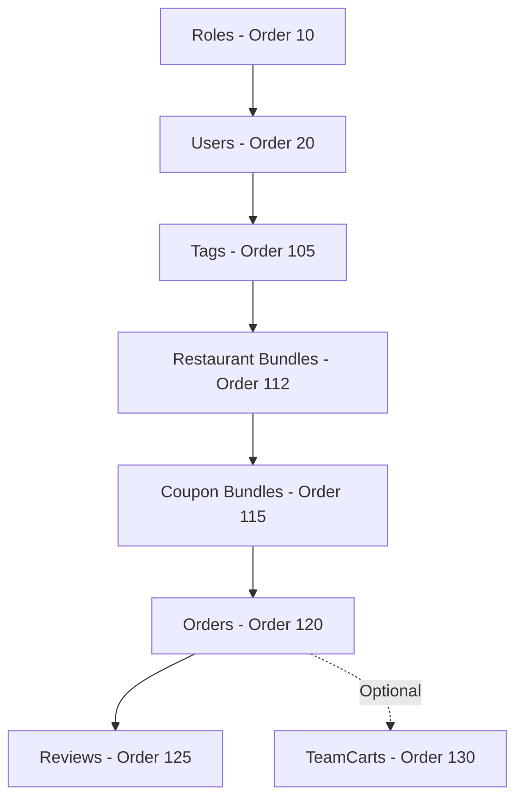

# Seeding Module Extension Design

**Document Version:** 1.0  
**Created:** 2025-10-17  
**Status:** Design Proposal  
**Priority:** High

---

## 📋 Executive Summary

This document outlines the design for extending the YummyZoom seeding module to support business flow records including Orders, Coupons, Reviews, and optionally TeamCarts. The proposed hybrid approach combines JSON bundle-based seeding for simple entities with command-based programmatic seeding for complex workflows.

---

## 🎯 Objectives

1. Enable realistic data seeding for complete business flow testing
2. Support development environments with representative data
3. Maintain consistency with existing seeding architecture
4. Ensure data integrity and business rule enforcement
5. Provide flexibility for various testing scenarios

---

## 📊 Current State Analysis

### Existing Seeding Infrastructure

**Strengths:**
- Well-designed `ISeeder` interface with ordered execution
- `SeedingOrchestrator` manages transaction boundaries
- `SeedingContext` enables data sharing between seeders
- Configuration-based seeder enable/disable
- Options pattern for seeder-specific settings

**Current Capabilities:**
- ✅ Restaurant bundle seeding (JSON-based, declarative)
- ✅ Identity seeding (Users, Roles - programmatic)
- ✅ Tag seeding
- ❌ Coupon seeding
- ❌ Order seeding with realistic histories
- ❌ Review seeding
- ❌ TeamCart seeding

### Entities Analysis

| Entity | Complexity | Dependencies | Creation Pattern |
|--------|-----------|--------------|------------------|
| **Coupon** | Medium | Restaurant, MenuItem (optional), MenuCategory (optional) | Simple factory with value objects |
| **Order** | High | User, Restaurant, MenuItem, DeliveryAddress, Coupon (optional) | Complex factory + `OrderFinancialService` |
| **Review** | Low | Completed Order, User, Restaurant | Simple factory with validation |
| **TeamCart** | High | Multiple Users, Restaurant, MenuItem | Complex collaborative workflow |

---

## 🏗️ Proposed Architecture

### Strategy: Hybrid Approach with Command Integration

We recommend a **tiered hybrid strategy** that leverages different approaches based on entity complexity:

```
┌─────────────────────────────────────────────────────────────┐
│                    Seeding Strategy Tiers                    │
├─────────────────────────────────────────────────────────────┤
│                                                               │
│  Tier 1: Bundle-Based                                        │
│  └─ Coupons (JSON files, declarative)                       │
│                                                               │
│  Tier 2: Command-Based                                       │
│  ├─ Orders (ISender + InitiateOrderCommand)                 │
│  └─ Reviews (ISender + CreateReviewCommand)                 │
│                                                               │
│  Tier 3: Direct Domain (Optional)                           │
│  └─ TeamCarts (Domain factories, if needed)                 │
│                                                               │
└─────────────────────────────────────────────────────────────┘
```

---

## 📦 Tier 1: Coupon Bundle Seeding

### Rationale

Coupons are ideal for bundle-based seeding because they:
- Have clear, declarative structure
- Are restaurant-specific with manageable dependencies
- Require minimal dynamic calculation
- Can be easily reviewed and modified by non-developers

### Implementation Design

#### 1. DTO Structure

**File:** `src/Infrastructure/Persistence/EfCore/Seeding/Bundles/CouponBundleDto.cs`

```csharp
public sealed class CouponBundle
{
    [JsonPropertyName("restaurantSlug")] 
    public string RestaurantSlug { get; set; } = string.Empty;
    
    [JsonPropertyName("code")] 
    public string Code { get; set; } = string.Empty;
    
    [JsonPropertyName("description")] 
    public string Description { get; set; } = string.Empty;
    
    [JsonPropertyName("valueType")] 
    public string ValueType { get; set; } = string.Empty; // "Percentage", "FixedAmount", "FreeItem"
    
    // For Percentage type
    [JsonPropertyName("percentage")] 
    public decimal? Percentage { get; set; }
    
    // For FixedAmount type
    [JsonPropertyName("fixedAmount")] 
    public decimal? FixedAmount { get; set; }
    
    [JsonPropertyName("fixedCurrency")] 
    public string? FixedCurrency { get; set; }
    
    // For FreeItem type
    [JsonPropertyName("freeItemName")] 
    public string? FreeItemName { get; set; } // Resolved by name lookup
    
    [JsonPropertyName("scope")] 
    public string Scope { get; set; } = "WholeOrder"; // "WholeOrder", "SpecificItems", "SpecificCategories"
    
    [JsonPropertyName("itemNames")] 
    public List<string>? ItemNames { get; set; } // For SpecificItems scope
    
    [JsonPropertyName("categoryNames")] 
    public List<string>? CategoryNames { get; set; } // For SpecificCategories scope
    
    [JsonPropertyName("validityStartDate")] 
    public DateTime ValidityStartDate { get; set; }
    
    [JsonPropertyName("validityEndDate")] 
    public DateTime ValidityEndDate { get; set; }
    
    [JsonPropertyName("minOrderAmount")] 
    public decimal? MinOrderAmount { get; set; }
    
    [JsonPropertyName("minOrderCurrency")] 
    public string? MinOrderCurrency { get; set; }
    
    [JsonPropertyName("totalUsageLimit")] 
    public int? TotalUsageLimit { get; set; }
    
    [JsonPropertyName("usageLimitPerUser")] 
    public int? UsageLimitPerUser { get; set; }
    
    [JsonPropertyName("isEnabled")] 
    public bool IsEnabled { get; set; } = true;
}
```

#### 2. Example Bundle File

**File:** `src/Infrastructure/Persistence/EfCore/Seeding/Data/Coupons/summer-sale.coupon.json`

```json
{
  "restaurantSlug": "burger-palace",
  "code": "SUMMER20",
  "description": "20% off summer promotion - valid on all orders over $20",
  "valueType": "Percentage",
  "percentage": 20.0,
  "scope": "WholeOrder",
  "validityStartDate": "2025-06-01T00:00:00Z",
  "validityEndDate": "2025-08-31T23:59:59Z",
  "minOrderAmount": 20.00,
  "minOrderCurrency": "USD",
  "totalUsageLimit": 1000,
  "usageLimitPerUser": 5,
  "isEnabled": true
}
```

#### 3. Seeder Implementation

**File:** `src/Infrastructure/Persistence/EfCore/Seeding/Seeders/CouponSeeders/CouponBundleSeeder.cs`

```csharp
public class CouponBundleSeeder : ISeeder
{
    public string Name => "CouponBundle";
    public int Order => 115; // After RestaurantBundle (112), before Orders

    public async Task<Result> SeedAsync(SeedingContext context, CancellationToken cancellationToken)
    {
        var options = context.Configuration.GetCouponBundleOptions();
        
        // Load JSON bundles from Data/Coupons/
        var bundles = await LoadBundlesAsync(logger, options, cancellationToken);
        
        foreach (var bundle in bundles)
        {
            // Validate bundle
            // Resolve restaurant by slug
            // Resolve menu items/categories by name if needed
            // Create Coupon aggregate
            // Check for duplicates (restaurant + code)
            // Add to repository
        }
        
        return Result.Success();
    }
}
```

#### 4. Configuration Options

**File:** `src/Infrastructure/Persistence/EfCore/Seeding/Options/CouponBundleOptions.cs`

```csharp
public sealed class CouponBundleOptions
{
    public bool ReportOnly { get; set; } = false;
    public bool OverwriteExisting { get; set; } = false;
    public string[] CouponGlobs { get; set; } = new[] { "*.coupon.json" };
}
```

**appsettings.Development.json:**

```json
{
  "Seeding": {
    "SeederSettings": {
      "CouponBundle": {
        "ReportOnly": false,
        "OverwriteExisting": false,
        "CouponGlobs": ["*.coupon.json"]
      }
    }
  }
}
```

---

## 🛒 Tier 2: Order Command-Based Seeding

### Rationale

Orders require command-based seeding because they:
- Involve complex financial calculations via `OrderFinancialService`
- Have strict validation rules and state machine logic
- Need to test the complete order flow
- Benefit from reusing application layer business logic

### Implementation Design

#### 1. Seeder Implementation

**File:** `src/Infrastructure/Persistence/EfCore/Seeding/Seeders/OrderSeeders/OrderSeeder.cs`

```csharp
public class OrderSeeder : ISeeder
{
    private readonly ISender _sender;
    private readonly ApplicationDbContext _dbContext;

    public string Name => "Order";
    public int Order => 120; // After Coupons (115)

    public async Task<Result> SeedAsync(SeedingContext context, CancellationToken cancellationToken)
    {
        var options = context.Configuration.GetOrderSeedingOptions();
        
        // Load dependencies from SharedData or database
        var users = await LoadSeedUsers(context, cancellationToken);
        var restaurants = await LoadSeedRestaurants(context, cancellationToken);
        var coupons = await LoadSeedCoupons(context, cancellationToken);
        
        var seededOrders = new List<Order>();
        
        foreach (var restaurant in restaurants)
        {
            for (int i = 0; i < options.OrdersPerRestaurant; i++)
            {
                // Generate order scenario
                var scenario = GenerateOrderScenario(users, restaurant, coupons, options);
                
                // Create order via command
                var order = await CreateOrderViaCommand(scenario, cancellationToken);
                
                if (order.IsSuccess)
                {
                    // Transition to desired status
                    await TransitionOrderToStatus(order.Value, scenario.TargetStatus, cancellationToken);
                    seededOrders.Add(order.Value);
                }
            }
        }
        
        // Store for Review seeder
        context.SharedData["SeededOrders"] = seededOrders;
        
        return Result.Success();
    }
    
    private async Task<Result<Order>> CreateOrderViaCommand(OrderScenario scenario, CancellationToken ct)
    {
        var command = new InitiateOrderCommand(
            CustomerId: scenario.User.Id.Value,
            RestaurantId: scenario.Restaurant.Id.Value,
            Items: scenario.Items,
            DeliveryAddress: scenario.DeliveryAddress,
            PaymentMethod: scenario.PaymentMethod,
            SpecialInstructions: scenario.SpecialInstructions,
            CouponCode: scenario.CouponCode,
            TipAmount: scenario.TipAmount
        );
        
        var result = await _sender.Send(command, ct);
        
        if (result.IsSuccess)
        {
            var order = await _dbContext.Orders
                .FirstOrDefaultAsync(o => o.Id == result.Value.OrderId, ct);
            return Result.Success(order);
        }
        
        return Result.Failure<Order>(result.Error);
    }
    
    private async Task TransitionOrderToStatus(Order order, OrderStatus targetStatus, CancellationToken ct)
    {
        // Use domain methods to transition through states
        switch (targetStatus)
        {
            case OrderStatus.Delivered:
                await TransitionToDelivered(order, ct);
                break;
            case OrderStatus.Accepted:
                order.Accept(DateTime.UtcNow.AddHours(1));
                break;
            case OrderStatus.Cancelled:
                order.Cancel();
                break;
            // ... other states
        }
        
        await _dbContext.SaveChangesAsync(ct);
    }
}
```

#### 2. Configuration Options

**File:** `src/Infrastructure/Persistence/EfCore/Seeding/Options/OrderSeedingOptions.cs`

```csharp
public sealed class OrderSeedingOptions
{
    public int OrdersPerRestaurant { get; set; } = 10;
    
    public Dictionary<string, int> StatusDistribution { get; set; } = new()
    {
        { "Delivered", 60 },      // 60% completed orders
        { "Accepted", 10 },       // 10% accepted
        { "Preparing", 10 },      // 10% preparing
        { "ReadyForDelivery", 5 },// 5% ready
        { "Cancelled", 10 },      // 10% cancelled
        { "Rejected", 5 }         // 5% rejected
    };
    
    public decimal CouponUsagePercentage { get; set; } = 30; // 30% of orders use coupons
    public decimal OnlinePaymentPercentage { get; set; } = 70; // 70% online, 30% COD
    
    public bool CreateRealisticTimestamps { get; set; } = true;
    public int OrderHistoryDays { get; set; } = 90; // Past 90 days
}
```

**appsettings.Development.json:**

```json
{
  "Seeding": {
    "SeederSettings": {
      "Order": {
        "OrdersPerRestaurant": 15,
        "StatusDistribution": {
          "Delivered": 60,
          "Accepted": 10,
          "Preparing": 10,
          "ReadyForDelivery": 5,
          "Cancelled": 10,
          "Rejected": 5
        },
        "CouponUsagePercentage": 30,
        "OnlinePaymentPercentage": 70,
        "CreateRealisticTimestamps": true,
        "OrderHistoryDays": 90
      }
    }
  }
}
```

#### 3. Order Scenario Generator

```csharp
private class OrderScenario
{
    public User User { get; set; }
    public Restaurant Restaurant { get; set; }
    public List<OrderItemDto> Items { get; set; }
    public DeliveryAddressDto DeliveryAddress { get; set; }
    public string PaymentMethod { get; set; }
    public string? SpecialInstructions { get; set; }
    public string? CouponCode { get; set; }
    public decimal? TipAmount { get; set; }
    public OrderStatus TargetStatus { get; set; }
    public DateTime OrderTimestamp { get; set; }
}

private OrderScenario GenerateOrderScenario(
    List<User> users, 
    Restaurant restaurant, 
    List<Coupon> coupons,
    OrderSeedingOptions options)
{
    var random = new Random();
    
    // Select random user
    var user = users[random.Next(users.Count)];
    
    // Determine target status based on distribution
    var targetStatus = SelectStatusByDistribution(options.StatusDistribution, random);
    
    // Generate realistic timestamp
    var timestamp = GenerateRealisticTimestamp(targetStatus, options, random);
    
    // Select payment method
    var isOnlinePayment = random.Next(100) < options.OnlinePaymentPercentage;
    var paymentMethod = isOnlinePayment ? "CreditCard" : "CashOnDelivery";
    
    // Select items from restaurant menu
    var items = GenerateOrderItems(restaurant, random);
    
    // Apply coupon randomly
    string? couponCode = null;
    if (random.Next(100) < options.CouponUsagePercentage)
    {
        var validCoupons = coupons.Where(c => c.RestaurantId == restaurant.Id && c.IsValidForUse(timestamp)).ToList();
        if (validCoupons.Any())
        {
            couponCode = validCoupons[random.Next(validCoupons.Count)].Code;
        }
    }
    
    // Generate delivery address
    var deliveryAddress = GenerateDeliveryAddress(user, random);
    
    // Add tip for some orders
    decimal? tip = random.Next(100) < 40 ? (decimal?)random.Next(2, 10) : null;
    
    return new OrderScenario
    {
        User = user,
        Restaurant = restaurant,
        Items = items,
        DeliveryAddress = deliveryAddress,
        PaymentMethod = paymentMethod,
        CouponCode = couponCode,
        TipAmount = tip,
        TargetStatus = targetStatus,
        OrderTimestamp = timestamp
    };
}
```

---

## ⭐ Tier 2: Review Command-Based Seeding

### Rationale

Reviews benefit from command-based seeding because they:
- Must reference completed orders
- Have strict validation (order must be delivered)
- Are relatively simple but need business rule enforcement

### Implementation Design

#### 1. Seeder Implementation

**File:** `src/Infrastructure/Persistence/EfCore/Seeding/Seeders/ReviewSeeders/ReviewSeeder.cs`

```csharp
public class ReviewSeeder : ISeeder
{
    private readonly ISender _sender;
    private readonly IReviewRepository _reviews;
    private readonly ApplicationDbContext _dbContext;

    public string Name => "Review";
    public int Order => 125; // After Orders (120)

    public async Task<Result> SeedAsync(SeedingContext context, CancellationToken cancellationToken)
    {
        var options = context.Configuration.GetReviewSeedingOptions();
        
        // Get delivered orders from SharedData or database
        var deliveredOrders = await LoadDeliveredOrders(context, cancellationToken);
        
        // Calculate how many reviews to create
        var reviewCount = (int)(deliveredOrders.Count * options.ReviewPercentage / 100.0);
        var ordersToReview = deliveredOrders
            .OrderBy(_ => Guid.NewGuid()) // Random selection
            .Take(reviewCount)
            .ToList();
        
        foreach (var order in ordersToReview)
        {
            // Check if review already exists
            var existing = await _reviews.GetByCustomerAndRestaurantAsync(
                order.CustomerId.Value, 
                order.RestaurantId.Value, 
                cancellationToken);
            
            if (existing != null) continue;
            
            // Generate review
            var rating = GenerateRealisticRating(options);
            var comment = GenerateComment(rating, options);
            
            var command = new CreateReviewCommand(
                OrderId: order.Id.Value,
                RestaurantId: order.RestaurantId.Value,
                Rating: rating,
                Title: null,
                Comment: comment
            )
            {
                UserId = order.CustomerId
            };
            
            // Create review via command (handles validation)
            var result = await _sender.Send(command, cancellationToken);
            
            // Optionally add restaurant reply
            if (result.IsSuccess && ShouldAddReply(options))
            {
                var review = await _reviews.GetByIdAsync(result.Value.ReviewId, cancellationToken);
                var reply = GenerateRestaurantReply(rating);
                review?.AddReply(reply);
                await _dbContext.SaveChangesAsync(cancellationToken);
            }
        }
        
        return Result.Success();
    }
    
    private int GenerateRealisticRating(ReviewSeedingOptions options)
    {
        var random = new Random();
        var roll = random.Next(100);
        
        // Realistic distribution: most reviews are 4-5 stars
        return roll switch
        {
            < 5 => 1,   // 5%
            < 10 => 2,  // 5%
            < 20 => 3,  // 10%
            < 50 => 4,  // 30%
            _ => 5      // 50%
        };
    }
}
```

#### 2. Configuration Options

**File:** `src/Infrastructure/Persistence/EfCore/Seeding/Options/ReviewSeedingOptions.cs`

```csharp
public sealed class ReviewSeedingOptions
{
    public decimal ReviewPercentage { get; set; } = 40; // 40% of delivered orders get reviews
    public decimal ReplyPercentage { get; set; } = 50;  // 50% of reviews get restaurant replies
    public bool GenerateComments { get; set; } = true;
    public string[] PositiveComments { get; set; } = new[]
    {
        "Excellent food and fast delivery!",
        "Amazing quality, will order again!",
        "Best burger in town!",
        "Great portions and delicious!",
        "Highly recommended!"
    };
    public string[] NegativeComments { get; set; } = new[]
    {
        "Food arrived cold.",
        "Took too long to deliver.",
        "Not as expected.",
        "Portion was too small.",
        "Quality could be better."
    };
}
```

---

## 🔄 Tier 3: TeamCart Seeding (Optional)

### Rationale

TeamCarts are optional because:
- They represent a less common use case
- High complexity with multi-user coordination
- Can be added later if needed for specific testing scenarios

### Design Considerations (If Implemented)

- Use direct domain model creation
- Simulate multiple users adding items
- Test payment collection workflows
- Test conversion to orders

---

## 🔢 Execution Order & Dependencies



**Execution Sequence:**
1. **Order 10**: Roles (existing)
2. **Order 20**: Users (existing)
3. **Order 105**: Tags (existing)
4. **Order 112**: Restaurant Bundles (existing)
5. **Order 115**: ⭐ **Coupon Bundles** (NEW)
6. **Order 120**: ⭐ **Orders** (NEW)
7. **Order 125**: ⭐ **Reviews** (NEW)
8. **Order 130**: TeamCarts (OPTIONAL)

---

## 🔑 Key Technical Decisions

### 1. Dependency Resolution via SharedData

The `SeedingContext.SharedData` dictionary enables seeders to share data:

```csharp
// In RestaurantBundleSeeder
context.SharedData["SeededRestaurants"] = restaurantList;
context.SharedData["SeededMenuItems"] = menuItemsByRestaurant;

// In CouponBundleSeeder
var restaurants = context.SharedData["SeededRestaurants"] as List<Restaurant>;
var menuItems = context.SharedData["SeededMenuItems"] as Dictionary<Guid, List<MenuItem>>;

// In OrderSeeder
var users = await LoadSeedUsers(context);
var restaurants = context.SharedData["SeededRestaurants"] as List<Restaurant>;

// In ReviewSeeder
var orders = context.SharedData["SeededOrders"] as List<Order>;
```

### 2. Idempotency Strategies

Each seeder must handle re-execution gracefully:

| Seeder | Idempotency Strategy |
|--------|---------------------|
| **CouponBundle** | Check for existing coupon by `RestaurantId + Code` |
| **Order** | Check order count per restaurant or skip if threshold met |
| **Review** | Check for existing review by `CustomerId + RestaurantId` |

```csharp
// Example: Coupon idempotency
var existingCoupon = await _coupons.GetByRestaurantAndCodeAsync(
    restaurantId, 
    bundle.Code, 
    cancellationToken);

if (existingCoupon != null)
{
    if (options.OverwriteExisting)
    {
        // Update existing
    }
    else
    {
        logger.LogInformation("Coupon {Code} already exists, skipping", bundle.Code);
        continue;
    }
}
```

### 3. Transaction Management

Following the existing pattern, each seeder runs in its own transaction:

```csharp
// Handled by SeedingOrchestrator
await using var tx = await _dbContext.Database.BeginTransactionAsync(cancellationToken);
var result = await seeder.SeedAsync(context, cancellationToken);
if (result.IsFailure)
{
    await tx.RollbackAsync(cancellationToken);
    return;
}
await tx.CommitAsync(cancellationToken);
```

### 4. Error Handling Philosophy

- **Log warnings** for individual entity failures
- **Continue processing** other entities
- **Don't fail** the entire seeding pipeline
- Use **Result pattern** consistently

```csharp
try
{
    var result = await CreateOrderViaCommand(scenario, cancellationToken);
    if (result.IsFailure)
    {
        logger.LogWarning("Failed to create order: {Error}", result.Error);
        failedCount++;
        continue; // Move to next order
    }
    successCount++;
}
catch (Exception ex)
{
    logger.LogError(ex, "Unexpected error creating order");
    errorCount++;
}

logger.LogInformation(
    "Order seeding completed: {Success} success, {Failed} failed, {Error} errors",
    successCount, failedCount, errorCount);
```

### 5. Performance Considerations

**Optimization Strategies:**

```csharp
// 1. Batch database queries
var restaurants = await context.DbContext.Restaurants
    .Include(r => r.Menus)
        .ThenInclude(m => m.Categories)
            .ThenInclude(c => c.Items)
    .AsNoTracking()  // Read-only queries
    .ToListAsync(cancellationToken);

// 2. Clear domain events to avoid unnecessary processing
order.ClearDomainEvents();

// 3. Bulk save changes periodically
if (processedCount % 50 == 0)
{
    await context.DbContext.SaveChangesAsync(cancellationToken);
    context.DbContext.ChangeTracker.Clear();
}

// 4. Use compiled queries for repeated operations
private static readonly Func<ApplicationDbContext, Guid, Task<Restaurant?>> GetRestaurantQuery =
    EF.CompileAsyncQuery((ApplicationDbContext ctx, Guid id) => 
        ctx.Restaurants.FirstOrDefault(r => r.Id == RestaurantId.Create(id)));
```

### 6. Command Handler Integration

**Authentication Handling:**

For command-based seeding, we need to handle authentication context:

```csharp
public class SeedingUserContext : IUser
{
    private readonly UserId _userId;
    
    public SeedingUserContext(UserId userId)
    {
        _userId = userId;
    }
    
    public string? Id => _userId.Value.ToString();
    public UserId? DomainUserId => _userId;
    public string? Email => null;
    public bool IsAuthenticated => true;
    
    // ... implement other IUser members
}

// In OrderSeeder
private async Task<Result<Order>> CreateOrderViaCommand(OrderScenario scenario, CancellationToken ct)
{
    // Temporarily set user context for command execution
    var originalUser = _userService.CurrentUser;
    _userService.CurrentUser = new SeedingUserContext(scenario.User.Id);
    
    try
    {
        var command = new InitiateOrderCommand(/* ... */);
        return await _sender.Send(command, ct);
    }
    finally
    {
        _userService.CurrentUser = originalUser;
    }
}
```

**Alternative: Bypass Authorization**

Configure authorization policies to allow seeding context:

```csharp
// In DependencyInjection
services.AddAuthorization(options =>
{
    options.AddPolicy("SeedingContext", policy =>
        policy.RequireAssertion(context => 
            context.Resource is SeedingContext));
});
```

---

## 📁 File Structure

```
src/Infrastructure/Persistence/EfCore/Seeding/
├── Bundles/
│   ├── RestaurantBundleDto.cs          (existing)
│   ├── RestaurantBundleValidation.cs   (existing)
│   ├── CouponBundleDto.cs              ⭐ NEW
│   └── CouponBundleValidation.cs       ⭐ NEW
│
├── Data/
│   ├── Restaurants/                    (existing)
│   │   └── *.restaurant.json
│   ├── Coupons/                        ⭐ NEW
│   │   └── *.coupon.json
│   └── Templates/                      (existing)
│
├── Options/
│   ├── RestaurantBundleOptions.cs      (existing)
│   ├── CouponBundleOptions.cs          ⭐ NEW
│   ├── OrderSeedingOptions.cs          ⭐ NEW
│   └── ReviewSeedingOptions.cs         ⭐ NEW
│
├── Seeders/
│   ├── IdentitySeeders/                (existing)
│   │   ├── RoleSeeder.cs
│   │   └── UserSeeder.cs
│   ├── RestaurantSeeders/              (existing)
│   │   ├── RestaurantBundleSeeder.cs
│   │   └── TagSeeder.cs
│   ├── CouponSeeders/                  ⭐ NEW
│   │   └── CouponBundleSeeder.cs
│   ├── OrderSeeders/                   ⭐ NEW
│   │   ├── OrderSeeder.cs
│   │   └── OrderScenarioGenerator.cs
│   └── ReviewSeeders/                  ⭐ NEW
│       └── ReviewSeeder.cs
│
├── ISeeder.cs                          (existing)
├── SeedingConfiguration.cs             (existing)
├── SeedingConfigurationExtensions.cs   (existing - extend)
├── SeedingContext.cs                   (existing)
└── SeedingOrchestrator.cs              (existing)
```

---

## 🚀 Implementation Roadmap

### Phase 1: Foundation (Week 1)

**Goal:** Set up infrastructure for new seeders

- [ ] Extend `SeedingConfigurationExtensions` for new options
- [ ] Create base classes/utilities for command-based seeding
- [ ] Set up directory structure
- [ ] Update DI registration

**Deliverables:**
- Extended configuration system
- Directory structure in place
- Updated `DependencyInjection.cs`

---

### Phase 2: Coupon Bundle Seeding (Week 1-2)

**Goal:** Implement declarative coupon seeding

- [ ] Create `CouponBundleDto.cs` and related DTOs
- [ ] Implement `CouponBundleValidation.cs`
- [ ] Build `CouponBundleSeeder.cs`
- [ ] Create sample coupon JSON files (5-10 examples)
- [ ] Add `CouponBundleOptions` configuration
- [ ] Write unit tests for validation logic
- [ ] Test idempotency

**Deliverables:**
- Working coupon bundle seeding
- Sample coupon files for each restaurant
- Documentation updates

**Sample Coupon Files to Create:**
1. `first-order-discount.coupon.json` - 15% off for new customers
2. `weekend-special.coupon.json` - $5 off weekend orders
3. `free-appetizer.coupon.json` - Free appetizer with purchase
4. `bulk-order-discount.coupon.json` - 20% off orders over $50
5. `category-specific.coupon.json` - 10% off desserts

---

### Phase 3: Order Seeding (Week 2-3)

**Goal:** Implement realistic order history generation

- [ ] Create `OrderSeeder.cs` with command integration
- [ ] Implement `OrderSeedingOptions` configuration
- [ ] Build `OrderScenarioGenerator.cs` for realistic scenarios
- [ ] Integrate with `OrderFinancialService`
- [ ] Add state transition logic
- [ ] Handle authentication context for commands
- [ ] Test various order statuses
- [ ] Optimize performance with batch operations

**Deliverables:**
- Working order seeding with realistic distributions
- Support for all order statuses
- Proper financial calculations
- Performance metrics

**Key Scenarios to Support:**
- Cash on Delivery orders
- Online payment orders
- Orders with coupons applied
- Orders with tips
- Orders with customizations
- Orders in various states (Delivered, In-Progress, Cancelled)
- Realistic timestamp distribution (past 90 days)

---

### Phase 4: Review Seeding (Week 3)

**Goal:** Add authentic review generation

- [ ] Create `ReviewSeeder.cs` with command integration
- [ ] Implement `ReviewSeedingOptions` configuration
- [ ] Build realistic rating distribution
- [ ] Generate contextual comments
- [ ] Add restaurant replies for some reviews
- [ ] Test review authenticity constraints

**Deliverables:**
- Working review seeding
- Realistic rating distribution (skewed toward 4-5 stars)
- Varied comments library
- Restaurant replies

**Comment Templates:**

```csharp
// Positive Comments by Rating
5-star: "Outstanding!", "Best ever!", "Perfection!", "Highly recommend!"
4-star: "Very good", "Solid choice", "Enjoyed it", "Will order again"
3-star: "Decent", "Average", "It was okay", "Nothing special"
2-star: "Disappointing", "Not great", "Expected better", "Below average"
1-star: "Terrible", "Awful experience", "Do not recommend", "Very poor"

// Restaurant Replies
"Thank you for your feedback!"
"We're glad you enjoyed your meal!"
"We apologize for the experience. Please contact us to make it right."
"Thank you for choosing us! We look forward to serving you again."
```

---

### Phase 5: Testing & Refinement (Week 4)

**Goal:** Ensure quality and reliability

- [ ] Integration testing of full seeding pipeline
- [ ] Performance testing with large datasets
- [ ] Verify idempotency across multiple runs
- [ ] Validate data integrity and relationships
- [ ] Test configuration options
- [ ] Error handling and recovery
- [ ] Documentation and examples

**Test Scenarios:**
1. Fresh database seeding
2. Re-running seeding (idempotency)
3. Partial seeding (some seeders disabled)
4. Large volume seeding (100+ restaurants, 1000+ orders)
5. Configuration variations
6. Error conditions (invalid data, missing dependencies)

**Deliverables:**
- Comprehensive test suite
- Performance benchmarks
- Updated documentation
- Sample configurations for different scenarios

---

### Phase 6: Optional Enhancements (Future)

**Goal:** Advanced features if needed

- [ ] TeamCart seeding
- [ ] Support ticket seeding
- [ ] Account transaction seeding
- [ ] Advanced scenario templates
- [ ] Seeding report generation
- [ ] Visual seeding dashboard
- [ ] External data import capabilities

---

## 📊 Success Metrics

### Functional Requirements

✅ **Completeness:**
- Coupon seeding covers all value types and scopes
- Order seeding supports all payment methods and statuses
- Review seeding maintains authenticity constraints
- All seeders handle errors gracefully

✅ **Correctness:**
- Financial calculations are accurate
- Business rules are enforced
- Data relationships are valid
- State transitions follow proper workflows

✅ **Idempotency:**
- Re-running seeding doesn't create duplicates
- Existing data is preserved or updated appropriately
- Consistent results across multiple executions

### Non-Functional Requirements

⚡ **Performance:**
- Seed 10 restaurants with full data in < 30 seconds
- Seed 1000 orders in < 2 minutes
- Memory usage stays under 500 MB
- No N+1 query problems

🔧 **Maintainability:**
- Clear separation of concerns
- Reusable components
- Comprehensive logging
- Easy to extend for new entities

📖 **Usability:**
- Clear configuration options
- Helpful error messages
- Sample files provided
- Documentation for all features

---

## 🎯 Configuration Examples

### Development Environment

**Goal:** Rich test data for feature development

```json
{
  "Seeding": {
    "Profile": "Development",
    "EnableIdempotentSeeding": true,
    "SeedTestData": true,
    "EnabledSeeders": {
      "Role": true,
      "User": true,
      "Tag": true,
      "RestaurantBundle": true,
      "CouponBundle": true,
      "Order": true,
      "Review": true,
      "TeamCart": false
    },
    "SeederSettings": {
      "RestaurantBundle": {
        "RestaurantGlobs": ["*.restaurant.json"],
        "UpdateDescriptions": true,
        "UpdateBasePrices": false
      },
      "CouponBundle": {
        "CouponGlobs": ["*.coupon.json"],
        "OverwriteExisting": false
      },
      "Order": {
        "OrdersPerRestaurant": 20,
        "StatusDistribution": {
          "Delivered": 50,
          "Accepted": 15,
          "Preparing": 15,
          "ReadyForDelivery": 5,
          "Cancelled": 10,
          "Rejected": 5
        },
        "CouponUsagePercentage": 35,
        "OnlinePaymentPercentage": 70,
        "CreateRealisticTimestamps": true,
        "OrderHistoryDays": 90
      },
      "Review": {
        "ReviewPercentage": 45,
        "ReplyPercentage": 60,
        "GenerateComments": true
      }
    }
  }
}
```

### Demo/Staging Environment

**Goal:** Realistic data for demos and user testing

```json
{
  "Seeding": {
    "Profile": "Demo",
    "EnableIdempotentSeeding": true,
    "SeedTestData": true,
    "SeederSettings": {
      "Order": {
        "OrdersPerRestaurant": 50,
        "StatusDistribution": {
          "Delivered": 70,
          "Accepted": 5,
          "Preparing": 5,
          "ReadyForDelivery": 5,
          "Cancelled": 10,
          "Rejected": 5
        },
        "OrderHistoryDays": 180
      },
      "Review": {
        "ReviewPercentage": 60,
        "ReplyPercentage": 80
      }
    }
  }
}
```

### Testing Environment

**Goal:** Minimal data for automated tests

```json
{
  "Seeding": {
    "Profile": "Testing",
    "EnableIdempotentSeeding": true,
    "SeedTestData": true,
    "SeederSettings": {
      "Order": {
        "OrdersPerRestaurant": 5,
        "StatusDistribution": {
          "Delivered": 60,
          "Cancelled": 40
        }
      },
      "Review": {
        "ReviewPercentage": 80,
        "ReplyPercentage": 50
      }
    }
  }
}
```

---

## ⚠️ Risks & Mitigations

### Risk 1: Command Authorization Issues

**Problem:** Commands require authentication context that may not exist during seeding.

**Mitigation:**
- Create `SeedingUserContext` implementation of `IUser`
- Temporarily inject user context during command execution
- Alternative: Add seeding-specific authorization policy
- Document approach clearly

### Risk 2: Performance Degradation

**Problem:** Seeding thousands of orders via commands may be slow.

**Mitigation:**
- Implement batch operations
- Use `AsNoTracking()` for read-only queries
- Clear change tracker periodically
- Profile and optimize bottlenecks
- Provide configurable limits

### Risk 3: Financial Calculation Accuracy

**Problem:** Pre-computed financial values may not match `OrderFinancialService` calculations.

**Mitigation:**
- Always use `OrderFinancialService` for calculations
- Validate totals after creation
- Log discrepancies for investigation
- Add integration tests for financial scenarios

### Risk 4: Data Dependency Issues

**Problem:** Seeders may fail if dependencies aren't seeded first.

**Mitigation:**
- Clear execution order with numeric ordering
- Use `SharedData` for dependency passing
- Implement `CanSeedAsync` checks
- Graceful degradation if optional dependencies missing

### Risk 5: Idempotency Bugs

**Problem:** Re-running seeding creates duplicates or corrupts data.

**Mitigation:**
- Comprehensive idempotency tests
- Use unique constraint checks
- Transaction rollback on errors
- Clear documentation of idempotency strategy

### Risk 6: Maintenance Burden

**Problem:** Changes to domain models break seeders.

**Mitigation:**
- Use domain services and commands (self-updating)
- Comprehensive test coverage
- Clear documentation
- Regular seeder maintenance in definition of done

---

## 🔮 Future Enhancements

### 1. Seeding Templates

Create reusable scenario templates:

```json
{
  "template": "Pizza Restaurant Complete",
  "includes": [
    "restaurant-bundle",
    "coupons",
    "orders",
    "reviews"
  ],
  "parameters": {
    "restaurantName": "{{name}}",
    "orderCount": 50,
    "reviewPercentage": 60
  }
}
```

### 2. Seeding Dashboard

Web UI for:
- Viewing seeding status
- Configuring options
- Triggering selective seeding
- Viewing generated data
- Resetting data

### 3. Advanced Scenario Generation

- Machine learning-based realistic data
- Geographic-aware address generation
- Seasonal patterns in orders
- Customer behavior patterns

### 4. External Data Import

- Import from CSV/Excel
- Sync from production (anonymized)
- Generate from API specifications
- Import from third-party services

### 5. Seeding Analytics

- Report generation
- Data quality metrics
- Coverage analysis
- Performance monitoring

### 6. TeamCart Workflow Seeding

Complete implementation including:
- Multi-user cart creation
- Payment collection simulation
- Conversion to orders
- Expiration scenarios

---

## 📚 References

### Related Documents

- `Docs/Architecture/YummyZoom_Project_Documentation.md` - Overall project structure
- `Docs/Development-Guidelines/Domain_Layer_Guidelines.md` - Domain model design
- `Docs/Development-Guidelines/Application_Layer_Guidelines.md` - Application service patterns
- `Docs/Development-Guidelines/Authoring_Restaurant_Bundles.md` - Bundle file format reference
- `Docs/Aggregate-Documents/10-Order-Aggregate.md` - Order domain model
- `Docs/Aggregate-Documents/11-Coupon-Aggregate.md` - Coupon domain model
- `Docs/Aggregate-Documents/12-Review-Aggregate.md` - Review domain model
- `Docs/Aggregate-Documents/14-TeamCart-Aggregate.md` - TeamCart domain model

### External Resources

- [Bogus Library](https://github.com/bchavez/Bogus) - Consider for realistic fake data generation
- [EF Core Bulk Extensions](https://github.com/borisdj/EFCore.BulkExtensions) - For performance optimization
- [FluentValidation](https://fluentvalidation.net/) - Already in use, extend for bundle validation

---

## ✅ Acceptance Criteria

### Coupon Bundle Seeding

- [ ] Supports all three value types (Percentage, FixedAmount, FreeItem)
- [ ] Supports all three scope types (WholeOrder, SpecificItems, SpecificCategories)
- [ ] Validates bundle JSON files before processing
- [ ] Handles currency properly
- [ ] Resolves restaurant and item references by name
- [ ] Implements idempotency (no duplicates on re-run)
- [ ] Logs clear progress and errors
- [ ] Sample files provided for all coupon types

### Order Seeding

- [ ] Creates orders via `InitiateOrderCommand`
- [ ] Supports both payment methods (Online, COD)
- [ ] Distributes orders across configured statuses
- [ ] Applies coupons based on configuration
- [ ] Generates realistic timestamps
- [ ] Includes order customizations
- [ ] Handles authentication context properly
- [ ] Uses `OrderFinancialService` for calculations
- [ ] Transitions orders through states correctly
- [ ] Stores order references for Review seeder
- [ ] Performance: 100 orders in < 60 seconds

### Review Seeding

- [ ] Creates reviews via `CreateReviewCommand`
- [ ] Only reviews delivered orders
- [ ] Generates realistic rating distribution
- [ ] Creates contextual comments
- [ ] Adds restaurant replies based on configuration
- [ ] Maintains one review per customer+restaurant
- [ ] Respects review percentage configuration
- [ ] Logs clear progress

### General Requirements

- [ ] All seeders implement `ISeeder` interface
- [ ] Proper execution order maintained
- [ ] Transaction management per seeder
- [ ] Configuration via `appsettings.json`
- [ ] Comprehensive error handling
- [ ] Logging at appropriate levels
- [ ] Documentation complete
- [ ] Unit tests for validation logic
- [ ] Integration tests for full pipeline
- [ ] No breaking changes to existing seeders

---

## 📝 Conclusion

This design provides a comprehensive, maintainable, and extensible approach to seeding business flow data in YummyZoom. By leveraging a hybrid strategy—bundle-based for simple entities and command-based for complex workflows—we achieve the right balance between simplicity and robustness.

The phased implementation plan ensures steady progress with clear milestones, while the configuration-driven approach provides flexibility for different environments. The emphasis on idempotency, error handling, and performance ensures the seeding system is production-ready.

---

**Document Status:** Ready for Review  
**Next Steps:** Technical review → Implementation → Testing → Documentation finalization
