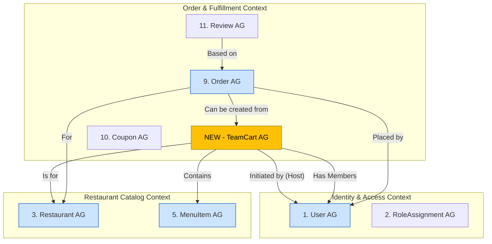

### **Feature Specification: YummyZoom Team Cart**

#### 1. Feature Overview

**Team Cart** is a collaborative ordering feature designed to eliminate the friction of placing group food orders. It allows a user (the "Host") to initiate a shared cart for a single restaurant, invite others ("Guests") via a simple link, and collectively add items. The feature's key innovation lies in its flexible and transparent payment-splitting options, including handling mixed payments like e-wallets and Cash on Delivery (COD) within a single order.

#### 2. Problem Statement & Target Audience

* **Problem:** Organizing group lunch or dinner orders for university students and office workers is a chaotic, manual process involving endless messaging, tracking individual requests, and awkwardly collecting money.
* **Target Audience:** University students and office workers in urban centers like Hanoi. This demographic frequently orders food in groups, is budget-conscious, and highly values convenience and time-saving solutions.
* **Goal:** To transform group ordering from a logistical chore into a seamless, integrated, and even social experience, thereby increasing user acquisition, average order value, and platform loyalty.

#### 3. Core User Stories

* **As a Host,** I want to start a group order from a restaurant and share a simple link with my friends/colleagues so that we can easily order together without back-and-forth messages.
* **As a Guest,** I want to click a link, add my own items to a shared cart, and see what others are ordering in real-time so that I can easily participate in a group order.
* **As a Host,** I want to offer flexible payment options, including letting each person pay for their own items with their preferred method (card, e-wallet, or cash), so that I don't have to chase people for money.
* **As a Driver,** I want to see a single, clear amount of cash to collect upon delivery, regardless of how many people paid online, so that my drop-off is fast and simple.
* **As a Restaurant,** I want to receive a single, consolidated group order to my system so that my kitchen workflow is not disrupted and I can benefit from larger order sizes.

#### 4. Detailed Functional Breakdown

##### 4.1. Initiating and Managing the Team Cart (Host Flow)

1. **Start a Team Cart:** On any restaurant menu screen, a new button, **"Start a Team Cart"**, will be present next to the standard "Add to Cart".
2. **Create Shareable Link:** Tapping this button instantly creates a unique, time-limited link to the shared cart.
3. **Share Invitation:** The Host is prompted to share this link via native sharing options (Zalo, Messenger, SMS, etc.).
4. **Host Controls:** The Host can see who has joined the cart, set an optional order deadline (e.g., "Order by 11:30 AM"), and has the final authority to proceed to checkout.

##### 4.2. Joining and Collaborating (Guest Flow)

1. **Join via Link:** Clicking the shared link opens the YummyZoom app directly to the restaurant's menu.
2. **Real-Time Collaborative Cart:** A persistent banner ("You've joined [Host's Name]'s Team Cart") is displayed. As Guests add items, the cart updates in real-time for all participants. Each item in the cart is tagged with the name or avatar of the person who added it.

##### 4.3. Checkout and Payment (The Core Innovation)

When the Host proceeds to checkout, they choose one of the following billing methods:

* **Option 1: Host Pays All**
  * The Host pays the entire bill using their chosen payment method. This is the simplest flow.

* **Option 2: Split Bill Evenly**
  * The total cost is divided equally among all participants. Each member receives a notification to pay their share online. The order proceeds once all shares are paid. (Primarily for online payments).

* **Option 3: Pay for Your Own Items (Mixed Payment Model)**
    1. **Individual Payment Prompt:** The system calculates each member's individual subtotal. A push notification is sent to each Guest: "Your YummyZoom order is ready for payment."
    2. **Guest Payment Choice:** Each Guest chooses their payment method for their specific amount:
        * **Online Payment:** Credit Card, E-wallet (MoMo, ZaloPay, etc.).
        * **Cash on Delivery (COD):** The user commits to paying their share in cash to the Host/Driver.
    3. **The "Trust Hub" - Host Confirmation Screen:** Before placing the order, the Host sees a clear, non-editable summary:
        * Total Order Value.
        * A list of members who have **Paid Online** and the total amount paid.
        * A list of members who will **Pay with Cash** and their individual amounts.
        * A final, prominent figure: **"Total Cash to Collect on Delivery"**.
    4. **Order Placement:** The Host confirms the order. The system places the order with the restaurant and sends the simplified instruction to the driver (e.g., "Collect 300,000₫ cash"). The Host is the guarantor for the cash portion of the payment.

#### 5. UI/UX Considerations

* **Real-time Cart:** The shared cart UI must clearly display items tagged by user (e.g., with small avatars).
* **Clear Status Indicators:** The Host's view must show payment status for each member (e.g., "Invited," "Added Items," "Paid ✅," "Will Pay with Cash 💵").
* **Notifications:** A robust notification system is critical for inviting, reminding, and prompting users for payment.
* **The "Trust Hub" UI:** The Host's final confirmation screen must be exceptionally clear and easy to understand to build trust in the system.

#### 6. Future Enhancements (Phase 2)

* **The "Lunch Train":** Allow groups to make a Team Cart a recurring event (e.g., "every Friday at 11 AM"), automatically sending out reminders.
* **Smart Coupon Suggestions:** The system can analyze the group cart in real-time and suggest adding an item to unlock a group-specific coupon (e.g., "Add one more drink to get 20% off the entire order!").
* **Post-Delivery Nudge:** A "Request Money" feature for the Host to send a digital payment link to a COD payer who forgot to pay them back.

#### 7. Success Metrics

* **Adoption Rate:** Percentage of active users who initiate or join a Team Cart.
* **Increase in Average Order Value (AOV):** Compare the AOV of Team Cart orders vs. individual orders.
* **User Acquisition:** Track new user sign-ups originating from Team Cart invitation links (viral coefficient).
* **Feature Retention:** Percentage of groups that place a second Team Cart order within 30 days.
* **Payment Method Mix:** Analyze the popularity of the "Pay for Your Own Items" feature and the ratio of COD vs. online payments within it.

===================================================================

===================================================================

Here are my suggestions and considerations, structured as a series of modifications and new additions to the domain design.

---

### High-Level Strategy

1. **Introduce a New Aggregate: `TeamCart`**. This is the core of the solution. It will be a stateful, transactional aggregate responsible for managing the entire lifecycle of a group order before it's confirmed.
2. **Modify the `Order` Aggregate**. We need a way for an `Order` to be created *from* a `TeamCart`, inheriting its data while remaining an immutable record of the final purchase.
3. **Define a New Read Model for Real-Time Collaboration**. To support the real-time view of the cart for all members, a dedicated read model is essential for performance.

---

### 1. New Aggregate: `TeamCart`

This will be a new, first-class citizen in your domain. It lives within the **Order & Fulfillment Context**.

* **Aggregate Root:** `TeamCart`
* **Description:** Represents a transient, collaborative shopping cart for a group of users at a single restaurant. It manages participants, their selected items, and their payment intentions. Its primary responsibility is to reach a valid state from which a final `Order` aggregate can be created. It is **short-lived** and can be archived or deleted after the `Order` is placed or it expires.
* **Entities/Value Objects (VOs) within:**
  * `TeamCart` (Entity - Root):
    * `TeamCartID` (Identifier)
    * `RestaurantID` (Identifier, reference to `Restaurant`)
    * `HostUserID` (Identifier, reference to the `User` who initiated it)
    * `Status` (Enum: `Open`, `AwaitingPayments`, `ReadyToConfirm`, `Converted`, `Expired`, `Abandoned`)
    * `ShareableLinkToken` (Unique, short-lived token for joining)
    * `Deadline` (Timestamp, optional, set by Host)
    * `CreatedAt`, `ExpiresAt` (Timestamps)
  * `TeamCartMember` (List of Child Entities):
    * `UserID` (Identifier, serves as the local ID within the cart)
    * `Name` (Snapshot of the user's name for display)
    * `Role` (Enum: `Host`, `Guest`)
    * `PaymentStatus` (Enum: `Pending`, `CommittedToCOD`, `PaidOnline`, `Failed`)
  * `TeamCartItem` (List of Child Entities):
    * `TeamCartItemID` (Identifier)
    * `AddedByUserID` (Identifier, links to a `TeamCartMember`)
    * `MenuItemID` (Identifier, reference to `MenuItem`)
    * `Quantity`
    * `Snapshot_ItemName`
    * `Snapshot_BasePrice` (Money VO)
    * `SelectedCustomizations` (List of VOs, mirroring `OrderItem`)
    * `LineItemTotal` (Calculated Money VO)
  * `MemberPayment` (List of Child Entities):
    * `MemberPaymentID` (Identifier)
    * `UserID` (Identifier, links to a `TeamCartMember`)
    * `Amount` (Money VO - The member's subtotal)
    * `Method` (Enum: `Online`, `COD`)
    * `Status` (Enum: `Pending`, `Succeeded`, `Failed`)
    * `OnlinePaymentTransactionID` (Optional, reference to a payment gateway transaction)
* **Invariants:**
  * A `TeamCart` must be associated with exactly one `Restaurant` and one `Host`.
  * The `Host` cannot be removed from the `TeamCartMember` list.
  * Items can only be added if the `Status` is `Open`.
  * Status can only transition to `ReadyToConfirm` if all members who chose `Online` payment have a `MemberPayment` with `Status = Succeeded`.
  * The `convertToOrder()` method can only be called if `Status` is `ReadyToConfirm`.
  * `ExpiresAt` must be after `CreatedAt`.
* **Behavior and Events:**
  * Methods: `addMember(user)`, `addItem(user, menuItem, customizations)`, `setDeadline(timestamp)`, `commitToPayment(user, method)`, `recordOnlinePaymentSuccess(user, transactionId)`, `convertToOrder()`.
  * Events: `TeamCartCreated`, `MemberJoined`, `ItemAddedToTeamCart`, `MemberCommittedToPayment`, `TeamCartReadyForConfirmation`, `TeamCartExpired`.
* **References to other aggregates (by ID):**
  * `RestaurantID`
  * `HostUserID` & `TeamCartMember.UserID` (references `User`)
  * `TeamCartItem.MenuItemID` (references `MenuItem`)

---

### 2. Modifications to Existing Aggregates

#### `Order` Aggregate (Key Modification)

The `Order` aggregate needs to be aware that it can originate from a `TeamCart`. We will not make it more complex, but rather add a reference and a specific factory method.

* **Add a new property to the `Order` root entity:**
  * `SourceTeamCartID` (Identifier, optional): This provides an audit trail, linking the final, immutable order back to its collaborative origin.
* **Add a new property to the `PaymentTransaction` child entity:**
  * `PaidByUserID` (Identifier, optional): This is crucial for the "Pay for Your Own Items" feature. It records which `User` made which specific payment. For the COD portion, this can be null or assigned to the Host.
* **Introduce a new Factory Method in the Application Layer (or a Domain Service):**
  * Instead of bloating the `Order` constructor, we use a factory pattern. The `Application Service` will call the `teamCart.convertToOrder()` method. This method will assemble all the necessary data and then call a static factory method like `Order.createFromTeamCart(teamCartData)`.
  * **Logic within `convertToOrder()`:**
        1. Validates all invariants are met.
        2. Calculates final financials (`Subtotal`, `TotalAmount`, etc.).
        3. Constructs the list of `OrderItem`s from the `TeamCartItem`s.
        4. Constructs the list of `PaymentTransaction`s:
            * For each successful `MemberPayment` with `Method = Online`, create one `PaymentTransaction` with the corresponding `Amount` and `PaidByUserID`.
            * Sum all `MemberPayment`s with `Method = COD`. Create a *single* `PaymentTransaction` with `PaymentMethodType = CashOnDelivery`, the total cash amount, and `PaidByUserID` set to the Host's ID (as they are the guarantor).
        5. Returns a fully constituted, ready-to-persist `Order` object.

#### `User` Aggregate

* **No changes needed.** The `User` aggregate remains pristine, focused on identity. Its relationship to a `TeamCart` is transient and managed by the `TeamCart` aggregate itself.

---

### 3. CQRS - The New Read Model

To provide the fast, real-time experience of seeing the cart update as others add items, we cannot query the `TeamCart` aggregate directly for every participant.

* **New Read Model: `TeamCartViewModel`**
* **Description:** A denormalized JSON document or flat table stored in a fast-read database (like Redis or a document DB). It contains all the information needed to render the Team Cart UI for all participants.
* **Structure:**
  * `TeamCartID`
  * `RestaurantInfo` (Name, ID)
  * `HostInfo` (ID, Name)
  * `Status`
  * `Deadline`
  * `Members` (List of objects: `UserID`, `Name`, `PaymentStatus`)
  * `Items` (List of objects: `TeamCartItemID`, `MenuItemID`, `Name`, `Price`, `Quantity`, `AddedByUserID`, `AddedByName`)
  * `Financials` (Calculated `Subtotal`, etc.)
* **Updating Mechanism:** An event handler in the infrastructure layer will subscribe to all events from the `TeamCart` aggregate (`TeamCartCreated`, `MemberJoined`, `ItemAddedToTeamCart`, etc.) and update this read model accordingly.
* **Use Case:** The frontend application subscribes to changes on this read model (e.g., via WebSockets) to provide a live, collaborative view to all participants without hammering the primary database.

---

### Updated System Diagram

Here is how the new aggregate fits into the overall domain map.

By introducing `TeamCart` as a dedicated aggregate, we encapsulate all the complex logic of group collaboration, protect the immutability of the `Order` aggregate, and create a clean, event-driven flow that is scalable and fits perfectly within your existing DDD and CQRS architecture.

==================================================================

==================================================================

This flow assumes a "happy path" where the Host uses the **"Pay for Your Own Items"** option, and the group consists of both online payers and Cash on Delivery (COD) payers.

### Actors & Components Involved

* **Users:** Host, Guest(s)
* **Application:** Frontend (Client App) & Backend (Server)
* **Domain Aggregates:** `TeamCart`, `Order`
* **Read Model:** `TeamCartViewModel` (e.g., in Redis)
* **Infrastructure:** WebSockets, Payment Gateway, Database

---

### The Processing Flow

#### Phase 1: Creation and Invitation

1. **Host Starts a Cart:** The Host selects a restaurant and taps the **"Start a Team Cart"** button.
    * **Frontend:** Sends a `CreateTeamCartCommand` to the backend (containing `HostUserID` and `RestaurantID`).
    * **Backend (Application Service):**
        * Creates a new `TeamCart` aggregate instance.
        * The `TeamCart` constructor sets its `Status` to `Open`, generates a unique `ShareableLinkToken`, and adds the Host as the first `TeamCartMember`.
        * It raises a `TeamCartCreated` domain event.
    * **Backend (Event Handler):** A listener for `TeamCartCreated` creates the initial `TeamCartViewModel` in the read model store (Redis).
    * **Backend:** Returns the `ShareableLinkToken` to the Host's client.
    * **Frontend:** The Host's app displays the link, ready to be shared.

#### Phase 2: Collaboration and Real-Time Updates

2. **Guest Joins:** A Guest clicks the shared link.
    * **Frontend:** The app opens and sends a `JoinTeamCartCommand` (with the token) to the backend.
    * **Backend (Application Service):**
        * Finds the `TeamCart` by its token.
        * Calls the `addMember(guestUser)` method on the loaded `TeamCart` aggregate.
        * The aggregate adds the Guest to its internal list of `TeamCartMember`s and raises a `MemberJoined` event.
    * **Backend (Event Handler):** The `TeamCartViewModel` is updated with the new member's information.
    * **Infrastructure (WebSockets):** The updated `ViewModel` is pushed to all subscribed clients (the Host and any other Guests).
    * **Frontend:** The UI for all participants updates in real-time to show the new member has joined.

3. **Guests Add Items:** A Guest selects a "Phở Bò" and adds it to the cart.
    * **Frontend:** Sends an `AddItemToTeamCartCommand` (with `UserID`, `MenuItemID`, quantity, customizations).
    * **Backend (Application Service):**
        * Loads the `TeamCart` aggregate.
        * Calls the `addItem(...)` method.
        * The aggregate creates a new `TeamCartItem`, links it to the Guest (`AddedByUserID`), and raises an `ItemAddedToTeamCart` event.
    * **Backend (Event Handler):** The `TeamCartViewModel` is updated with the new item.
    * **Infrastructure (WebSockets):** The updated `ViewModel` is pushed to all clients.
    * **Frontend:** Everyone's cart view now shows "Phở Bò - Added by [Guest's Name]".

#### Phase 3: Checkout and Payment Splitting

4. **Host Initiates Checkout:** The Host sees that everyone has added their items and taps **"Proceed to Checkout"**.
    * **Frontend:** Sends `InitiateCheckoutCommand`.
    * **Backend (Application Service):** Loads the `TeamCart` and calls the `beginCheckout()` method.
    * **Domain (`TeamCart` AG):**
        * Changes its internal `Status` to `AwaitingPayments`.
        * Raises a `CheckoutInitiated` event.
    * **Frontend:** The UI for all members transitions to the payment screen, showing each person their individual subtotal.

5. **The Payment Dance:**
    * **Guest A (Online Payer):** Chooses to pay their 45,000₫ with MoMo.
        * **Frontend:** Sends `CommitToOnlinePaymentCommand`.
        * **Backend:** Interacts with the **Payment Gateway** to create a payment intent. The gateway returns a payment URL/QR code.
        * **Frontend:** Displays the MoMo QR code to Guest A.
        * *(Guest A scans and pays. The Payment Gateway sends a webhook to our backend.)*
        * **Backend (Webhook Handler):** Receives confirmation. It loads the `TeamCart` and calls `recordOnlinePaymentSuccess(guestA_UserID, ...)`.
        * **Domain (`TeamCart` AG):** Updates Guest A's `PaymentStatus` to `PaidOnline` and raises a `MemberPaymentSucceeded` event.
        * **Frontend (All Members):** The UI updates via WebSockets to show Guest A has **Paid ✅**.

    * **Guest B (COD Payer):** Chooses to pay their 55,000₫ with **Cash on Delivery**.
        * **Frontend:** Sends `CommitToCODPaymentCommand`.
        * **Backend (Application Service):** Loads the `TeamCart` and calls `commitToPayment(guestB_UserID, 'COD')`.
        * **Domain (`TeamCart` AG):** Updates Guest B's `PaymentStatus` to `CommittedToCOD` and raises a `MemberCommittedToCOD` event.
        * **Frontend (All Members):** The UI updates via WebSockets to show Guest B will **Pay with Cash 💵**.

#### Phase 4: Final Confirmation and Order Creation

6. **Host Confirms the Order:** The Host sees all online payments are complete and the "Confirm and Place Order" button is now active. They tap it.
    * **Frontend:** Sends the final `ConfirmAndPlaceOrderCommand`.
    * **Backend (Application Service):** This is the critical transaction.
        1. Loads the `TeamCart` aggregate.
        2. Performs a final validation check (e.g., `isReadyToConfirm()`).
        3. Calls the `teamCart.convertToOrder()` method.
        4. **Inside `convertToOrder()`:**
            * The `TeamCart` uses its own internal state to construct a new, fully populated `Order` aggregate.
            * It creates `OrderItem`s from its `TeamCartItem`s.
            * It creates `PaymentTransaction`s: one for Guest A's online payment (with `PaidByUserID` = Guest A) and one for the total COD amount (with `PaymentMethodType` = `CashOnDelivery` and `PaidByUserID` = Host's ID).
            * It returns the new `Order` object.
        5. The Application Service saves the new `Order` aggregate. This transactionally fires the `OrderPlaced` event.
        6. The service then updates the `TeamCart` status to `Converted` and saves it.

#### Phase 5: Post-Order Fulfillment

7. **System Takes Over:**
    * **Backend (Event Handler for `OrderPlaced`):**
        * A handler sends the finalized `Order` details to the **restaurant's order management system**.
        * Another handler notifies the **driver allocation system**, telling it the delivery address and, crucially, the **exact cash amount to collect** (55,000₫ in this case).
        * Another handler updates the `Order` read models so the customers can track their order status.
    * **Restaurant & Driver:** The restaurant prepares the single, consolidated order. The driver picks it up and knows they only need to collect 55,000₫ in cash from the group. The transaction is seamless for them.

---

### Visual Summary of the Happy Path

```mermaid
sequenceDiagram
    participant Host
    participant Guest
    participant Frontend
    participant Backend
    participant TeamCart AG
    participant Order AG

    Host->>Frontend: 1. Start Team Cart
    Frontend->>Backend: CreateTeamCartCommand
    Backend->>TeamCart AG: new()
    TeamCart AG-->>Backend: TeamCartCreated Event
    Backend-->>Frontend: Shareable Link

    Host->>Guest: Shares Link
    Guest->>Frontend: 2. Joins & Adds Items
    Frontend->>Backend: Join/AddItem Commands
    Backend->>TeamCart AG: addMember()/addItem()
    TeamCart AG-->>Backend: Member/Item Events (updates ViewModel)
    Backend-->>Frontend: Real-time UI Update (WebSockets)

    Host->>Frontend: 3. Initiate Checkout
    Frontend->>Backend: InitiateCheckoutCommand
    Backend->>TeamCart AG: beginCheckout()
    TeamCart AG-->>Backend: Status -> AwaitingPayments

    Guest->>Frontend: 4. Pays Online / Chooses COD
    Frontend->>Backend: CommitToPayment Commands
    Backend->>TeamCart AG: commitToPayment()
    TeamCart AG-->>Backend: Payment Status Events
    Backend-->>Frontend: Real-time UI Update (✅ / 💵)

    Host->>Frontend: 5. Confirm Final Order
    Frontend->>Backend: ConfirmAndPlaceOrderCommand
    Backend->>TeamCart AG: convertToOrder()
    TeamCart AG->>Order AG: new(from TeamCart data)
    Order AG-->>Backend: OrderPlaced Event
    Backend->>TeamCart AG:setStatus(Converted)
    
    Backend->>Restaurant/Driver: Fulfill Order
```

