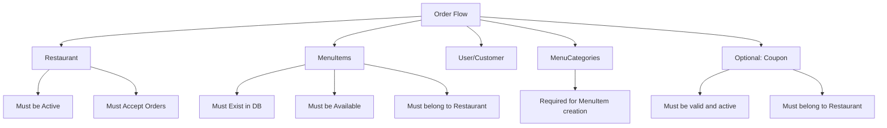

## **Analysis: Missing Menu Items in Functional Test Setup**

### **Root Cause Analysis**

Looking at the failing test, here's what's happening:

1. **Test Setup Issue**: The test setup creates a Restaurant but **does not create any MenuItems**
2. **Helper Method Problem**: `PaymentTestHelper.BuildTestOrderItems()` generates **random MenuItemIds** with `Guid.NewGuid()` 
3. **Database Mismatch**: The command handler tries to validate these non-existent MenuItemIds, causing `InitiateOrder.MenuItemsNotFound`

**Current Setup (Lines 56-57):**
```csharp
_menuItemId1 = Guid.NewGuid();  // ← These are just placeholders, not real entities!
_menuItemId2 = Guid.NewGuid();
```

**Helper Method Problem (Lines 215-217):**
```csharp
items.Add(new OrderItemDto(
    MenuItemId: Guid.NewGuid(),  // ← Generates random IDs that don't exist in DB!
    Quantity: i + 1
));
```

### **Entity Dependencies for Order Flow**

Based on the `InitiateOrderCommandHandler` validation flow, here are the **required entities**:



## **Comprehensive Solution Plan**

### **Phase 1: Immediate Fix - MenuItem Setup**

#### **1.1 Fix Current Test Setup**
- Add MenuCategory creation (required for MenuItem)
- Add actual MenuItem entities to database
- Update `PaymentTestHelper` to use real MenuItemIds instead of random GUIDs

#### **1.2 Test Helper Improvements**
```csharp
// Instead of random GUIDs:
public static List<OrderItemDto> BuildTestOrderItems(List<Guid> menuItemIds)

// Or with a restaurant context:
public static async Task<List<OrderItemDto>> BuildTestOrderItemsAsync(Guid restaurantId, ITestDatabase database)
```

### **Phase 2: Centralized Entity Setup Strategy**

#### **2.1 Create Test Data Builders**
**Location**: `tests/Application.FunctionalTests/TestData/`

```
TestData/
├── Builders/
│   ├── RestaurantBuilder.cs
│   ├── MenuItemBuilder.cs
│   ├── MenuCategoryBuilder.cs
│   ├── CouponBuilder.cs
│   └── OrderBuilder.cs
├── Scenarios/
│   ├── RestaurantScenarios.cs
│   ├── MenuScenarios.cs
│   └── OrderScenarios.cs
└── TestDataSeeder.cs
```

#### **2.2 Fluent Builder Pattern**
```csharp
// Example usage:
var restaurant = await TestDataSeeder
    .ForRestaurant("Test Restaurant")
    .WithMenuCategory("Main Dishes")
    .WithMenuItem("Pizza", price: 15.99m, available: true)
    .WithMenuItem("Burger", price: 12.99m, available: true)
    .CreateAsync(database);

var orderCommand = PaymentTestHelper
    .BuildValidOnlineOrderCommand()
    .WithRestaurant(restaurant.Id)
    .WithMenuItems(restaurant.MenuItems.Take(2))
    .Build();
```

#### **2.3 Scenario-Based Setup**
```csharp
public static class RestaurantScenarios
{
    public static async Task<RestaurantTestData> CreateActiveRestaurantWithMenu(ITestDatabase db)
    {
        // Creates: Restaurant + MenuCategory + 5 MenuItems + Activates restaurant
    }
    
    public static async Task<RestaurantTestData> CreateRestaurantWithCoupons(ITestDatabase db)
    {
        // Creates: Restaurant + Menu + Active/Expired Coupons
    }
}
```

### **Phase 3: Test Infrastructure Improvements**

#### **3.1 Enhanced Base Test Fixture**
```csharp
public abstract class OrderFlowTestFixture : BaseTestFixture
{
    protected RestaurantTestData Restaurant { get; private set; }
    protected List<MenuItemTestData> MenuItems { get; private set; }
    
    protected override async Task SetUpAsync()
    {
        await base.SetUpAsync();
        Restaurant = await RestaurantScenarios.CreateActiveRestaurantWithMenu(Database);
        MenuItems = Restaurant.MenuItems;
    }
}
```

#### **3.2 Test Data DTOs**
```csharp
public record RestaurantTestData(
    Guid Id,
    string Name,
    List<MenuItemTestData> MenuItems,
    List<CouponTestData> Coupons);

public record MenuItemTestData(
    Guid Id,
    string Name,
    decimal Price,
    bool IsAvailable);
```

### **Phase 4: Specific Entity Setup Strategies**

#### **4.1 MenuItem Setup Strategy**
```csharp
public static class MenuItemTestBuilder
{
    public static async Task<List<MenuItem>> CreateMenuItemsForRestaurant(
        Guid restaurantId, 
        int count = 3,
        bool allAvailable = true)
    {
        var category = await CreateMenuCategory(restaurantId);
        var items = new List<MenuItem>();
        
        for (int i = 0; i < count; i++)
        {
            var item = MenuItem.Create(
                RestaurantId.Create(restaurantId),
                category.Id,
                $"Test Item {i + 1}",
                $"Description for item {i + 1}",
                new Money(10.00m + i, "USD"),
                isAvailable: allAvailable).Value;
            
            items.Add(item);
        }
        
        return items;
    }
}
```

#### **4.2 Dependency Chain Builder**
```csharp
public static class OrderFlowDataBuilder
{
    public static async Task<OrderFlowTestData> CreateCompleteOrderFlowData(ITestDatabase db)
    {
        // 1. Create User
        var userId = await CreateTestUser();
        
        // 2. Create Restaurant
        var restaurant = await CreateActiveRestaurant();
        
        // 3. Create MenuCategory
        var category = await CreateMenuCategory(restaurant.Id);
        
        // 4. Create MenuItems
        var menuItems = await CreateMenuItems(restaurant.Id, category.Id, count: 3);
        
        // 5. Create Coupons (optional)
        var coupons = await CreateCoupons(restaurant.Id);
        
        return new OrderFlowTestData(userId, restaurant, menuItems, coupons);
    }
}
```

### **Phase 5: Configuration and Cleanup**

#### **5.1 Test Configuration**
```csharp
public static class TestConfiguration
{
    public static class Defaults
    {
        public const int MenuItemsPerRestaurant = 3;
        public const decimal BaseMenuItemPrice = 10.00m;
        public const string DefaultCurrency = "USD";
        public const bool AllMenuItemsAvailable = true;
    }
}
```

#### **5.2 Cleanup Strategy**
- Each test should clean up its data using the existing Respawner
- Builders should track created entities for potential selective cleanup
- Use database transactions for isolation where needed

## **Implementation Priority**

### **Immediate (Fix Current Test)**
1. ✅ **Fix MenuItemRepository type issue** (already completed)
2. 🔥 **Add MenuItem creation to OnlineOrderPaymentTests.SetUp()**
3. 🔥 **Update PaymentTestHelper to use real MenuItemIds**

### **Short Term (Next Sprint)**
4. **Create basic TestDataSeeder with MenuItem support**
5. **Refactor PaymentTestHelper to be more robust**
6. **Add MenuCategory creation support**

### **Medium Term (Future Sprints)**
7. **Implement full Builder pattern infrastructure**
8. **Create scenario-based test data setup**
9. **Refactor all functional tests to use centralized helpers**

This plan addresses both the immediate failing test and sets up a robust foundation for maintainable functional test data management across the entire application.