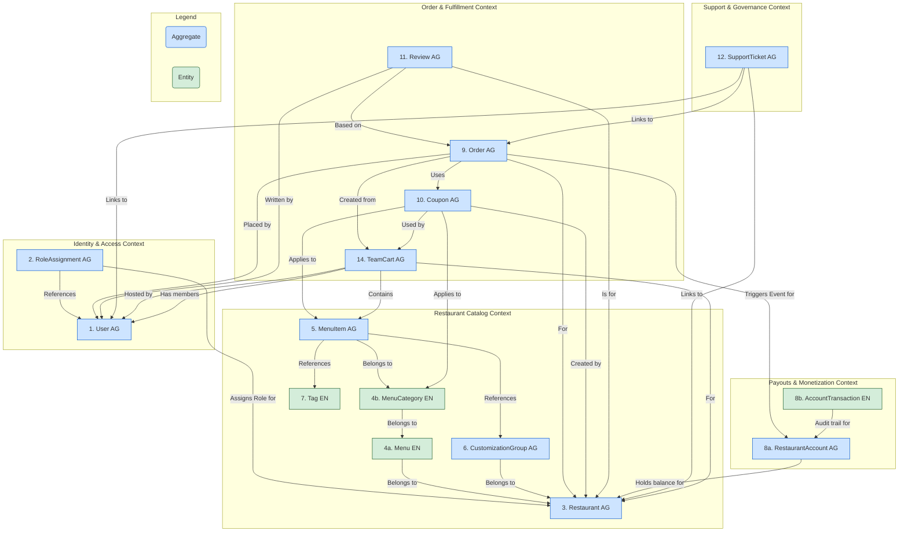

<file path="Docs\Architecture\YummyZoom_Project_Documentation.md">
<![CDATA[
# YummyZoom Project Documentation

## Project Structure

The YummyZoom project follows a Clean Architecture with Domain-Driven Design (DDD) principles, organized into several layers to promote separation of concerns, testability, and maintainability.

```txt
YummyZoom/
├── src/
│   ├── AppHost/             - Service hosting and configuration
│   ├── Application/         - Application-specific business logic, commands, queries, DTOs, validators
│   ├── Domain/              - Core business logic, entities, value objects, aggregates, domain events, errors
│   ├── Infrastructure/      - Implementation details for infrastructure concerns (data access, identity, etc.)
│   ├── ServiceDefaults/     - Default service configurations
│   ├── SharedKernel/        - Common components used across layers (Result pattern, etc.)
│   └── Web/                 - API endpoints and presentation logic
└── tests/
    ├── Application.FunctionalTests/
    ├── Application.UnitTests/
    ├── Domain.UnitTests/
    └── Infrastructure.IntegrationTests/
```

## Layer Responsibilities

- **Domain:** This is the heart of the application. It contains the core business logic, including entities (objects with identity), value objects (objects that represent descriptive aspects of the domain with no conceptual identity), aggregate roots (entities that are the root of an aggregate, ensuring consistency within the aggregate), domain events (objects that represent something that happened in the domain), and domain errors. The Domain layer is independent of all other layers.

- **Application:** This layer contains the application services that orchestrate the domain layer to perform specific use cases. It includes command handlers (for executing actions that change the state of the application), query handlers (for retrieving data), Data Transfer Objects (DTOs) for data exchange, and validators for input validation. The Application layer depends on the Domain layer and defines interfaces for infrastructure concerns.

- **Infrastructure:** This layer provides the concrete implementations for the interfaces defined in the Application layer. This includes data access implementations (e.g., using Entity Framework Core), external service integrations, identity management, and other technical concerns. The Infrastructure layer depends on the Application and Domain layers.

- **Web:** This layer is the presentation layer, responsible for handling user interactions (e.g., HTTP requests). It is a thin layer that translates user requests into calls to the Application layer and formats the results for the user. It depends on the Application layer.

- **SharedKernel:** This layer contains common utilities and components that are shared across multiple layers, such as the `Result` pattern for handling the outcome of operations and a consistent way to represent errors.

- **AppHost and ServiceDefaults:** These projects are responsible for hosting the application services and providing default configurations using .NET Aspire, similar to a docker-compose file.

- **tests:** This directory contains automated tests for different layers of the application, ensuring the quality and correctness of the codebase.

## Rules for Working with a New Feature

When implementing a new feature in the YummyZoom project, follow these guidelines to maintain the Clean Architecture and DDD principles:

1. **Domain First:** Begin by modeling the core concepts of the new feature in the `Domain` layer. Define the necessary entities, value objects, aggregates, and domain events that represent the business domain of the feature. Ensure that the domain model is rich and encapsulates the business rules.
2. **Define Application Use Cases:** In the `Application` layer, define the commands and queries that represent the use cases for the new feature. Create handlers for these commands and queries. These handlers should orchestrate the domain model to perform the required actions or retrieve the necessary data. Define any required DTOs for data transfer between layers and validators for input.
3. **Implement Infrastructure Details:** In the `Infrastructure` layer, provide the concrete implementations for any interfaces defined in the Application layer that are required by the new feature (e.g., data repositories, external service clients). Configure persistence for the new domain entities if using an ORM like Entity Framework Core.
4. **Create Presentation Layer Entry Points:** In the `Web` layer (or other presentation layers), create the necessary endpoints (e.g., API controllers or minimal APIs) to expose the functionality of the new feature to the outside world. These endpoints should be thin and delegate the business logic to the Application layer by sending commands and queries.
5. **Leverage SharedKernel:** Utilize the common components in the `SharedKernel` for consistent error handling and result management.
6. **Write Comprehensive Tests:** Develop unit tests for the Domain and Application layers, and integration/functional tests for the Infrastructure and Web layers to ensure the new feature works correctly and to prevent regressions.
7. **Adhere to Style and Structure:** Follow the existing coding style, naming conventions, and project structure to maintain consistency across the codebase. Place new files and folders in the appropriate layers and directories based on their responsibility.

> **Note:**  
> The `TodoList` and `TodoItem` classes and related features found across the layers are template placeholders. They serve as implementation examples for understanding the project structure and patterns, but are not part of the actual YummyZoom project scope.

]]>
</file>

<file path="Docs\Architecture\Features-Design.md">
<![CDATA[
## Features

### 🧑‍🍳 **Restaurant Features**

#### 1. Restaurant Profile Management

* Set restaurant name, logo, contact info, business hours, and location.
* Define cuisine type and brief description.

#### 2. Menu Management

* Add/edit/remove menu items.
* Update item descriptions, prices, and images.
* Set availability per item (e.g., “out of stock” toggle).
* Offer customization (e.g., toppings, size, spice level).

#### 3. Order Management

* Receive real-time order notifications.
* Accept or reject orders.
* View detailed order info (items, notes, customer name).
* Update order status: *Accepted → Preparing → Ready → Delivered* (simulated delivery).
* Access order history with filters.

#### 4. Coupon Management (New)

* Create and manage coupons (percentage, fixed amount, free items, etc.).
* Apply coupons to specific items, categories, or whole orders.
* Set usage limits and validity periods.
* View coupon usage statistics.

---

### 👤 **Customer Features**

#### 1. Browse Restaurants and Menus

* Search by cuisine, location, rating, dietary preferences.
* View menus with dish details, images, and prices.

#### 2. Placing an Order

* Select dishes, customize them, and add to cart.
* Review cart, apply coupons, and checkout.

#### 3. Checkout & Payments

* Save and use payment methods (optional: tokenized Stripe/PayPal).
* Apply promo codes during checkout.
* Simple one-click checkout for returning users.

#### 4. Order Tracking (Simulated)

* Track order status in real-time: *Placed → Accepted → Preparing → Delivered*.
* View estimated delivery time (static or mock logic).

#### 5. Delivery Preferences (Simplified)

* Save multiple delivery addresses.
* Add special instructions (e.g., "leave at door").

#### 6. Order History & Reordering

* View previous orders and reorder with one click.

#### 7. Rating and Reviews (New)

* Rate restaurants after delivery (1–5 stars).
* Leave written feedback.
* View your own past reviews.

#### 8. Use Coupons (New)

* Apply valid promo codes to orders during checkout.
* See applied discount in order summary.

---

### 🛠️ **Admin / Support Features**

#### 1. Admin Dashboard

* View platform metrics: total orders, active users, revenue.
* Manage customers and restaurants (add/edit/deactivate accounts).
* View all orders and update statuses manually if needed.

#### 2. Restaurant Management

* Onboard and verify restaurants (manual toggle).
* View and manage restaurant menus and coupons.

#### 3. Order Oversight

* Monitor active orders across the system.
* Manually update order statuses or simulate delivery.
* Cancel/refund orders if needed.

#### 4. Coupon and Review Monitoring

* View all coupon campaigns.
* See customer feedback and ratings.
* Moderate or delete inappropriate reviews if required.

---

### ✅ Summary of Functional Scope

| **Module**     | **Customer**                      | **Restaurant**        | **Admin**                          |
| -------------- | --------------------------------- | --------------------- | ---------------------------------- |
| Profile & Auth | ✔️                                | ✔️                    | ✔️                                 |
| Menu           | View                              | Create & Edit         | Moderate                           |
| Order          | Place, track, review              | Accept, update status | Monitor & override                 |
| Coupon         | Apply promo code                  | Create/manage coupons | Monitor usage                      |
| Reviews        | Submit/view reviews               | View feedback         | Moderate content                   |
| Payment        | Mock/real payments, apply coupons | View revenue          | Monitor, trigger refunds           |
| Admin Panel    | —                                 | —                     | Full control over data & workflows |

---

]]>
</file>

<file path="Docs\Architecture\Domain_Design.md">
<![CDATA[
## YummyZoom Domain Design

This document outlines the domain design for the YummyZoom platform, focusing on the aggregates and entities that encapsulate the core business logic and data structures. The design follows Domain-Driven Design (DDD) principles, ensuring that each object is cohesive, encapsulated, and adheres to its own invariants.

### Domain Objects and Their Detailed Structures

#### 1. `User` Aggregate

* **Aggregate Root:** `User`
* **Description:** Represents an individual's identity on the platform. A `User` is always a **customer** by default. This aggregate is solely responsible for managing personal identity, authentication credentials, and customer-specific data like addresses and payment methods.
* **Entities/Value Objects (VOs) within:**
  * `User` (Entity - Root):
    * `UserID` (Identifier)
    * `Name`
    * `Email` (Unique identifier for login)
    * `PhoneNumber` (Optional)
    * `IsActive` (Boolean)
  * `Address` (List of Child Entities):
    * `AddressID` (Identifier)
    * `Street`, `City`, `State`, `ZipCode`, `Country`
    * `Label` (e.g., "Home", "Work")
    * `DeliveryInstructions` (Optional)
  * `PaymentMethod` (List of Child Entities):
    * `PaymentMethodID` (Identifier)
    * `Type` (e.g., "Card", "PayPal")
    * `TokenizedDetails` (e.g., Stripe token, last 4 digits)
    * `IsDefault` (Boolean)
* **Invariants:**
  * `Email` must be unique across all users (enforced by application service/database).
  * When a new `PaymentMethod` is added as default, all others must be marked as not default.
  * A `User` is considered a customer by their very existence; no special flag is needed.
* **References to other aggregates (by ID):**
  * None.

---

#### 2. `RoleAssignment` Aggregate

* **Aggregate Root:** `RoleAssignment`
* **Description:** A dedicated aggregate that explicitly links a `User` to a `Restaurant` with a specific role. This is the authoritative source for determining a user's permissions and responsibilities within the context of a restaurant.
* **Entities/Value Objects (VOs) within:**
  * `RoleAssignment` (Entity - Root):
    * `RoleAssignmentID` (Identifier)
    * `UserID` (Identifier, reference to the `User` aggregate)
    * `RestaurantID` (Identifier, reference to the `Restaurant` aggregate)
    * `Role` (Enum: `Owner`, `Staff`)
* **Invariants:**
  * The combination of `UserID`, `RestaurantID` must be unique. A user can only have one role per restaurant.
  * A `RoleAssignment` must contain a valid, non-null `UserID` and `RestaurantID`.
  * The `Role` must be a valid value from the defined enum (e.g., `Owner`, `Staff`).
* **References to other aggregates (by ID):**
  * `UserID` (references `User`)
  * `RestaurantID` (references `Restaurant`)

---

#### 3. `Restaurant` Aggregate

* **Aggregate Root:** `Restaurant`
* **Description:** A lean aggregate representing the restaurant as a legal and operational entity. Its data changes infrequently.
* **Entities/Value Objects (VOs) within:**
  * `Restaurant` (Entity - Root):
    * `RestaurantID` (Identifier)
    * `Name`
    * `LogoURL`
    * `Description`
    * `CuisineType` (String or list of strings)
    * `Location` (`Address` VO - The physical address)
    * `GeoCoordinates` (VO: `Latitude`, `Longitude` – optional geospatial coordinates)
    * `ContactInfo` (VO: `PhoneNumber`, `Email`)
    * `BusinessHours` (VO or structured data)
    * `IsVerified` (Boolean - Admin controlled)
    * `IsAcceptingOrders` (Boolean - Owner/Staff controlled master switch)
* **Invariants:**
  * `Name` and `Location` are mandatory.
  * If `IsAcceptingOrders` is false, no orders can be created for this restaurant.
* **References to other aggregates (by ID):**
  * None.

---

#### 4. `Menu` & `MenuCategory` (Independent Entities)

* **Design Rationale:** Following performance analysis, the original monolithic `Menu` aggregate has been split. `Menu` and `MenuCategory` are now modeled as independent domain entities, serving as organizational tools rather than consistency boundaries. They do not contain collections of their children; relationships are maintained via ID references.

* **`Menu` (Independent Entity):**
  * **Description:** An organizational entity that groups `MenuCategory`s. Represents a named collection like "Lunch Menu" or "All Day Menu".
  * **Structure:** `MenuID`, `RestaurantID`, `Name`, `Description`, `IsEnabled`.

* **`MenuCategory` (Independent Entity):**
  * **Description:** An organizational entity that groups `MenuItem`s. Represents a section like "Appetizers" or "Desserts".
  * **Structure:** `MenuCategoryID`, `MenuID`, `Name`, `DisplayOrder`.

---

#### 5. `MenuItem` Aggregate

* **Aggregate Root:** `MenuItem`
* **Description:** The primary transactional boundary for a single saleable item. This allows for frequent, high-performance updates (e.g., changing availability) without loading an entire menu.
* **Entities/Value Objects (VOs) within:**
  * `MenuItem` (Entity - Root):
    * `MenuItemID` (Identifier)
    * `RestaurantID` (Reference)
    * `MenuCategoryID` (Reference)
    * `Name`, `Description`, `ImageURL`
    * `BasePrice` (Money VO)
    * `IsAvailable` (Boolean - The frequently updated "out of stock" flag)
    * `AppliedCustomizations` (List of VOs referencing `CustomizationGroupID`)
    * `DietaryTagIDs` (List of `TagID`s)
* **Invariants:** `BasePrice` cannot be negative; `Name` must be unique within its `MenuCategory` (enforced by Application Service).
* **References to other aggregates/entities (by ID):** `RestaurantID`, `MenuCategoryID`, `CustomizationGroupID` (list), `TagID` (list).

---

#### 6. `CustomizationGroup` Aggregate

* **Aggregate Root:** `CustomizationGroup`
* **Description:** Manages a self-contained, reusable set of choices (e.g., sizes, toppings). This allows an owner to define an option once and apply it to many menu items.
* **Entities/Value Objects (VOs) within:**
  * `CustomizationGroup` (Entity - Root):
    * `GroupID` (Identifier)
    * `RestaurantID` (Identifier)
    * `GroupName` (Internal name, e.g., "Standard Toppings")
    * `MinSelections`, `MaxSelections` (Integers)
  * `CustomizationChoice` (List of Child Entities):
    * `ChoiceID` (Identifier)
    * `Name` (e.g., "Medium", "Extra Cheese")
    * `PriceAdjustment` (Money VO, can be zero)
    * `IsDefault` (Boolean)
    * `DisplayOrder` (Integer)
* **Invariants:** `MaxSelections` >= `MinSelections`; `Choice.Name` must be unique within the group; `DisplayOrder` must be non-negative.
* **References to other aggregates (by ID):** `RestaurantID`.

---

#### 7. `Tag` (Independent Entity)

* **Description:** A simple, centrally defined entity for classification (e.g., "Vegetarian", "Spicy"). It does not require the overhead of an aggregate as its invariants are simple.
* **Structure:**
  * `TagID` (Identifier)
  * `TagName` (String, e.g., "Gluten-Free")
  * `TagDescription` (Optional)
  * `TagCategory` (String, e.g., "Dietary", "Cuisine")
* **Invariants:** `TagName` must be unique across the entire system.

---

#### 8. `RestaurantAccount` Aggregate

* **Aggregate Root:** `RestaurantAccount`
* **Description:** A lean aggregate that manages a restaurant's *current financial balance* and payout settings. It is designed to be small and highly performant for frequent financial operations, decoupling it from the full transaction history.
* **Entities/Value Objects (VOs) within:**
  * `RestaurantAccount` (Entity - Root):
    * `RestaurantAccountID` (Identifier)
    * `RestaurantID` (Identifier, links to the `Restaurant` aggregate)
    * `CurrentBalance` (Money VO - A stateful property, not calculated on the fly)
    * `PayoutMethodDetails` (VO - Stores tokenized bank info, etc.)
* **Invariants:**
  * A `PayoutSettlement` transaction cannot be for an amount greater than the `CurrentBalance` at the time of the transaction.
  * The `CurrentBalance` is modified directly by behavior-driven methods.
* **Behavior and Events:**
  * Methods like `RecordRevenue(amount, orderId)` and `SettlePayout(amount)` directly modify the `CurrentBalance`.
  * Upon successful state change, it raises specific domain events like `RevenueRecorded` or `PayoutSettled`, which are used to create the audit trail.
* **References to other aggregates (by ID):**
  * `RestaurantID`

---

#### 9. `AccountTransaction` (Independent Entity)

* **Type:** Independent Entity
* **Description:** An immutable, historical record of a single financial event that has occurred on a `RestaurantAccount`. It serves as the official audit log and is created in response to domain events.
* **Structure:**
  * `AccountTransactionID` (Identifier)
  * `RestaurantAccountID` (Identifier, links to the `RestaurantAccount` aggregate)
  * `Type` (Enum: `OrderRevenue`, `PlatformFee`, `RefundDeduction`, `PayoutSettlement`, `ManualAdjustment`)
  * `Amount` (Money VO) - Positive for credits, negative for debits.
  * `Timestamp`
  * `RelatedOrderID` (Identifier, optional) - Links the transaction to a specific order for auditing.
  * `Notes` (String, optional) - For manual adjustment reasons, etc.
* **Creation Note:** This entity is not part of the `RestaurantAccount` aggregate's boundary. It is created and persisted by an event handler in the Application Layer that subscribes to events like `RevenueRecorded` or `PayoutSettled`.
* **Invariants:**
  * The `Amount` for a `PlatformFee` or `RefundDeduction` must be negative.
  * The `Amount` for an `OrderRevenue` must be positive.
* **References to other aggregates (by ID):**
  * `RestaurantAccountID`
  * `RelatedOrderID` (references `Order`)

---

#### 10. `Order` Aggregate

* **Aggregate Root:** `Order`
* **Description:** Represents a customer's confirmed request for items from a restaurant. It is a transactional record of a purchase. The aggregate manages the complete order lifecycle from placement through fulfillment, including status transitions and payment processing. Financial calculations and coupon validations are handled by dedicated domain services before an order is created.
* **Entities/Value Objects (VOs) within:**
  * `Order` (Entity - Root):
    * `OrderID` (Identifier)
    * `OrderNumber` (Human-readable sequence)
    * `Status` (Enum: `PendingPayment`, `PaymentFailed`, `Placed`, `Accepted`, `Preparing`, `ReadyForDelivery`, `Delivered`, `Cancelled`, `Rejected`)
    * `PaymentIntentId` (string, optional - correlates with payment gateway transaction)
    * `PlacementTimestamp`
    * `LastUpdateTimestamp`
    * `EstimatedDeliveryTime` (Timestamp or Duration)
    * `SpecialInstructions` (From customer)
    * `DeliveryAddress` (`Address` VO - A snapshot of the customer's chosen address)
    * **Financials (Money VOs - Pre-calculated and passed in):**
      * `Subtotal`
      * `DiscountAmount`
      * `DeliveryFee`
      * `TipAmount`
      * `TaxAmount`
      * `TotalAmount`
  * `OrderItem` (List of Child Entities):
    * `OrderItemID` (Identifier)
    * `Snapshot_MenuItemID` (ID of the original `MenuItem`)
    * `Snapshot_ItemName`
    * `Snapshot_BasePriceAtOrder` (Money VO)
    * `Quantity`
    * `SelectedCustomizations` (List of `OrderItemCustomization` VOs):
      * `Snapshot_CustomizationGroupName`
      * `Snapshot_ChoiceName`
      * `Snapshot_ChoicePriceAdjustmentAtOrder` (Money VO)
    * `LineItemTotal` (Money VO - `(BasePrice + sum of Adjustments) * Quantity`)
  * `PaymentTransaction` (List of Child Entities):
    * `TransactionID` (Identifier)
    * `PaymentMethodType` (Enum: CreditCard, PayPal, ApplePay, GooglePay, CashOnDelivery)
    * `PaymentMethodDisplay` (String, optional, e.g., "Visa **** 4242")
    * `Type` (Enum: Payment, Refund)
    * `Amount` (Money VO)
    * `Timestamp`
    * `PaymentGatewayReferenceID` (Optional)
* **Invariants:**
  * The `TotalAmount` provided during creation must strictly equal the sum of the other financial components (`Subtotal - DiscountAmount + TaxAmount + DeliveryFee + TipAmount`).
  * `Subtotal` must equal the sum of all `OrderItem.LineItemTotal`s.
  * Order status transitions are enforced by methods on the aggregate root (e.g., `confirmPayment()`, `accept()`). An order cannot be accepted if its status is not `Placed`.
  * An order cannot be created with a negative `TotalAmount`.
  * A `PaymentIntentId` is required if the initial status is `PendingPayment`.
* **References to other aggregates (by ID):**
  * `CustomerID` (`UserID` of the customer).
  * `RestaurantID` (The restaurant fulfilling the order).
  * `AppliedCouponID` (`CouponID` used).

---

#### 11. `Coupon` Aggregate

* **Aggregate Root:** `Coupon`
* **Description:** Manages a promotional coupon, its rules, validity, and global usage. Per-user usage is managed externally.
* **Entities/Value Objects (VOs) within:**
  * `Coupon` (Entity - Root):
    * `CouponID` (Identifier)
    * `RestaurantID` (Identifier, links to the owning `Restaurant`)
    * `Code` (String - what the customer enters, unique per restaurant)
    * `Description`
    * `Type` (Enum: Percentage, FixedAmount, FreeItem)
    * `Value` (Decimal for percentage, Money VO for fixed amount, `MenuItemID` for free item)
    * `AppliesTo` (VO):
      * `Scope` (Enum: WholeOrder, SpecificItems, SpecificCategories)
      * `ItemIDs` (List of `MenuItemID`s if `Scope` is SpecificItems)
      * `CategoryIDs` (List of `MenuCategoryID`s if `Scope` is SpecificCategories)
    * `MinOrderAmount` (Money VO, optional condition for applicability)
    * `ValidityStartDate` & `ValidityEndDate`
    * `TotalUsageLimit` (Integer, optional)
    * `CurrentTotalUsageCount` (Integer)
    * `IsEnabled` (Boolean)
    * `UsageLimitPerUser` (Interger)
* **Invariants:**
  * `Code` must be unique within the scope of its `RestaurantID`.
  * `ValidityEndDate` must be after `ValidityStartDate`.
  * `CurrentTotalUsageCount` cannot exceed `TotalUsageLimit`.
  * The `incrementUsageCount()` method must check the `TotalUsageLimit` before incrementing.
* **References to other aggregates (by ID):**
  * `RestaurantID`
  * `AppliesTo.ItemIDs` (List of `MenuItemID`s)
  * `AppliesTo.CategoryIDs` (List of `MenuCategoryID`s)

*(**Note on Per-User Tracking:** A separate, simple data store (e.g., a `CouponUsages` table) with the structure `(UserID, CouponID, OrderID)` will be managed by the Application Service to enforce per-user limits. This is not part of the `Coupon` aggregate's transactional boundary.)*

---

#### 12. `Review` Aggregate

* **Aggregate Root:** `Review`
* **Description:** Captures authentic customer feedback and ratings for a restaurant, anchored to a completed order.
* **Entities/Value Objects (VOs) within:**
  * `Review` (Entity - Root):
    * `ReviewID` (Identifier)
    * `OrderID` (Identifier, ensures review authenticity)
    * `CustomerID` (`UserID` of the reviewer)
    * `RestaurantID` (The restaurant being reviewed)
    * `Rating` (Integer, 1-5)
    * `Comment` (Text, optional)
    * `SubmissionTimestamp`
    * `IsModerated` (Boolean)
    * `IsHidden` (Boolean)
    * `Reply` (Text, optional)
* **Invariants:**
  * `Rating` must be an integer between 1 and 5 (inclusive).
  * A `Review` must be linked to a valid `OrderID`, `CustomerID`, and `RestaurantID`.
* **References to other aggregates (by ID):**
  * `OrderID`
  * `CustomerID` (`UserID`)
  * `RestaurantID`

---

#### 13. `SupportTicket` Aggregate

* **Aggregate Root:** `SupportTicket`
* **Description:** Represents a single, trackable case or issue raised by a user, a restaurant, or the system itself. It manages the entire lifecycle of the issue from submission to resolution.
* **Entities/Value Objects (VOs) within:**
  * `SupportTicket` (Entity - Root):
    * `TicketID` (Identifier)
    * `TicketNumber` (Human-readable sequence)
    * `Subject` (String)
    * `Status` (Enum: `Open`, `InProgress`, `PendingCustomerResponse`, `Resolved`, `Closed`)
    * `Priority` (Enum: `Low`, `Normal`, `High`, `Urgent`)
    * `Type` (Enum: `RefundRequest`, `AccountIssue`, `RestaurantReactivation`, `GeneralInquiry`)
    * `SubmissionTimestamp`
    * `LastUpdateTimestamp`
    * `AssignedToAdminID` (`AdminID`, optional - links to the admin working on it)
  * `ContextLink` (List of Value Objects):
    * `EntityType` (Enum: `User`, `Order`, `Restaurant`, `Review`)
    * `EntityID` (Identifier of the linked entity)
    * *This flexible structure allows a single ticket to be linked to both the customer (`User`) who reported an issue and the `Order` it relates to.*
  * `TicketMessage` (List of Child Entities):
    * `MessageID` (Identifier)
    * `AuthorID` (`UserID` or `AdminID`)
    * `AuthorType` (Enum: `Customer`, `RestaurantOwner`, `Admin`)
    * `MessageText` (String)
    * `Timestamp`
    * `IsInternalNote` (Boolean - for admin-only comments)
* **Invariants:**
  * A ticket must have at least one `ContextLink` to be meaningful.
  * Only an `Admin` can change the `Status` to `Resolved` or `Closed`.
  * `TicketMessage`s are immutable once added.
* **References to other aggregates (by ID):**
  * `ContextLink.EntityID` (references `User`, `Order`, `Restaurant`, etc.)
  * `AssignedToAdminID`
  * `TicketMessage.AuthorID`

---

#### 14. `TeamCart` Aggregate

* **Aggregate Root:** `TeamCart`
* **Description:** Represents a collaborative shopping cart where multiple users can add items before converting to a final Order. It manages the entire lifecycle of team-based ordering, from creation and member invitation through item selection, payment collection, and final conversion to an Order.
* **Entities/Value Objects (VOs) within:**
  * `TeamCart` (Entity - Root):
    * `TeamCartID` (Identifier)
    * `RestaurantID` (Identifier, links to the `Restaurant` aggregate)
    * `HostUserID` (Identifier, links to the `User` who created the cart)
    * `Status` (Enum: `Open`, `AwaitingPayments`, `ReadyToConfirm`, `Converted`, `Expired`)
    * `ShareToken` (`ShareableLinkToken` VO - Used for inviting others)
    * `Deadline` (DateTime, optional - When the cart will close)
    * `CreatedAt` (DateTime)
    * `ExpiresAt` (DateTime)
    * `TipAmount` (Money VO)
    * `AppliedCouponID` (Identifier, optional - links to the `Coupon` aggregate)
    * `DiscountAmount` (Money VO)
  * `TeamCartMember` (List of Child Entities):
    * `MemberID` (Identifier)
    * `UserID` (Identifier, links to the `User` aggregate)
    * `Name` (String - Display name)
    * `Role` (Enum: `Host`, `Guest`)
  * `TeamCartItem` (List of Child Entities):
    * `ItemID` (Identifier)
    * `AddedByUserID` (Identifier, links to the `User` who added the item)
    * `Snapshot_MenuItemID` (ID of the original `MenuItem`)
    * `Snapshot_MenuCategoryID` (ID of the original `MenuCategory`)
    * `Snapshot_ItemName` (String)
    * `Snapshot_BasePriceAtOrder` (Money VO)
    * `Quantity` (Integer)
    * `LineItemTotal` (Money VO)
    * `SelectedCustomizations` (List of `TeamCartItemCustomization` VOs):
      * `Snapshot_CustomizationGroupName` (String)
      * `Snapshot_ChoiceName` (String)
      * `Snapshot_ChoicePriceAdjustmentAtOrder` (Money VO)
  * `MemberPayment` (List of Child Entities):
    * `PaymentID` (Identifier)
    * `UserID` (Identifier, links to the `User` making the payment)
    * `Amount` (Money VO)
    * `Method` (Enum: `Online`, `CashOnDelivery`)
    * `Status` (Enum: `Pending`, `CommittedToCOD`, `PaidOnline`, `Failed`)
    * `OnlineTransactionID` (String, optional - for online payments)
    * `CreatedAt` (DateTime)
    * `UpdatedAt` (DateTime)
* **Invariants:**
  * Every team cart must have exactly one Host who cannot be removed.
  * Members can only be added when the cart is in Open status.
  * Payment amount must match the total of items added by that member.
  * All online payments must be completed before the cart can transition to ReadyToConfirm.
  * Only the host can modify financial details (tip, coupons).
  * Cart must be in ReadyToConfirm status to be converted to an Order.
* **References to other aggregates (by ID):**
  * `RestaurantID` (references `Restaurant`)
  * `HostUserID` (references `User`)
  * `TeamCartMember.UserID` (references `User`)
  * `TeamCartItem.Snapshot_MenuItemID` (references `MenuItem`)
  * `TeamCartItem.Snapshot_MenuCategoryID` (references `MenuCategory`)
  * `AppliedCouponID` (references `Coupon`)

---

### System-Wide Domain Object Relationship Diagram

This diagram illustrates all major domain objects, grouped into their logical Bounded Contexts. It shows how they are decoupled and relate to one another primarily through ID references. (AG = Aggregate, EN = Entity).



---

### Read Models & Lookup Tables (CQRS Approach)

To optimize for frequent read operations and to handle cross-aggregate checks efficiently, the system will employ several read models. These are denormalized data structures, typically simple database tables, that are updated by event handlers listening to domain events from the write-side aggregates. They do not belong to the Domain Layer but are critical for system performance.

| Read Model / Lookup Table | Description | Triggering Domain Events | Purpose & Use Case |
| :--- | :--- | :--- | :--- |
| **`RestaurantReviewSummary`** | A table with `RestaurantID`, `AverageRating`, and `TotalRatingCount`. | `ReviewSubmitted` | To display a restaurant's rating on its page instantly, without querying and calculating from all `Review` aggregates. |
| **`CouponUsage`** | A simple table with `(UserID, CouponID, OrderID)`. | `OrderPlacedWithCoupon` | To quickly check if a user has already used a coupon with a per-user limit. The Application Service queries this *before* attempting to apply the coupon. |
| **`FullMenuView`** | A denormalized JSON document or set of tables containing a restaurant's complete menu structure. | `MenuItemCreated`, `MenuItemUpdated`, `MenuCategoryCreated`, `MenuEnabled`, etc. | To provide a lightning-fast, pre-compiled view of a restaurant's menu for the customer-facing app, avoiding complex joins across multiple tables on every page load. |
| **`RestaurantSearchIndex`** | A search engine document (e.g., in Elasticsearch) containing restaurant name, cuisine types, location, and key menu items. | `RestaurantCreated`, `RestaurantUpdated`, `MenuItemCreated` | To power the main search and discovery feature, allowing users to find restaurants by name, cuisine, or even specific dishes. |

]]>
</file>

<files>
<file path="Docs\Development-Guidelines\Feature-Discovery-Template.md">
<![CDATA[
## Feature Discovery & Application Layer Design — `[AggregateName]`

> Target layer: **Application** (Clean Architecture). Backed by Domain aggregate `[AggregateName]` and any relevant read/audit entities. Aligns with overall YummyZoom architecture (DDD + CQRS).

---

## 0) Overview & Scope Alignment

`[AggregateName]` is the `[short, high-level description of purpose and boundaries]`. It owns `[core mutable state/value objects]` and emits domain events for `[audit/integrations/projections]`. Historical records, if needed, live outside the aggregate as immutable `[ReadModelName]` rows produced by event handlers.

Primary goals in the Application layer:

* Expose **commands** that safely mutate aggregate state through aggregate methods.
* Expose **queries** optimized for dashboards (Dapper/SQL) and back-office needs.
* Handle **domain events** to create audit rows and integrate with external systems.
* Enforce **authorization** and **cross-aggregate checks**.
* Provide **idempotency**, **observability**, and **hard invariants** mapping to domain errors.

---

## 1) Core Use Cases & Actors

| Actor                       | Use Case / Goal                     | Description |
| --------------------------- | ----------------------------------- | ----------- |
| `[Role or System]`          | `[Primary action for this actor]`   | `[One-line description of what happens and why]` |
| `[Role or System]`          | `[Another action]`                  | `[Description]` |
| `[Admin/Owner/Staff]`       | `[Administrative/owner action]`     | `[Description]` |
| `[Viewer/External System]`  | `[Read/reporting action]`           | `[Description]` |

---

## 2) Commands (Write Operations)

> Conventions: MediatR commands returning `Result<T>` or `Result`. Validation via FluentValidation; transactional boundary via `IUnitOfWork.ExecuteInTransactionAsync`.

### 2.1 Command Catalog

| Command                            | Actor/Trigger           | Key Parameters                                   | Response DTO                                 | Authorization |
| ---------------------------------- | ----------------------- | ------------------------------------------------ | -------------------------------------------- | ------------- |
| **`[Create][AggregateName]Command`** | `[Admin/User/System]`   | `[AggregateId?]`, `[RequiredDtos]`               | `[CreateXResponse(Id)]`                      | `[Policy/Role]` |
| **`[Action]Command`**              | `[Role/System]`         | `[AggregateId]`, `[OtherIds]`, `[ValueObjects]`  | `Result.Success()`                           | `[Policy/Role]` |
| **`[Action]Command`**              | `[Role/System]`         | `[Parameters]`                                   | `[ResponseDto]`                               | `[Policy/Role]` |

### 2.2 Command → Aggregate Method Mapping & Error Surface

| Command                  | Aggregate Method                             | Domain Invariants enforced                                 | Typical Failures surfaced to API |
| ------------------------ | -------------------------------------------- | ---------------------------------------------------------- | ------------------------------- |
| `[Create...]`            | `[AggregateName].Create(...)`                | `[e.g., unique per owner, initial state]`                  | `[409 Conflict / 400 ...]` |
| `[Action...]`            | `[AggregateMethod(ValueObject, ids...)]`     | `[e.g., value sign/constraints, state preconditions]`      | `[400/422 specific domain errors]` |
| `[Delete/Archive...]`    | `[MarkAsDeleted/Archive]`                    | `[emits deletion event, no further mutations allowed?]`    | `200 OK` |

**Cross-aggregate checks (Application layer):**

* `[Example: verify related aggregate exists and belongs to same owner/context]`
* `[Example: ensure prerequisites such as configuration/KYC/external state]`

---

## 3) Queries (Read Operations)

> Implementation: Dapper SQL; tailored DTOs; indices appropriate for query predicates.

### 3.1 Query Catalog

| Query                               | Actor              | Key Parameters                              | Response DTO                                 | SQL Highlights / Tables |
| ----------------------------------- | ------------------ | ------------------------------------------- | -------------------------------------------- | ----------------------- |
| **`Get[Aggregate]SummaryQuery`**    | `[Role(s)]`        | `[AggregateId or Filters]`                   | `[SummaryDto]`                                | `SELECT ... FROM [Table] WHERE ...` |
| **`Get[Aggregate]DetailsQuery`**    | `[Role(s)]`        | `[AggregateId]`                              | `[DetailsDto]`                                | `JOIN ...` |
| **`List[Aggregate]ItemsQuery`**     | `[Role(s)]`        | `[Filter, Page]`                             | `PaginatedList<[RowDto]>`                     | `WHERE ... ORDER BY ...` |
| **`Search[Aggregate]Query`**        | `[Role(s)]`        | `[Text, Filters]`                            | `PaginatedList<[SearchResultDto]>`            | `[FTS, indexes, etc.]` |

### 3.2 DTO Sketches

* `[SummaryDto { ... }]`
* `[RowDto { ... }]`
* `[DetailsDto { ... }]`

---

## 4) Domain Events & Application Handlers

> Domain events emitted by the aggregate drive audit/projections/integrations. Handlers are **asynchronous** (outbox) and **idempotent**.

| Domain Event                | Emitted When            | Application Handlers                       | Responsibilities |
| --------------------------- | ----------------------- | ------------------------------------------ | ---------------- |
| `[AggregateCreated]`        | `[on create]`           | `[EnsureProjection]`                        | `[Seed projections / notify]` |
| `[MeaningfulEvent]`         | `[on state change]`     | `[CreateAuditRow(...)]`                     | `[Append immutable audit row]` |
| `[AnotherEvent]`            | `[on action]`           | `[TriggerExternalIntegration]`              | `[Call provider with idempotency key]` |
| `[Deleted/Archived]`        | `[on delete/archive]`   | `[FlagProjection/HideFromUI]`               | `[Governance, prevent postings]` |

**Integration events consumed by Application layer:**

* `[InboundEventName]` → orchestrates `[CommandName]`.
* `[InboundEventName]` → orchestrates `[CommandName]`.

---

## 5) Orchestration for Complex Flows

### 5.1 `[ImportantCommand]CommandHandler`

1. **Validate**: `[rules]`.
2. **Authorize**: `[policies/ownership checks]`.
3. **Load**: `[AggregateName]` by id via repo.
4. **Pre-checks**: `[required configuration/external state/thresholds]`.
5. **Invoke Aggregate**: ``aggregate.[Method](...)`` → may return domain errors.
6. **Persist**: repo update; commit transaction.
7. **Side effects (async)**: outbox publishes events; trigger external processes; notify users.
8. **Return**: `[Response DTO / Result]`.

### 5.2 `[InboundEvent]` → `[CommandName]`

1. Receive `[InboundEvent(args...)]`.
2. **Idempotency check**: `[ensure not processed / no duplicate audit row exists]`.
3. **Load** `[AggregateName]`; `[create if auto-provisioning enabled?]`.
4. **Call** `[Command/AggregateMethod]`; persist.
5. **Emit** `[DomainEvent]` → handler writes audit/projection and triggers any integrations.

---

## 6) Read Models & Projections (CQRS)

> Immutable audit: `[AuditTable] (Type, Amount/Value, Timestamp, RelatedId, Notes)`. Denormalized summaries for dashboards.

Recommended projections:

* **`[AuditTable]`**: append-only; indexed by `[keys]`.
* **`[DashboardView]`**: `{[Key fields and computed summaries]}` maintained by event handlers.
* **`[HistoryView]`**: separate view (or filter) for quick access to specific subsets.

---

## 7) API Surface (Web Layer Endpoints)

> Minimal APIs/Controllers call Application commands/queries. All endpoints return `Result<>` shapes from `SharedKernel`.

### 7.1 User/Admin APIs

* `POST /[resource]` → `[CreateCommand]` → `201 Created` with resource id.
* `PUT /[resource]/{id}` → `[UpdateCommand]` → `204 No Content`.
* `GET /[resource]/{id}/summary` → `[GetSummaryQuery]`.
* `GET /[resource]/{id}/items` → `[ListItemsQuery]` (paging, filters).

### 7.2 System/Admin APIs

* `POST /internal/[resource]/[action]` → `[SystemCommand]` (idempotent).
* `POST /admin/[resource]/[action]` → `[AdminCommand]`.
* `DELETE /admin/[resource]/{id}` → `[DeleteCommand]` (soft delete).

---

## 8) Suggested Refinements (Domain & Code)

1. `[Value Object structure improvements]`.
2. `[Optimistic concurrency / RowVersion]`.
3. `[Currency/units discipline or normalization rules]`.
4. `[Deletion semantics and guards]`.
5. `[Thresholds/reserves/holds as configuration]`.
6. `[Outbox + Inbox for idempotency]`.
7. `[Unique constraints at DB level]`.
8. `[Snapshot fields to ease reconciliation]`.
9. `[Back-pressure and state transitions for external providers]`.

---

## 9) Open Questions

* `[Accounting policy / modeling choice?]`
* `[Do we need additional holds/reserves/limits?]`
* `[Regulatory/KYC requirements?]`

---

**End of Feature Discovery — `[AggregateName]`.**

]]>
</file>
</files>


<files>
<file path="Docs\Aggregate-Documents\9-AccountTransaction-Entity.md">
<![CDATA[
# AccountTransaction Entity

## Entity Documentation: `AccountTransaction`

* **Version:** 1.0
* **Last Updated:** 2024-12-13
* **Source File:** `src/Domain/AccountTransactionEntity/AccountTransaction.cs`

### 1. Overview

**Description:**
An immutable, historical record of a single financial event that has occurred on a RestaurantAccount. It serves as the official audit log and is created in response to domain events from the RestaurantAccount aggregate. This entity is not part of the RestaurantAccount aggregate's boundary and is managed by event handlers in the Application Layer.

**Core Responsibilities:**

* Records immutable financial transaction history
* Acts as an audit trail for all RestaurantAccount balance changes
* Enforces business rules for transaction amount sign validation based on type
* Links transactions to related orders for comprehensive auditing

### 2. Structure

* **Entity Root:** `AccountTransaction`
* **Key Value Objects:**
  * `AccountTransactionId`: Strongly-typed identifier for the transaction
  * `TransactionType`: Enumeration of valid transaction types (OrderRevenue, PlatformFee, etc.)
  * `Money`: Represents monetary amounts with currency information

### 3. Lifecycle & State Management

#### 3.1. Creation (Factory Method)

The only valid way to create an `AccountTransaction` is through its static factory method.

```csharp
public static Result<AccountTransaction> Create(
    RestaurantAccountId restaurantAccountId,
    TransactionType type,
    Money amount,
    OrderId? relatedOrderId = null,
    string? notes = null)
```

| Parameter | Type | Description |
| :--- | :--- | :--- |
| `restaurantAccountId` | `RestaurantAccountId` | The restaurant account this transaction belongs to |
| `type` | `TransactionType` | The type of transaction (OrderRevenue, PlatformFee, etc.) |
| `amount` | `Money` | The transaction amount (positive for credits, negative for debits) |
| `relatedOrderId` | `OrderId?` | Optional order ID linking transaction to specific order |
| `notes` | `string?` | Optional notes (used for manual adjustments, etc.) |

**Validation Rules & Potential Errors:**

* `OrderRevenue` amounts must be positive. (Returns `RestaurantAccountErrors.OrderRevenueMustBePositive`)
* `PlatformFee` amounts must be negative. (Returns `RestaurantAccountErrors.PlatformFeeMustBeNegative`)
* `RefundDeduction` amounts must be negative. (Returns `RestaurantAccountErrors.RefundDeductionMustBeNegative`)
* `PayoutSettlement` and `ManualAdjustment` types have no amount sign restrictions
* Timestamp is automatically set to `DateTime.UtcNow`

#### 3.2. State Transitions & Commands (Public Methods)

This entity is immutable once created. There are no public methods that modify its state.

### 4. Exposed State & Queries

#### 4.1. Public Properties

| Property | Type | Description |
| :--- | :--- | :--- |
| `Id` | `AccountTransactionId` | The unique identifier of the transaction |
| `RestaurantAccountId` | `RestaurantAccountId` | The restaurant account this transaction belongs to |
| `Type` | `TransactionType` | The type of financial transaction |
| `Amount` | `Money` | The transaction amount (positive for credits, negative for debits) |
| `Timestamp` | `DateTime` | When the transaction was recorded (UTC) |
| `RelatedOrderId` | `OrderId?` | Optional order ID for audit trail linking |
| `Notes` | `string?` | Optional notes for additional context |

#### 4.2. Public Query Methods

This entity does not expose any additional query methods beyond property access.

### 5. Communication (Domain Events)

This entity does not raise domain events. It is created in response to events from other aggregates and serves as a passive audit record.

### 6. Transaction Types

The `TransactionType` enum defines the following valid transaction types:

| Transaction Type | Description | Amount Sign | Related Order Required |
| :--- | :--- | :--- | :--- |
| `OrderRevenue` | Revenue from customer orders | Positive (credit) | Yes |
| `PlatformFee` | Platform fees deducted by the system | Negative (debit) | Yes |
| `RefundDeduction` | Refunds deducted from restaurant balance | Negative (debit) | Yes |
| `PayoutSettlement` | Payouts settled to restaurant | Negative (debit) | No |
| `ManualAdjustment` | Manual adjustments by administrators | Any sign | No |

### 7. Creation Context

This entity is not created directly by application services but rather by event handlers that subscribe to the following RestaurantAccount domain events:

* `RevenueRecorded` → Creates `OrderRevenue` transaction
* `PlatformFeeRecorded` → Creates `PlatformFee` transaction  
* `RefundDeducted` → Creates `RefundDeduction` transaction
* `PayoutSettled` → Creates `PayoutSettlement` transaction
* `ManualAdjustmentMade` → Creates `ManualAdjustment` transaction

This decoupling ensures that the RestaurantAccount aggregate remains focused on balance management while the transaction history is maintained separately for audit purposes.

]]>
</file>

<file path="src\Domain\AccountTransactionEntity\AccountTransaction.cs">
<![CDATA[
using YummyZoom.Domain.AccountTransactionEntity.Enums;
using YummyZoom.Domain.AccountTransactionEntity.ValueObjects;
using YummyZoom.Domain.Common.ValueObjects;
using YummyZoom.Domain.OrderAggregate.ValueObjects;
using YummyZoom.Domain.RestaurantAccountAggregate.Errors;
using YummyZoom.Domain.RestaurantAccountAggregate.ValueObjects;
using YummyZoom.Domain.Common.Models;
using YummyZoom.SharedKernel;

namespace YummyZoom.Domain.AccountTransactionEntity;

public sealed class AccountTransaction : Entity<AccountTransactionId>, ICreationAuditable
{
    public RestaurantAccountId RestaurantAccountId { get; private set; }
    public TransactionType Type { get; private set; }
    public Money Amount { get; private set; }
    public DateTime Timestamp { get; private set; }
    public OrderId? RelatedOrderId { get; private set; }
    public string? Notes { get; private set; }

    // Creation audit properties (immutable entity)
    public DateTimeOffset Created { get; set; }
    public string? CreatedBy { get; set; }

    private AccountTransaction(
        AccountTransactionId id,
        RestaurantAccountId restaurantAccountId,
        TransactionType type,
        Money amount,
        DateTime timestamp,
        OrderId? relatedOrderId,
        string? notes)
        : base(id)
    {
        RestaurantAccountId = restaurantAccountId;
        Type = type;
        Amount = amount;
        Timestamp = timestamp;
        RelatedOrderId = relatedOrderId;
        Notes = notes;
    }

    public static Result<AccountTransaction> Create(
        RestaurantAccountId restaurantAccountId,
        TransactionType type,
        Money amount,
        OrderId? relatedOrderId = null,
        string? notes = null)
    {
        var validationResult = ValidateTransaction(type, amount);
        if (validationResult.IsFailure)
        {
            return Result.Failure<AccountTransaction>(validationResult.Error);
        }

        return Result.Success(new AccountTransaction(
            AccountTransactionId.CreateUnique(),
            restaurantAccountId,
            type,
            amount,
            DateTime.UtcNow,
            relatedOrderId,
            notes));
    }
    
    private static Result ValidateTransaction(TransactionType type, Money amount)
    { 
        // Using the same errors from RestaurantAccountErrors for consistency.
        return type switch
        {
            TransactionType.OrderRevenue when amount.Amount <= 0 => 
                Result.Failure(RestaurantAccountErrors.OrderRevenueMustBePositive(amount)),
            TransactionType.PlatformFee when amount.Amount >= 0 => 
                Result.Failure(RestaurantAccountErrors.PlatformFeeMustBeNegative(amount)),
            TransactionType.RefundDeduction when amount.Amount >= 0 =>
                Result.Failure(RestaurantAccountErrors.RefundDeductionMustBeNegative(amount)),
            _ => Result.Success()
        };
    }

#pragma warning disable CS8618
    private AccountTransaction() { }
#pragma warning restore CS8618
}

]]>
</file>
<file path="src\Domain\AccountTransactionEntity\Enums\TransactionType.cs">
<![CDATA[
namespace YummyZoom.Domain.AccountTransactionEntity.Enums; 

public enum TransactionType
{
    OrderRevenue,
    PlatformFee,
    RefundDeduction,
    PayoutSettlement,
    ManualAdjustment
}

]]>
</file>
</files>


---

The files provided:
- "Docs\Architecture\YummyZoom_Project_Documentation.md": The over all project documentation.
- "Docs\Architecture\Features-Design.md": Outline all the features of the project for customers, restaurants, and admins.
- "Docs\Architecture\Domain_Design.md": The full design of all aggregates and entities in the Domain of the project.
- "Docs\Development-Guidelines\Feature-Discovery-Template.md": Feature Discovery Template document.
- "Docs\Aggregate-Documents\9-AccountTransaction-Entity.md": AccountTransaction Entity document.
- Code implementation of the AccountTransaction Entity.

Your task is to analyze and perform the feature discovery for the account transaction entity. These features will live in the Application layer of the system.
Follow the template in the Feature-Discovery-Template.md file to perform the feature discovery.
Make sure the feature designs are consistent with the overall design of the project and best serve the flow and features of the project.
Make the feature design documentation clear, concise, and condensed.
You can give any additional recommendations or suggestions on the domain design or the code implementation if you think it's necessary. All suggestions will be considered.
