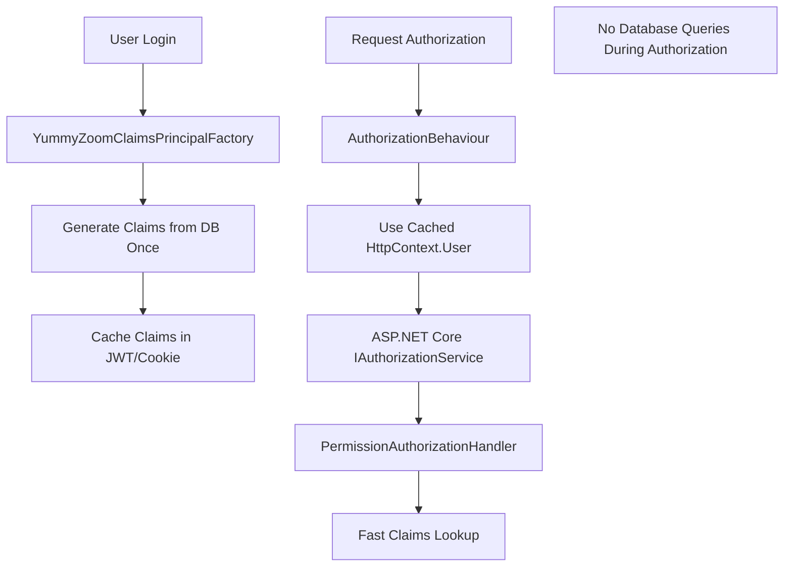

# Authorization Pattern in YummyZoom

## Overview

YummyZoom implements a **high-performance, claims-based authorization system** that provides fine-grained, resource-aware security controls. The system seamlessly handles multiple resource types (restaurants, users, etc.) while maintaining type safety, extensibility, and optimal performance through cached claims.

### Key Features

- **High-Performance Claims-Based**: Uses cached claims instead of database queries for authorization
- **Generic Resource Authorization**: Single authorization infrastructure supporting any resource type
- **Contextual Permissions**: Role-based access scoped to specific resources
- **Optimized Pipeline**: Eliminates unnecessary database queries during authorization checks
- **Type-Safe Commands**: Strongly-typed command interfaces for each resource type
- **Extensible Design**: Easy to add new resource types and authorization rules
- **Full Backward Compatibility**: Existing restaurant authorization unchanged

---

## System Architecture

### 1. **Authentication Foundation**

- **ASP.NET Core Identity**: Manages user authentication, passwords, and global roles
- **ApplicationUser**: Identity entity for authentication
- **User Aggregate**: Domain entity for business logic
- **Cached Claims**: Claims generated once during login and reused for all requests

### 2. **Enhanced Authorization Pipeline**



### 4. **Core Interfaces**

#### Base Interface

```csharp
public interface IContextualCommand
{
    string ResourceType { get; }
    string ResourceId { get; }
}
```

#### Enhanced IUser Interface

```csharp
public interface IUser
{
    string? Id { get; }
    ClaimsPrincipal? Principal { get; } 
}
```

#### Resource-Specific Interfaces

```csharp
// Restaurant commands
public interface IRestaurantCommand : IContextualCommand
{
    RestaurantId RestaurantId { get; }
    
    string IContextualCommand.ResourceType => "Restaurant";
    string IContextualCommand.ResourceId => RestaurantId.Value.ToString();
}

// User commands
public interface IUserCommand : IContextualCommand
{
    UserId UserId { get; }
    
    string IContextualCommand.ResourceType => "User";
    string IContextualCommand.ResourceId => UserId.Value.ToString();
}
```

---

## Enhanced Claims-Based Authorization Flow

### 1. **One-Time Claims Generation (During Login)**

Claims are generated once during authentication and cached:

```csharp
// YummyZoomClaimsPrincipalFactory generates claims from database ONCE
protected override async Task<ClaimsIdentity> GenerateClaimsAsync(ApplicationUser user)
{
    var identity = await base.GenerateClaimsAsync(user);
    
    // Query database ONCE during login
    var roleAssignments = await _roleAssignmentRepository.GetByUserIdAsync(domainUserId);
    
    // Generate permission claims
    foreach (var assignment in roleAssignments)
    {
        var claimValue = $"{assignment.Role}:{assignment.RestaurantId.Value}";
        identity.AddClaim(new Claim("permission", claimValue));
    }
    
    // Add user self-ownership claim
    identity.AddClaim(new Claim("permission", $"UserOwner:{user.Id}"));
    
    return identity; // Claims cached in JWT/Cookie
}
```

### 2. **Fast Authorization Pipeline**

Authorization now uses cached claims with zero database queries:

```csharp
// AuthorizationBehaviour - ENHANCED
public async Task<TResponse> Handle(TRequest request, RequestHandlerDelegate<TResponse> next, CancellationToken cancellationToken)
{
    var authorizationAttributes = request.GetType().GetCustomAttributes<AuthorizeAttribute>();
    
    if (authorizationAttributes.Any())
    {
        if (_user.Principal == null) // Use cached principal
            throw new UnauthorizedAccessException();
            
        foreach (var attribute in authorizationAttributes)
        {
            if (!string.IsNullOrEmpty(attribute.Policy))
            {
                // Use ASP.NET Core IAuthorizationService directly with cached claims
                var authorizationResult = await _authorizationService.AuthorizeAsync(
                    _user.Principal, // Cached claims - NO DB QUERY
                    request as IContextualCommand,
                    attribute.Policy);
                    
                if (!authorizationResult.Succeeded)
                    throw new ForbiddenAccessException();
            }
        }
    }
    
    return await next();
}
```

### 3. **Optimized Logging Behaviors**

Logging now extracts usernames from cached claims:

```csharp
// LoggingBehaviour - ENHANCED
public async Task<TResponse> Handle(TRequest request, RequestHandlerDelegate<TResponse> next, CancellationToken cancellationToken)
{
    var requestName = typeof(TRequest).Name;
    var userIdString = _user.Id ?? string.Empty;
    
    // Extract username from cached claims - NO DB QUERY
    string? userName = _user.Principal?.FindFirst(ClaimTypes.Name)?.Value ?? 
                      _user.Principal?.FindFirst(ClaimTypes.Email)?.Value ?? 
                      "Unknown";
    
    _logger.LogInformation("YummyZoom Request: {Name} {@UserId} {@UserName} {@Request}",
        requestName, userIdString, userName, request);
    
    return await next();
}
```

### 4. **Permission Format**

All permissions follow the pattern: `"Role:ResourceId"`

- **Exact Match**: `"RestaurantOwner:restaurant-123"` grants owner access to specific restaurant
- **Self-Access**: `"UserOwner:user-456"` grants user access to their own data  
- **Wildcard**: `"UserAdmin:*"` grants admin access to all users

---

## How to Protect Commands with Authorization

### Restaurant Commands

```csharp
[Authorize(Policy = Policies.MustBeRestaurantOwner)]
public record UpdateRestaurantCommand(
    Guid RestaurantId,
    string Name,
    string Description
) : IRequest<Result<Unit>>, IRestaurantCommand
{
    RestaurantId IRestaurantCommand.RestaurantId => 
        Domain.RestaurantAggregate.ValueObjects.RestaurantId.Create(RestaurantId);
}
```

### User Commands

```csharp
[Authorize(Policy = Policies.MustBeUserOwner)]
public record UpdateUserProfileCommand(
    Guid UserId,
    string FirstName,
    string LastName
) : IRequest<Result<Unit>>, IUserCommand
{
    UserId IUserCommand.UserId => 
        Domain.UserAggregate.ValueObjects.UserId.Create(UserId);
}
```

### Unprotected Commands

```csharp
// No authorization attribute = no authorization required
public record GetPublicDataCommand() : IRequest<Result<PublicData>>;
```

### Global Role-Based Commands

```csharp
[Authorize(Roles = Roles.Administrator)]
public record PurgeSystemDataCommand : IRequest<Result<Unit>>;
```

---

## Available Policies and Roles

### Current Policies

```csharp
// Restaurant policies
public const string MustBeRestaurantOwner = nameof(MustBeRestaurantOwner);
public const string MustBeRestaurantStaff = nameof(MustBeRestaurantStaff);

// User policies  
public const string MustBeUserOwner = nameof(MustBeUserOwner);

// System policies
public const string CanPurge = nameof(CanPurge);
```

### Current Roles

```csharp
// Global roles
public const string User = nameof(User);
public const string Administrator = nameof(Administrator);

// Restaurant roles (contextual)
public const string RestaurantOwner = nameof(RestaurantOwner);
public const string RestaurantStaff = nameof(RestaurantStaff);

// User roles (contextual)
public const string UserOwner = nameof(UserOwner);
public const string UserAdmin = nameof(UserAdmin);
```

### Business Rules

1. **Restaurant Owners** can perform all staff actions
2. **Users** can access their own data automatically
3. **Administrators** can access any user data via wildcard permissions
4. **Resource isolation** prevents cross-resource permission bleeding

---

## How to Add a New Contextual Resource Type

### Step 1: Create Resource Interface

```csharp
// Example: Order commands
public interface IOrderCommand : IContextualCommand
{
    OrderId OrderId { get; }
    
    string IContextualCommand.ResourceType => "Order";
    string IContextualCommand.ResourceId => OrderId.Value.ToString();
}
```

### Step 2: Add Role Constants

```csharp
// In SharedKernel/Constants/Roles.cs
public const string OrderOwner = nameof(OrderOwner);
public const string OrderManager = nameof(OrderManager);
```

### Step 3: Add Policy Constants

```csharp
// In SharedKernel/Constants/Policies.cs  
public const string MustBeOrderOwner = nameof(MustBeOrderOwner);
public const string MustBeOrderManager = nameof(MustBeOrderManager);
```

### Step 4: Register Policies

```csharp
// In Infrastructure/DependencyInjection.cs
builder.Services.AddAuthorizationBuilder()
    .AddPolicy(Policies.MustBeOrderOwner, policy =>
        policy.AddRequirements(new HasPermissionRequirement(Roles.OrderOwner)))
    .AddPolicy(Policies.MustBeOrderManager, policy =>
        policy.AddRequirements(new HasPermissionRequirement(Roles.OrderManager)));
```

### Step 5: Add Authorization Logic

```csharp
// In PermissionAuthorizationHandler.cs
switch (resource.ResourceType)
{
    case "Restaurant":
        HandleRestaurantAuthorization(context, requirement, resource);
        break;
    case "User":
        HandleUserAuthorization(context, requirement, resource);
        break;
    case "Order":
        HandleOrderAuthorization(context, requirement, resource);  // Add this
        break;
}

private void HandleOrderAuthorization(
    AuthorizationHandlerContext context,
    HasPermissionRequirement requirement,
    IContextualCommand resource)
{
    // Business rule: Order managers can perform owner actions
    if (requirement.Role == Roles.OrderOwner)
    {
        var managerPermission = $"{Roles.OrderManager}:{resource.ResourceId}";
        if (context.User.HasClaim("permission", managerPermission))
        {
            context.Succeed(requirement);
        }
    }
}
```

### Step 6: Add Claims Generation (One-Time Setup)

```csharp
// In YummyZoomClaimsPrincipalFactory.cs
protected override async Task<ClaimsIdentity> GenerateClaimsAsync(ApplicationUser user)
{
    var identity = await base.GenerateClaimsAsync(user);

    // Add restaurant permissions (existing)
    // Add user permissions (existing)
    
    // Add order permissions (new) - QUERIED ONCE DURING LOGIN
    var orderAssignments = await _orderAssignmentRepository.GetByUserIdAsync(domainUserId);
    foreach (var assignment in orderAssignments)
    {
        var roleConstant = assignment.Role switch
        {
            OrderRole.Owner => Roles.OrderOwner,
            OrderRole.Manager => Roles.OrderManager,
            _ => assignment.Role.ToString()
        };
        
        var claimValue = $"{roleConstant}:{assignment.OrderId.Value}";
        identity.AddClaim(new Claim("permission", claimValue));
    }

    return identity; // Claims cached for all subsequent requests
}
```

### Step 7: Create Commands

```csharp
[Authorize(Policy = Policies.MustBeOrderOwner)]
public record UpdateOrderCommand(
    Guid OrderId,
    OrderStatus Status
) : IRequest<Result<Unit>>, IOrderCommand
{
    OrderId IOrderCommand.OrderId => Domain.OrderAggregate.ValueObjects.OrderId.Create(OrderId);
}
```

---

## Advanced Scenarios

### Cross-Resource Authorization

```csharp
// User must own both the restaurant AND the order
[Authorize(Policy = Policies.MustBeRestaurantOwner)]
[Authorize(Policy = Policies.MustBeOrderOwner)]
public record TransferOrderCommand(
    Guid RestaurantId,
    Guid OrderId,
    Guid TargetRestaurantId
) : IRequest<Result<Unit>>, IRestaurantCommand, IOrderCommand
{
    RestaurantId IRestaurantCommand.RestaurantId => 
        RestaurantId.Create(RestaurantId);
    OrderId IOrderCommand.OrderId => 
        OrderId.Create(OrderId);
}
```

### Custom Authorization Logic

```csharp
// For complex scenarios, create custom authorization handlers
public class ComplexOrderAuthorizationHandler : 
    AuthorizationHandler<ComplexOrderRequirement, ComplexOrderCommand>
{
    protected override Task HandleRequirementAsync(
        AuthorizationHandlerContext context,
        ComplexOrderRequirement requirement,
        ComplexOrderCommand resource)
    {
        // Custom business logic using cached claims
        // Multiple resource checks (no DB queries)
        // Temporal constraints
        // etc.
    }
}
```

The high-performance, claims-based authorization system provides optimal performance while maintaining simplicity, type safety, and full backward compatibility.
