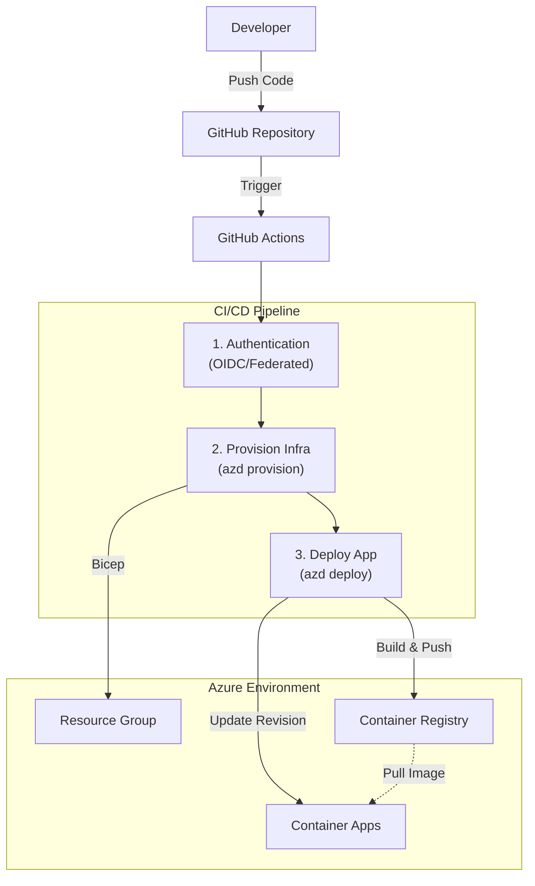

# Đề cương Chương 4: Quy trình phát triển và Vận hành (DevOps & CI/CD)

## Mục tiêu chương
Chương này tập trung vào việc tự động hóa quy trình phân phối phần mềm (Software Delivery), chuyển đổi từ việc triển khai thủ công sang quy trình Tích hợp liên tục và Triển khai liên tục (CI/CD) hiện đại.
Điểm nhấn là việc sử dụng **GitHub Actions** kết hợp với **Azure Developer CLI (azd)** để tạo ra một pipeline thống nhất cho cả hạ tầng (IaC) và ứng dụng.

## Cấu trúc nội dung đề xuất

### 4.1. Tổng quan quy trình CI/CD
*   **Concept**: Giới thiệu mô hình pipeline của dự án.
*   **Luồng đi (Flow)**:
    1.  Developer push code lên nhánh `main`.
    2.  GitHub Actions tự động kích hoạt.
    3.  Thiết lập môi trường (Setup .NET, azd).
    4.  Xác thực với Azure (Authentication).
    5.  Cấp phát/Cập nhật hạ tầng (`azd provision`).
    6.  Đóng gói và Triển khai ứng dụng (`azd deploy`).
*   **Tại sao chọn phương pháp này?**: Tận dụng sự tích hợp chặt chẽ giữa `azd` và .NET Aspire giúp giảm bớt việc phải viết các script Docker/Kubernetes thủ công phức tạp.

### 4.2. Cơ chế Bảo mật và Xác thực (Security & Auth)
*   **Vấn đề**: Việc lưu trữ "Client Secret" (Secret cứng) của Service Principal trên GitHub tiềm ẩn rủi ro bảo mật (hết hạn, rò rỉ).
*   **Giải pháp (Zero Trust)**: Sử dụng **OpenID Connect (OIDC)** với **Federated Credentials**.
    *   GitHub Actions đóng vai trò là một "Identity" được Azure tin tưởng.
    *   Không cần lưu trữ bất kỳ mật khẩu nào của Azure trong GitHub Secrets.
*   **Quản lý biến môi trường**:
    *   **GitHub Variables**: Lưu các cấu hình không nhạy cảm (Tenant ID, Subscription ID, Location).
    *   **GitHub Secrets**: Chỉ lưu các thông tin nhạy cảm thực sự cần thiết cho quá trình provision (như DB Password khởi tạo).

### 4.3. Chi tiết luồng thực thi (Workflow Implementation)
Phân tích chi tiết file workflow `.github/workflows/azure-dev.yml`:

#### Bước 1: Khởi tạo và Xác thực
Minh họa đoạn code `azd auth login` sử dụng `--federated-credential-provider "github"`.

#### Bước 2: Cấp phát hạ tầng (Provisioning)
*   Lệnh `azd provision` hoạt động như thế nào trong CI?
*   Cách nó liên kết các biến bí mật (Secrets) từ GitHub vào tham số Bicep (ví dụ: `AZURE_POSTGRES_PASSWORD`).

#### Bước 3: Đóng gói và Vận hành (Build & Deploy)
*   Lệnh `azd deploy`:
    *   Tự động phát hiện Dockerfile hoặc build container từ Project .NET (`Web/Web.csproj`).
    *   Push image lên Azure Container Registry (ACR).
    *   Cập nhật Azure Container Apps (ACA) để kéo image mới (Revision Management).
*   Cơ chế **Zero-Downtime Deployment** của ACA (giới thiệu sơ lược về việc ACA tạo revision mới và traffic shifting - dù MVP có thể dùng chế độ `single`, nhưng cần nhắc đến khả năng này).

### 4.4. Chiến lược quản lý phiên bản (Versioning)
*   Cách đặt tag cho Docker Image (thường `azd` sử dụng checksum hoặc timestamp).
*   Truy vết (Traceability): Từ một Revision đang chạy trên Azure có thể truy ngược lại Commit ID trên GitHub.

---

## Các điểm nhấn kỹ thuật (Key Highlights)
1.  **Secretless Deployment**: Loại bỏ hoàn toàn việc lưu trữ credential dài hạn của Azure (Service Principal Client Secrets).
2.  **Infrastructure as Code Pipeline**: Hạ tầng được cập nhật *trước* khi ứng dụng được deploy, đảm bảo tính đồng bộ (ví dụ: thêm cột DB mới -> chạy migration -> deploy code mới).
3.  **Adherence to Best Practices**: Tuân thủ các nguyên tắc của Modern DevOps (tự động hóa tối đa, everything as code).

## Hình ảnh minh họa dự kiến
1.  **Sơ đồ luồng CI/CD**: Biểu đồ Mermaid High-level mô tả các giai đoạn chính.

2.  **Screenshot GitHub Actions**: Ảnh chụp màn hình một lần chạy pipeline thành công (xanh).
3.  **Snippet YAML**: Các đoạn cấu hình quan trọng trong `azure-dev.yml`.
