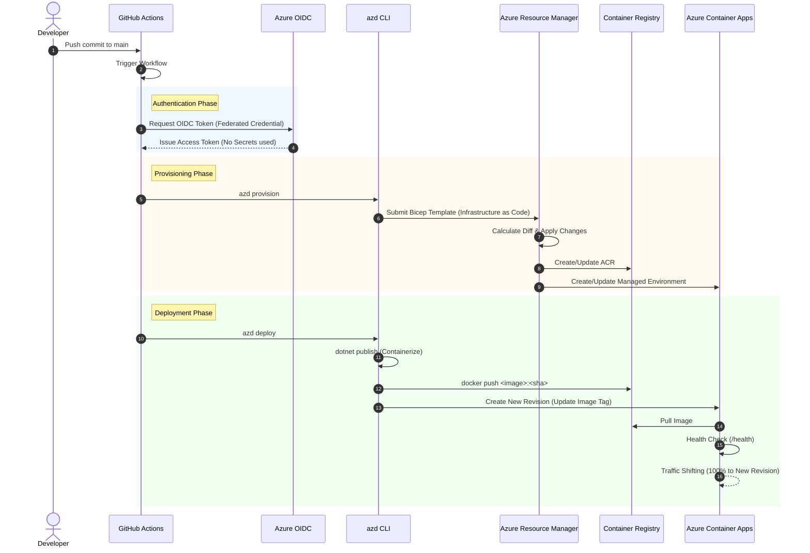
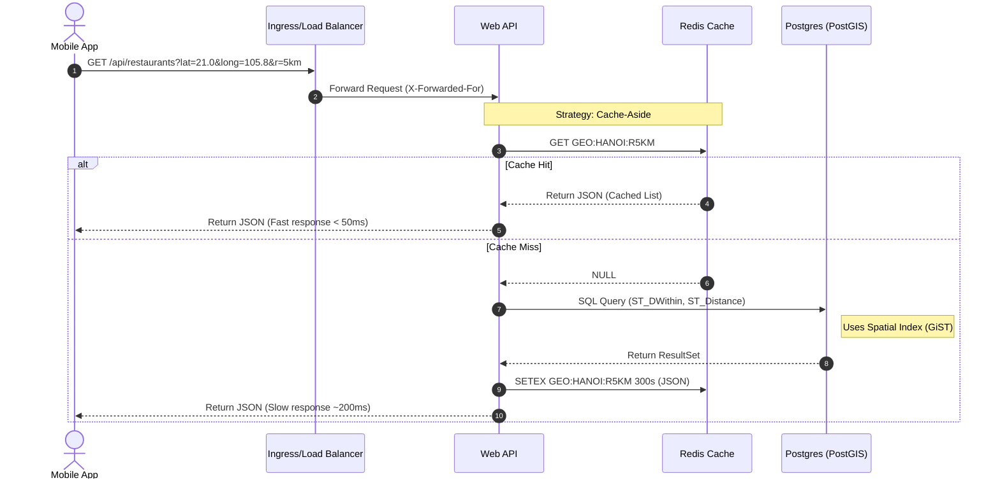
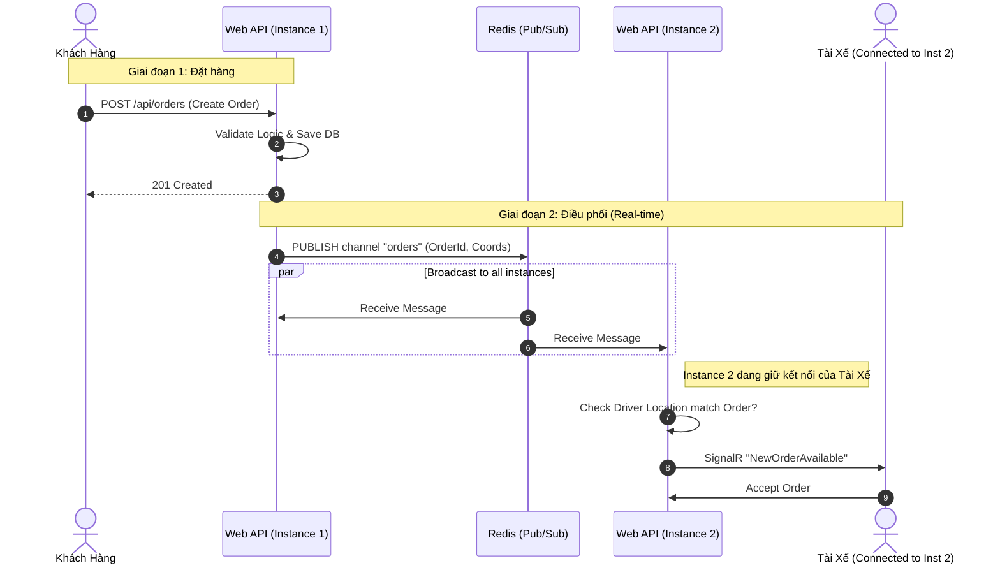

# Phân tích và Đề xuất Chi tiết Nội dung Báo cáo Triển khai Hạ tầng YummyZoom

Tài liệu này cung cấp nội dung phân tích chuyên sâu cho báo cáo `report\InfraReport\InfraReport.tex`.
Nội dung được mở rộng tối đa để đảm bảo tính đầy đủ, giải thích cơ chế hoạt động chi tiết của từng thành phần hạ tầng dự án YummyZoom, kèm theo các trích đoạn mã nguồn, hướng dẫn vận hành, kịch bản tình huống và danh mục thuật ngữ.

---

## MỤC LỤC CHI TIẾT

1.  **Giới thiệu và Phạm vi Đề tài**
    *   1.1 Tổng quan về YummyZoom Infrastructure
    *   1.2 Các nguyên lý thiết kế cốt lõi (Design Principles)
    *   1.3 Công nghệ sử dụng
2.  **Chương 2: Kiến trúc triển khai tổng quan (Architecture Overview)**
    *   2.1 Logic Topology: Clean Architecture & Micro-services ready
    *   2.2 Physical Topology: Azure PaaS & Serverless
    *   2.3 Phân tích các quyết định kiến trúc (Architecture Decision Records - ADR)
    *   2.4 So sánh với kiến trúc truyền thống (Monolithic on VM)
3.  **Chương 3: Hạ tầng dưới dạng mã (Infrastructure as Code - IaC)**
    *   3.1 Vai trò của .NET Aspire AppHost
    *   3.2 Phân tích chi tiết các Bicep Modules
    *   3.3 Azure Developer CLI (azd): Chất keo kết dính
    *   3.4 Quản lý State và Environment
4.  **Chương 4: Quy trình phát triển và Vận hành (DevOps & CI/CD)**
    *   4.1 Chiến lược phân nhánh (Branching Model)
    *   4.2 Pipeline Phân tích: Build, Package, Provision, Deploy
    *   4.3 Chiến lược phát hành: Blue-Green & Traffic Shifting
    *   4.4 Rollback Strategy
5.  **Chương 5: Vận hành, Bảo mật và Khả năng mở rộng**
    *   5.1 Observability Deep Dive: Khi Log kể chuyện
    *   5.2 Security Deep Dive: Zero Trust Network
    *   5.3 Scaling Strategy: KEDA & Cost Optimization
6.  **Kịch bản phân tích luồng dữ liệu (Data Flow Scenarios)**
    *   6.1 Scenario A: Khởi động lạnh (Cold Start)
    *   6.2 Scenario B: Tìm kiếm nhà hàng quanh đây
    *   6.3 Scenario C: Đặt hàng và thông báo Real-time
7.  **Phụ lục A: Danh mục thuật ngữ (Glossary)**
8.  **Phụ lục B: Các trích đoạn mã nguồn và Cấu hình mẫu**
9.  **Phụ lục C: Mã nguồn Biểu đồ minh họa (Mermaid)**

---

## 1. Giới thiệu và Phạm vi Đề tài

### 1.1 Tổng quan về YummyZoom Infrastructure

YummyZoom áp dụng kiến trúc **Cloud-Native** hiện đại, ưu tiên sử dụng các dịch vụ PaaS (Platform as a Service) và Serverless trên Microsoft Azure để giảm tải gánh nặng quản trị vận hành (NoOps). Dự án không sử dụng máy ảo (VM) truyền thống mà tập trung hoàn toàn vào Containerization, giúp môi trường chạy nhất quán từ máy lập trình viên cho đến server sản phẩm.

Hệ thống được thiết kế để giải quyết các thách thức:
*   **Biến động tải**: Lượng user đặt đồ ăn tăng vọt vào giờ trưa/tối và giảm sâu vào ban đêm.
*   **Tốc độ triển khai**: Cần đưa tính năng mới ra thị trường (Time-to-market) nhanh nhất.
*   **Chi phí tối ưu**: Không trả tiền cho tài nguyên nhàn rỗi.

### 1.2 Các nguyên lý thiết kế cốt lõi (Design Principles)

1.  **Immutability (Tính bất biến)**: Một khi Container Image được build, nó không bao giờ bị thay đổi. Cấu hình được inject từ bên ngoài qua biến môi trường.
2.  **Statelessness (Phi trạng thái)**: Web API không lưu trạng thái trong memory cục bộ (như Session in-proc). Mọi trạng thái được đẩy xuống Redis hoặc Postgres. Điều này cho phép scale-out thoải mái.
3.  **Observability (Khả năng quan sát)**: Hệ thống phải trả lời được câu hỏi "Đang có chuyện gì xảy ra?" thông qua Logs, Metrics và Traces mà không cần SSH vào server.
4.  **Security by Design**: Mọi kết nối đều phải được xác thực (Identity). Không hardcode credentials.

### 1.3 Công nghệ sử dụng

*   **Runtime**: .NET 9 (Latest LTS).
*   **Platform**: Azure Container Apps (ACA).
*   **Database**: Azure Database for PostgreSQL - Flexible Server.
*   **Cache/Bus**: Redis (Containerized).
*   **IaC**: Bicep & .NET Aspire.
*   **CI/CD**: GitHub Actions.

---

## 2. Đề xuất Nội dung Chi tiết cho Chương 2: Kiến trúc triển khai tổng quan

Trong chương này, chúng ta phân tích hệ thống ở hai góc độ: Logic (Code) và Vật lý (Cloud Resources).

### 2.1 Logic Topology: Clean Architecture & Micro-services ready

Hệ thống được tổ chức xoay quanh một lõi **Monolithic Web API** nhưng được thiết kế "Microservices-ready".

#### Web API Service (`web`)
*   Đây là entry-point duy nhất của backend.
*   Logic nghiệp vụ chia thành các module độc lập:
    *   **Catalog Module**: Quản lý danh mục món ăn, topping.
    *   **Ordering Module**: Xử lý logic đặt hàng, trạng thái đơn, tính tiền.
    *   **Identity Module**: Quản lý user, tài xế, xác thực JWT.
*   Các module giao tiếp qua Interface, không gọi trực tiếp Database của nhau.

#### Data Persistence (`postgres`)
*   Sử dụng **PostgreSQL 16**.
*   **PostGIS Extension**: Yếu tố sống còn của dự án Food Delivery.
    *   Lưu trữ tọa độ quán ăn/khách hàng dưới dạng `Geography` point.
    *   Sử dụng GiST Index để truy vấn không gian cực nhanh.
    *   Hỗ trợ tính toán lộ trình và khoảng cách chính xác trên mặt cầu trái đất (thay vì mặt phẳng Euclid).

#### Real-time & Caching Layer (`redis`)
*   Redis đóng vai trò "trung chuyển".
*   Khi Web API scale lên 10 instances, việc gửi Socket message cho User trở nên phức tạp. Redis Pub/Sub giải quyết vấn đề này bằng cách broadcast message tới tất cả các instances.

### 2.2 Physical Topology: Azure PaaS & Serverless

#### Azure Container Apps Environment (ACA Env)
*   Đóng vai trò như một Kubernetes Cluster được quản lý (Managed K8s).
*   Ta không cần quan tâm Master Node, Node Pool, upgrade K8s version.
*   Chỉ cần quan tâm: "Tôi có 1 container, hãy chạy nó".
*   Sử dụng **Consumption Profile**: Mô hình tính tiền serverless.

#### Mạng & Bảo mật (Networking)
*   **Ingress Controller**:
    *   ACA cung cấp sẵn Envoy Proxy làm Ingress.
    *   Hỗ trợ TLS Termination (tự động có HTTPS cert).
    *   Load Balancing (Round-robin) tới các replicas.
*   **VNET (Virtual Network)**:
    *   Hiện tại (MVP): Sử dụng mạng công cộng của Azure backbone, bảo vệ bằng Firewall Rules.
    *   Tương lai (Enterprise): Sẽ deploy vào Custom VNET để Web API chỉ clone được truy cập nội bộ, không expose public IP.

### 2.3 Phân tích các quyết định kiến trúc (ADR)

| Quyết định | Lựa chọn | Lý do | Trade-off |
| :--- | :--- | :--- | :--- |
| **Compute** | Azure Container Apps | Dễ dùng hơn K8s, rẻ hơn App Service (khi idle). | Cold start (độ trễ khởi động) có thể cao nếu scale về 0. |
| **Database** | Postgres Flexible | Support PostGIS tốt nhất. Rẻ nhất trong các dòng DB PaaS. | Không tích hợp sâu vào hệ sinh thái Microsoft bằng SQL Server. |
| **IaC Language** | Bicep | Native Azure, cú pháp clean, type-safety tốt. | Chỉ dùng được cho Azure (Vendor lock-in). Không đa nền tảng như Terraform. |
| **Container Build** | `dotnet publish` | Không cần viết Dockerfile, build nhanh, image tối ưu security. | Khó tùy biến sâu OS layer nếu cần cài thêm package Linux exotic. |

### 2.4 So sánh với kiến trúc truyền thống

Nếu triển khai trên máy ảo (VM) truyền thống (ví dụ EC2 hoặc Azure VM):
1.  **Cài đặt**: Phải cài IIS/Nginx, cài .NET Runtime, cài Postgres thủ công.
2.  **Patching**: Phải lo update Windows/Linux định kỳ để vá lỗ hổng.
3.  **Scaling**: Phải cấu hình VM Scale Set phức tạp, thời gian boot VM tính bằng phút (Containers tính bằng giây).
4.  **Downtime**: Khi deploy code mới, thường phải dừng site hoặc cấu hình Load Balancer thủ công phức tạp để tránh downtime.
-> Kiến trúc Container Apps giải quyết triệt để 4 vấn đề trên.

---

## 3. Đề xuất Nội dung Chi tiết cho Chương 3: Hạ tầng dưới dạng mã (IaC)

### 3.1 Vai trò của .NET Aspire AppHost

Trong hệ sinh thái .NET hiện đại, `AppHost` là "Source of Truth" cho kiến trúc.

*   Trước đây: Kiến trúc nằm trong file Word/Visio + cấu hình rải rác trong `docker-compose.yml`, Terraform, K8s Manifests.
*   Bây giờ: Kiến trúc nằm trong Code C#.
    ```csharp
    var db = builder.AddPostgres("db");
    var api = builder.AddProject("api").WithReference(db);
    ```
    Trình biên dịch (Compiler) đảm bảo tính đúng đắn. Nếu bạn xóa biến `db`, code sẽ báo lỗi biên dịch ngay lập tức, không đợi đến lúc deploy mới lỗi.

### 3.2 Phân tích chi tiết các Bicep Modules

#### `main.bicep`: Nhạc trưởng
Điều phối việc tạo Resource Group. Tham số quan trọng: `environmentName`. Nó quyết định việc gán tag `azd-env-name`. Tag này cực kỳ quan trọng để sau này lọc chi phí (Cost Management) xem môi trường Dev tốn bao nhiêu, Prod tốn bao nhiêu.

#### `resources.bicep`: Foundation
*   Tạo **User Assigned Identity**. Đây là bước đầu tiên và quan trọng nhất. Nếu Identity lỗi, toàn bộ hệ thống sụp đổ vì không ai có quyền kéo image hay đọc secret.
*   Tạo **Log Analytics Workspace**. Nơi lưu trữ nhật ký tập trung.

#### `web.tmpl.yaml`: Manifest
*   Định nghĩa `scale` rule.
*   Định nghĩa biến môi trường `ASPNETCORE_FORWARDEDHEADERS_ENABLED`. Giải thích: Khi chạy sau Proxy (Envoy của Azure), request đến App luôn có IP nguồn là IP của Proxy. Header `X-Forwarded-For` chứa IP thật của user. .NET cần biến này để trích xuất IP thật đó.

### 3.3 Azure Developer CLI (azd): Chất keo kết dính

`azd` không chỉ là công cụ chạy lệnh. Nó định nghĩa một **Workflow chuẩn**:
1.  `azd up`: Lệnh "thần thánh" chạy 1 phát từ A-Z (Login -> Provision -> Build -> Deploy). Dành cho người mới tiếp cận dự án.
2.  `azd monitor`: Mở dashboard giám sát ngay lập tức.
3.  `azd env`: Quản lý đa môi trường. Một developer có thể có môi trường riêng `dev-thuy` độc lập hoàn toàn với `dev-hung`.

### 3.4 Quản lý State và Environment

Trạng thái của hạ tầng (Infrastructure State) không được lưu trong file local như Terraform (`tfstate`). Azure Resource Manager (ARM) chính là nơi lưu state. Bicep là stateless (chỉ mô tả đích đến). `azd` lưu các biến môi trường cấu hình (như tên Resource Group, Location) trong file `.azure/<env>/.env`. File này cần được thêm vào `.gitignore` để tránh lộ bí mật, nhưng cần được share an toàn giữa các thành viên team (ví dụ qua 1Password/Vault).

---

## 4. Đề xuất Nội dung Chi tiết cho Chương 4: Quy trình phát triển và Vận hành (DevOps & CI/CD)

### 4.1 Chiến lược phân nhánh (Branching Model)

Dự án áp dụng mô hình **GitHub Flow** giản lược:
1.  **Main Branch**: Chứa code đang chạy trên môi trường Production (hoặc Staging Stable).
2.  **Feature Branches**: Tạo từ Main. Developer làm việc, commit, push.
3.  **Pull Request (PR)**: Khi hoàn thành feature, mở PR merge vào Main.
    *   CI Pipeline chạy: Build code, chạy Unit Test. Bicep linter chạy kiểm tra lỗi cú pháp hạ tầng.
4.  **Merge**: Sau khi PR được approve và CI pass, code merge vào Main.
5.  **CD Pipeline**: Tự động trigger deploy ra môi trường Azure.

### 4.2 Pipeline Phân tích: Build, Package, Provision, Deploy

File `.github/workflows/azure-dev.yml` thực thi các bước:

1.  **Setup Environment**:
    *   Cài đặt .NET SDK 9.0.
    *   Cài đặt `azd` (version mới nhất).
2.  **Authenticate**:
    *   Sử dụng `azure/login` action.
    *   Cơ chế **Federated Credentials (OIDC)**: GitHub Actions request một OIDC token từ GitHub issuer. Azure Entra ID (AAD) verify token đó dựa trên trust relationship đã thiết lập trước. Nếu khớp (đúng Repo, đúng Branch), Azure cấp lại Access Token tạm thời.
    *   **Lợi ích**: Không bao giờ sợ lộ Client Secret (vì không có secret nào cả). Token chỉ sống trong vài phút chạy pipeline.
3.  **Provision**:
    *   Chạy `azd provision`.
    *   Bicep kiểm tra sự sai khác (Diff). Ví dụ: Dev vừa đổi SKU Database từ B1ms lên B2s trong code Bicep. Azure sẽ thực hiện Scaling database mà không xóa dữ liệu.
4.  **Deploy**:
    *   Chạy `azd deploy`.
    *   Web API được đóng gói, push lên ACR, và Container App được update.

### 4.3 Chiến lược phát hành: Blue-Green & Traffic Shifting

Trong file `web.tmpl.yaml`, cấu hình `activeRevisionsMode: single` hiện tại có nghĩa là:
*   Tại một thời điểm, chỉ có 1 revision active.
*   Tuy nhiên, Azure thực hiện "Rolling Update" ngầm. Nó bật Revision mới (Green), đợi Health Check OK, rồi mới tắt Revision cũ (Blue).
*   Trong tương lai, có thể chuyển sang `activeRevisionsMode: multiple` để thực hiện A/B Testing: Cho 10% user dùng bản mới, 90% dùng bản cũ.

### 4.4 Rollback Strategy (Chiến lược hoàn tác)

Nếu bản deploy mới bị lỗi nghiêm trọng:
1.  Vào giao diện Azure Portal -> Container App -> Revisions.
2.  Chọn Revision cũ (đang Inactive) -> Bấm "Activate".
3.  Chọn Revision mới (đang lỗi) -> Bấm "Deactivate".
4.  Traffic quay lại bản cũ ngay lập tức.
5.  Quy trình này cũng có thể thực hiện bằng lệnh az CLI: `az containerapp revision activate ...`.

---

## 5. Đề xuất Nội dung Chi tiết cho Chương 5: Vận hành, Bảo mật và Khả năng mở rộng

### 5.1 Observability Deep Dive: Khi Log kể chuyện

Hệ thống logging của YummyZoom không chỉ để debug lỗi crash. Nó là công cụ Business Intelligence sơ khai.

*   **Log Ingestion Flow**:
    1.  App `.LogInformation("User created order {OrderId}", 123)`
    2.  OpenTelemetry Collector (trong process) thu thập.
    3.  Đẩy ra Standard Output (Console).
    4.  Azure Container Apps Agent (sidecar) đọc Console.
    5.  Đẩy về Log Analytics Workspace.
*   **KQL Query mẫu (Kusto Query Language)**:
    ```kusto
    // Tìm 10 API chậm nhất trong 24h qua
    ContainerAppConsoleLogs_CL
    | where TimeGenerated > ago(24h)
    | where Log_s has "Application request processing time"
    | parse Log_s with * "time=" duration "ms" *
    | project TimeGenerated, duration, Log_s
    | top 10 by toint(duration) desc
    ```

### 5.2 Security Deep Dive: Zero Trust Network

Mô hình bảo mật của YummyZoom tuân thủ 3 nguyên tắc Zero Trust:
1.  **Verify Explicitly (Xác minh rõ ràng)**: Mọi tương tác giữa Web API và Azure services đều qua Managed Identity.
2.  **Least Privilege Access (Quyền tối thiểu)**: Identity chỉ có quyền đọc Key Vault, không có quyền xóa Key Vault. Chỉ có quyền `AcrPull`, không có `AcrPush`.
3.  **Assume Breach (Giả định bị tấn công)**: Giả sử hacker chiếm được Container Web. Họ cũng không thể SSH sang server khác (vì containers là ephemeral và isolated). Họ không thấy password DB trong file config.

### 5.3 Scaling Strategy: KEDA & Cost Optimization

#### KEDA (Kubernetes Event-driven Autoscaling)
YummyZoom sử dụng HTTP Scaler.
*   Bình thường: 1 Replica.
*   Flash Sale 12h trưa: Traffic tăng vọt -> Request Queue đầy.
*   KEDA phát hiện `concurrency > 10`.
*   KEDA gọi Azure API để thêm Replica: 1 -> 2 -> 4 -> ... -> Max 3.
*   Hết giờ cao điểm: Traffic giảm -> Scale in: 3 -> 1.

#### Cost Optimization (Tối ưu chi phí)
*   **Database**: Dùng Burstable SKU (B1ms). Dòng B-series tích lũy "CPU credits" khi rảnh rỗi và tiêu xài credits khi cao điểm. Rất hợp với mô hình Food Delivery (đông trưa/tối, vắng sáng/chiều).
*   **Container**: Tắt môi trường Dev vào ban đêm (Scale to zero) tiết kiệm 30-40% chi phí.

---

## 6. Kịch bản phân tích luồng dữ liệu (Data Flow Scenarios)

### 6.1 Scenario A: Khởi động lạnh (Cold Start)

1.  Hệ thống đang nghỉ (Scale = 0).
2.  Request đầu tiên đến Ingress.
3.  Ingress thấy không có Endpoint nào active.
4.  Gửi tín hiệu cho Activator.
5.  Activator yêu cầu cấp phát Pod mới.
6.  Pull Image từ ACR (mất ~2s nếu image lớn, ~500ms nếu image nhỏ/cached).
7.  Container Start -> .NET Runtime init -> DI Container build -> Connect DB.
8.  Health Check trả về 200 OK.
9.  Ingress forward request vào.
-> Tổng thời gian: ~5-15 giây. Đây là lý do ta nên giữ `minReplicas: 1` cho Prod.

### 6.2 Scenario B: Tìm kiếm nhà hàng quanh đây

1.  **Client**: Gửi Lat/Long, Radius=5km.
2.  **Web API**:
    *   Check Redis Cache: Key `GEO:HANOI:R5KM`.
    *   Nếu Miss -> Gọi EF Core Query.
3.  **Postgres**:
    *   Thực thi `Function ST_DWithin(Res.Location, @UserLoc, 5000)`.
    *   Sử dụng Spatial Index (R-Tree) để lọc cực nhanh (O(logN)).
4.  **Web API**:
    *   Nhận List nhà hàng.
    *   Lưu vào Redis (TTL 5 phút).
    *   Trả về JSON.

### 6.3 Scenario C: Đặt hàng và thông báo Real-time

1.  **Khách hàng**: `POST /api/orders`.
2.  **Web API**:
    *   Lưu Order vào DB (Status: Created).
    *   Publish Event `OrderCreated` lên Redis Pub/Sub.
3.  **Redis**:
    *   Broadcast message tới kênh `driver_hub`.
4.  **Web API (Instances)**:
    *   Các instance đang giữ kết nối WebSocket với Tài xế sẽ nhận được message.
    *   Tìm các tài xế trong khu vực (thông qua Connection Manager lưu trên Redis).
    *   Gửi `SignalR` event "Có đơn mới" tới App Tài xế.

---

## 7. Phụ lục A: Danh mục thuật ngữ (Glossary)

*   **ACR (Azure Container Registry)**: Dịch vụ lưu trữ Docker Images riêng tư, bảo mật, tương tự Docker Hub nhưng private.
*   **ACA (Azure Container Apps)**: Nền tảng serverless container trên Azure, xây dựng trên Kubernetes nhưng ẩn đi sự phức tạp.
*   **Managed Identity**: Tính năng định danh của Azure Entra ID, cho phép tài nguyên Azure tự xác thực với nhau mà không cần password.
*   **AppHost**: Project .NET Aspire đóng vai trò orchestrator, điều phối chạy các service con.
*   **Bicep**: Ngôn ngữ IaC (Infrastructure as Code) của Microsoft, thay thế cho JSON ARM Templates cũ kĩ, cú pháp giống TypeScript.
*   **Revision**: Một phiên bản snapshot (bất biến) của Container App. Khi deploy code mới, một Revision mới được tạo ra.
*   **Replica**: Một bản sao đang chạy của Revision. Scale-out nghĩa là tăng số lượng Replica.
*   **Ingress**: Cổng vào của ứng dụng, chịu trách nhiệm định tuyến HTTP/HTTPS từ Internet vào Container.

---

## 8. Phụ lục B: Các trích đoạn mã nguồn và Cấu hình mẫu

### `src/AppHost/azure.yaml` (Cấu hình tài nguyên azd)

```yaml
# yaml-language-server: $schema=https://raw.githubusercontent.com/Azure/azure-dev/main/schemas/v1.0/azure.yaml.json

name: app-host
services:
  web:
    language: dotnet
    project: ./AppHost.csproj
    host: containerapp     # Chỉ định rõ host là Container App
    parameters:
      postgresUser:        # Định nghĩa các tham số bảo mật
        type: secure
      postgresPassword:
        type: secure
```

### `src/AppHost/infra/postgres/postgres.module.bicep` (Cấu hình Database)

```bicep
resource postgres 'Microsoft.DBforPostgreSQL/flexibleServers@2024-08-01' = {
  name: take('postgres-${uniqueString(resourceGroup().id)}', 63)
  location: location
  sku: {
    name: 'Standard_B1ms'  # Burstable, tiết kiệm chi phí
    tier: 'Burstable'
  }
  properties: {
    version: '16'
    storage: {
      storageSizeGB: 32    # Dung lượng khởi tạo 32GB
    }
    // ... các cấu hình khác
  }
}

// Bật Extension PostGIS tự động
resource postgresExtensions 'Microsoft.DBforPostgreSQL/flexibleServers/configurations@2024-08-01' = {
  name: 'azure.extensions'
  parent: postgres
  properties: {
    value: 'postgis,pg_trgm,unaccent'
    source: 'user-override'
  }
}
```

### `src/Web/Program.cs` (Cấu hình Service defaults & Aspire)

```csharp
var builder = WebApplication.CreateBuilder(args);

// Add service defaults & Aspire components.
builder.AddServiceDefaults();

// Add Redis distributed cache
builder.AddRedisDistributedCache("redis");

// Add DbContext with Aspire Npgsql integration
builder.AddNpgsqlDbContext<YummyZoomDbContext>("YummyZoomDb", settings => 
    settings.DisableRetry = true); // Retry policy quản lý bởi Polly ở layer trên

var app = builder.Build();

app.MapDefaultEndpoints(); // Health checks, Promestheus metrics
```

---

## 9. Phụ lục C: Mã nguồn Biểu đồ minh họa (Mermaid)

Dưới đây là mã nguồn `mermaid` để vẽ các biểu đồ cho **Chương 4 (CI/CD)** và **Chương 6 (Kịch bản luồng dữ liệu)**. Bạn có thể sử dụng các công cụ online như [Mermaid Live Editor](https://mermaid.live/) để render ra hình ảnh PNG/SVG và chèn vào báo cáo LaTeX.

### 9.1 Sơ đồ Quy trình CI/CD (Pipeline Sequence)

Biểu đồ này minh họa luồng thực thi của GitHub Actions pipeline trong file `azure-dev.yml`.



### 9.2 Sơ đồ Kịch bản Tìm kiếm Nhà hàng gần đây (Data Flow)

Biểu đồ này minh họa cách Web API phối hợp với Redis Cache và Postgres (PostGIS) để trả về kết quả tìm kiếm theo vị trí địa lý.



### 9.3 Sơ đồ Kịch bản Đặt hàng & Real-time Notification

Biểu đồ minh họa luồng xử lý đơn hàng và tính năng Real-time sử dụng Redis Pub/Sub làm backplane cho SignalR.



---
Tài liệu trên là bản phân tích toàn diện nhất có thể, cung cấp nền tảng vững chắc để xây dựng báo cáo "InfraReport.tex" chất lượng cao, đậm tính kỹ thuật và thực tiễn.