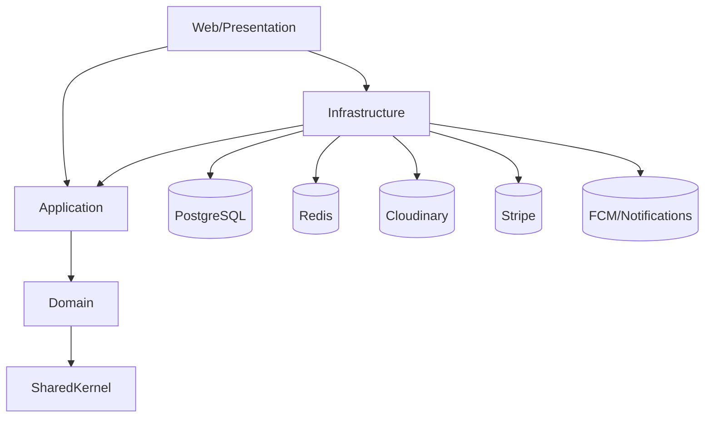

# 4.1.2 Thiet ke tong quan (Backend) - Phan tich va de xuat so do package

## Pham vi
- Tap trung vao backend cua he thong YummyZoom trong solution .NET.
- Muc tieu: mo ta cau truc goi (package) va quy tac phu thuoc de ve so do UML package cho backend.

## Phan tich cau truc goi hien tai (backend)
- Cap solution/layer:
  - `src/Domain`, `src/Application`, `src/Infrastructure`, `src/Web`, `src/SharedKernel`.
  - `src/AppHost`, `src/ServiceDefaults` (hosting/aspire config, co the dat ngoai so do backend chinh hoac gom thanh lop host).
- Domain (mieu ta theo bounded context/aggregate):
  - `UserAggregate`, `RoleAssignmentAggregate`, `RestaurantAggregate`, `MenuEntity`, `MenuItemAggregate`,
    `CustomizationGroupAggregate`, `TagEntity`, `OrderAggregate`, `TeamCartAggregate`, `CouponAggregate`,
    `ReviewAggregate`, `RestaurantAccountAggregate`, `AccountTransactionEntity`, `SupportTicketAggregate`,
    `RestaurantRegistrationAggregate`.
  - `Domain/Common`, `Domain/Services` cho cac quy tac chung.
- Application (theo feature/use case):
  - Cac module: `Users`, `RoleAssignments`, `Restaurants`, `Menus`, `MenuCategories`, `MenuItems`,
    `CustomizationGroups`, `Orders`, `TeamCarts`, `Coupons`, `Reviews`, `RestaurantRegistrations`, v.v.
  - `Application/Common` chua Behaviours (validation/authorization/logging), Interfaces, Models.
- Infrastructure (trien khai ky thuat):
  - `Persistence` (EF Core, Dapper, ReadModels), `Identity`, `Payments`, `Notifications`,
    `Messaging`, `Caching`, `BackgroundServices`, `Realtime`, `Services`.
- Web (presentation):
  - `Endpoints` (Minimal APIs), `Security`, `Middlewares`, `Realtime`, `Configuration`.

## Quy tac phu thuoc (Dependency Rule)
- Domain chi phu thuoc `SharedKernel` (neu can).
- Application phu thuoc Domain (+ SharedKernel), khong phu thuoc Infrastructure.
- Infrastructure phu thuoc Application + Domain (+ SharedKernel).
- Web phu thuoc Application + Infrastructure (+ SharedKernel) cho vai tro composition root.
- Cac he thong ben ngoai (DB, Redis, Cloudinary, Stripe, FCM, ...) chi duoc goi qua Infrastructure.

## Diem tim duoc ve phu thuoc va cau truc
- Monolithic modular: cau truc layer ro rang, module theo feature/ngu canh nghiep vu.
- CQRS: command/query trong Application; read-side dung Dapper/SQL trong Infrastructure; write-side dung EF Core + repository.
- Domain Event + Outbox: event tu Domain duoc day vao outbox trong Infrastructure, background handler xu ly bat dong bo.
- Web la lop mong: endpoint chi chuyen yeu cau xuong Application va tra ket qua.

## De xuat so do package tong quan (backend)

### 1) So do lop package cap cao (backend)
- Cac package chinh va huong phu thuoc:
  - `Web` -> `Application`
  - `Web` -> `Infrastructure`
  - `Infrastructure` -> `Application`
  - `Application` -> `Domain`
  - `Domain` -> `SharedKernel`
  - `Infrastructure` -> (DB/Redis/External Services)

Goi y ve so do (co the ve dang UML package hoac Mermaid):

### 2) Goi y bo cuc cac sub-package trong tung layer
- Domain (chia theo bounded context/aggregate):
  - Identity & Access: `UserAggregate`, `RoleAssignmentAggregate`.
  - Restaurant Catalog: `RestaurantAggregate`, `MenuEntity`, `MenuItemAggregate`, `CustomizationGroupAggregate`, `TagEntity`.
  - Order & Fulfillment: `OrderAggregate`, `TeamCartAggregate`, `CouponAggregate`, `ReviewAggregate`.
  - Payouts & Monetization: `RestaurantAccountAggregate`, `AccountTransactionEntity`.
  - Support & Governance: `SupportTicketAggregate`.
  - Onboarding: `RestaurantRegistrationAggregate`.
- Application (feature packages):
  - `Users`, `RoleAssignments`, `Restaurants`, `Menus`, `MenuCategories`, `MenuItems`,
    `CustomizationGroups`, `Orders`, `TeamCarts`, `Coupons`, `Reviews`, `RestaurantRegistrations`, ...
  - `Common` (Behaviours, Interfaces, Security, Models).
- Infrastructure (ky thuat):
  - `Persistence` (EF Core, Dapper, ReadModels), `Identity`, `Payments`, `Notifications`,
    `Messaging`, `Caching`, `BackgroundServices`, `Realtime`, `Services`.
- Web (presentation):
  - `Endpoints`, `Security`, `Middlewares`, `Realtime`, `Configuration`.

## Ghi chu khi ve so do
- Khong ve mui ten phu thuoc nguoc chieu (VD: Domain khong phu thuoc Infrastructure).
- Tranh phu thuoc cheo giua cac package cung cap.
- Neu can, ve `AppHost/ServiceDefaults` ben ngoai so do chinh nhu mot lop host/orchestration.
