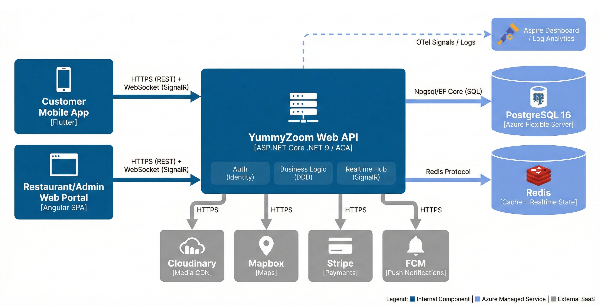
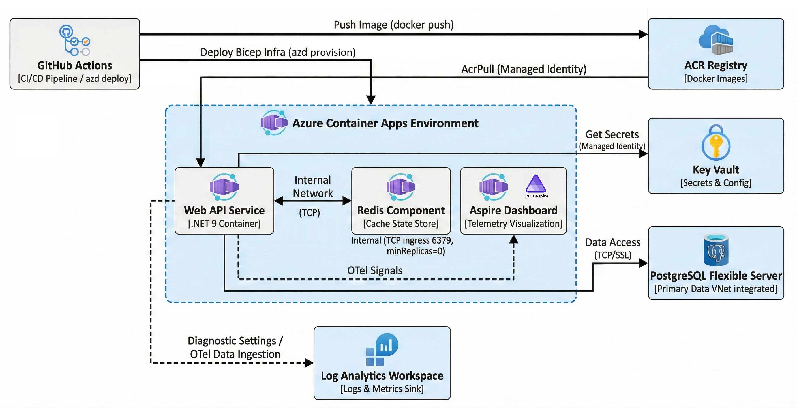

# YummyZoom – Ghi chú cập nhật sau buổi phản biện (2026-01-28)

> Mục tiêu tài liệu: tổng hợp ghi chú chỉnh sửa **sơ đồ Use Case tổng quan**, đề xuất **1–2 slide** mô tả quá trình hình thành ý tưởng/MVP (kèm script), và **dàn ý** cho báo cáo phụ về **hạ tầng & triển khai**.

---

## 0) Diagram 1 – System Architecture (C4 Container View)



### 0.1 Giải thích sơ đồ (đọc theo luồng trái → phải)

#### A) Các client (bên trái)
- **Customer Mobile App (Flutter):** ứng dụng khách hàng để duyệt nhà hàng/thực đơn, đặt món cá nhân hoặc TeamCart, theo dõi đơn…
- **Restaurant/Admin Web Portal (Angular SPA):** cổng web dành cho nhà hàng & admin để quản lý thực đơn, xử lý đơn, duyệt đăng ký nhà hàng, giám sát…

Cả hai client giao tiếp với backend theo **2 kênh**:
- **HTTPS (REST):** request/response cho các thao tác CRUD, truy vấn dữ liệu, submit đơn hàng…
- **WebSocket (SignalR):** realtime cho các tính năng cộng tác, đặc biệt là **TeamCart** (đồng bộ thao tác của nhiều người gần như tức thời).

#### B) Trung tâm hệ thống: YummyZoom Web API (backend)
- Đây là container backend chính (**ASP.NET Core .NET 9**, chạy trên **Azure Container Apps – ACA**).
- Sơ đồ thể hiện 3 nhóm trách nhiệm:
  - **Auth (Identity):** đăng nhập, JWT, role/claims, bảo vệ endpoint.
  - **Business Logic (DDD):** nghiệp vụ cốt lõi (TeamCart, Order lifecycle, quy tắc domain…).
  - **Realtime Hub (SignalR):** quản lý kết nối WebSocket và broadcast sự kiện realtime.

#### C) Data stores (bên phải)
- **PostgreSQL 16 (Azure Flexible Server):** lưu trữ dữ liệu bền vững (users, restaurants, menu, orders, reviews…). Backend truy cập qua **Npgsql/EF Core (SQL)**.
- **Redis:** dùng cho **cache** và đặc biệt là **realtime state** (ví dụ trạng thái TeamCart) nhằm giảm độ trễ và giảm tải cho PostgreSQL. Backend truy cập qua **Redis protocol**.

#### D) External SaaS (hàng dưới)
Backend tích hợp các dịch vụ ngoài hệ thống qua **HTTPS**:
- **Cloudinary:** lưu trữ/serve media (CDN cho ảnh món/nhà hàng).
- **Mapbox:** bản đồ/định vị.
- **Stripe:** thanh toán (thường dùng sandbox/PoC trong phạm vi đồ án).
- **FCM:** push notifications (đặc biệt hữu ích khi app chạy nền/đóng, đảm bảo không bỏ lỡ lời mời TeamCart hoặc cập nhật trạng thái đơn).

#### E) Observability (góc trên)
- Backend xuất **OpenTelemetry signals/logs** lên **Aspire Dashboard / Log Analytics**, giúp theo dõi logs/metrics/traces, hỗ trợ gỡ lỗi và đánh giá vận hành hệ thống thực tế.

### 0.2 Cách trình bày slide này (gợi ý script 60–90 giây)

> “Đây là sơ đồ kiến trúc tổng quan theo C4 Container View của YummyZoom. Hệ thống có hai nhóm client: mobile Flutter cho khách hàng và web Angular cho nhà hàng/admin.
> 
> Cả hai client giao tiếp với backend qua hai kênh: HTTPS REST cho các nghiệp vụ thông thường và WebSocket SignalR cho các tính năng realtime, đặc biệt là TeamCart.
> 
> Backend là Web API .NET 9 triển khai trên Azure Container Apps. Bên trong gồm ba nhóm chính: xác thực bằng Identity/JWT, lớp nghiệp vụ theo DDD, và SignalR hub để phát sự kiện realtime.
> 
> Dữ liệu bền vững lưu ở PostgreSQL Flexible Server; Redis dùng để cache và lưu trạng thái realtime để giảm độ trễ và giảm tải DB. Ngoài ra backend tích hợp các SaaS như Cloudinary, Mapbox, Stripe và FCM qua HTTPS. Cuối cùng, hệ thống có observability bằng OpenTelemetry đưa về Aspire Dashboard/Log Analytics để theo dõi logs/metrics/traces.”

### 0.3 Tips để slide “trông chuyên nghiệp” trước hội đồng
- Không đọc từng box; trình bày theo 4 ý: **Client → Giao tiếp → Backend → Data/Realtime/Observability**.
- Nhấn mạnh 1 câu “đóng đinh”: **REST để lấy dữ liệu, SignalR để đồng bộ realtime (TeamCart/Order status)**.
- Nhấn mạnh 2 điểm “ăn điểm kỹ thuật”:
  1) **Separation of concerns** (Auth/Business/Realtime).
  2) **Observability** (OTel → Aspire/Log Analytics).
- Nếu bị hỏi “vì sao Redis?”: dùng câu trả lời ngắn:
  - “Redis giúp xử lý thao tác dồn dập của nhiều người trong TeamCart với latency thấp và tránh đọc/ghi liên tục xuống Postgres.”

### 0.4 Chỉnh sửa nhỏ đề xuất (nếu muốn hoàn thiện hơn)
- Thêm dưới “YummyZoom Web API”: **Clean Architecture + CQRS** (đây là signature kiến trúc của hệ thống).

---

## 0.5 Diagram 2 – Physical Azure Deployment Architecture



### 0.5.1 Kiểm tra luồng triển khai: đã ổn chưa? Có cần chỉnh/ thêm gì?

**Luồng chính trong sơ đồ hiện tại là hợp lý** và khớp với tài liệu hạ tầng (Aspire + azd + bicep + Azure Container Apps):
- GitHub Actions thực hiện CI/CD
- Push image lên **ACR**
- `azd` provision infra bằng **Bicep** và deploy service lên **Azure Container Apps Environment**
- Web API truy cập **PostgreSQL Flexible Server** + **Redis**
- Lấy secrets từ **Key Vault** bằng **Managed Identity**
- Logs/metrics đi về **Log Analytics Workspace**
- OTel signals có thể hiển thị trên **Aspire Dashboard**

**Những điểm nên chỉnh/ bổ sung để “chuẩn” và sát implementation hơn:**
1) **Thêm mũi tên “ACA pulls image from ACR”**
   - Hiện bạn vẽ GitHub Actions → ACR (push) là đúng.
   - Nhưng lúc chạy, chính **Container App** sẽ **pull** image từ ACR qua quyền **AcrPull** (Managed Identity). Nên thêm arrow: `Azure Container Apps (web) → ACR (pull image)`.

2) **Nếu bạn không dùng Dapr**, nên đổi label “Internal Network (Dapr/Service Invocation)”
   - Trong docs hiện tại không thấy Dapr being used.
   - Đề xuất đổi thành: **Internal network (TCP)** hoặc **Internal service-to-service networking**.
   - (Nếu sau này có dùng Dapr thì giữ như hiện tại.)

3) **Ghi rõ “Redis” là Container App nội bộ (TCP ingress 6379, minReplicas=0)**
   - Vì đây là điểm hay (zero-scale) và khớp `redis-containerapp.module.bicep`.

4) **OTel → Aspire Dashboard**: ghi chú “OTLP exporter”
   - Thêm note nhỏ: Web API xuất OTel và gửi đến Aspire Dashboard qua OTLP endpoint (khi cấu hình `OTEL_EXPORTER_OTLP_ENDPOINT`).

5) **PostgreSQL ‘VNet integrated’**
   - Trong Bicep thực tế có thể là public + firewall hoặc private/VNet integration.
   - Nếu bạn chưa chắc, đổi label an toàn hơn: **PostgreSQL Flexible Server (TLS)**, tránh cam kết “VNet integrated” nếu chưa verify.

### 0.5.2 Giải thích sơ đồ (đọc theo luồng triển khai)

#### A) CI/CD & build artifacts
- **GitHub Actions** chạy pipeline:
  - Build & test
  - Build Docker image
  - Push image lên **Azure Container Registry (ACR)**
  - Chạy `azd` để provision + deploy

#### B) Provision hạ tầng (IaC)
- `azd up` / `azd provision` dùng **Bicep** để tạo tài nguyên:
  - Azure Container Apps Environment
  - ACR
  - Log Analytics
  - Key Vault
  - PostgreSQL Flexible Server
  - Redis Container App
  - Aspire Dashboard component

#### C) Deploy runtime (Azure Container Apps)
Trong **Azure Container Apps Environment**:
- **Web API Service (.NET 9 container)** chạy backend chính.
- **Redis component/container** cung cấp cache + realtime state.
- **Aspire Dashboard** nhận telemetry để quan sát hệ thống.

Kết nối nội bộ:
- Web API ↔ Redis qua mạng nội bộ (TCP).

#### D) Secrets / Config
- Web API lấy secrets/config từ **Key Vault**.
- Cơ chế đúng chuẩn là **Managed Identity** + quyền truy cập Key Vault (giảm phụ thuộc secrets trong CI/CD).

#### E) Data layer
- Web API truy cập **PostgreSQL Flexible Server** qua TCP/TLS.

#### F) Observability
- Web API xuất logs/metrics/traces:
  - **OTel signals** → Aspire Dashboard (để xem trace/metrics nhanh)
  - **Diagnostic settings / log ingestion** → Log Analytics Workspace (lưu trữ và truy vấn logs)

### 0.5.3 Cách trình bày slide này (script 60–90 giây)

> “Slide này mô tả kiến trúc triển khai vật lý của backend trên Azure.
> 
> Ở phía CI/CD, GitHub Actions build và push Docker image lên ACR. Song song, pipeline dùng azd để provision hạ tầng bằng Bicep và deploy ứng dụng lên Azure Container Apps.
> 
> Ở runtime, Web API .NET 9 chạy trong Container Apps Environment và kết nối nội bộ tới Redis để cache và lưu trạng thái realtime. Dữ liệu bền vững được lưu trên PostgreSQL Flexible Server. Secrets và cấu hình được lấy từ Key Vault thông qua Managed Identity.
> 
> Cuối cùng, hệ thống có observability: logs/metrics được đưa vào Log Analytics và telemetry có thể xem trực quan trên Aspire Dashboard, giúp theo dõi vận hành và gỡ lỗi.”

### 0.5.4 Tips trả lời Q&A (ngắn)
- **“Vì sao ACR?”**: để quản lý version Docker image và để ACA pull image theo từng revision.
- **“Vì sao Managed Identity + Key Vault?”**: tránh lưu secrets dài hạn trong repo/pipeline, giảm rủi ro lộ secrets.
- **“Vì sao Redis chạy trên ACA và min=0?”**: tiết kiệm chi phí, phù hợp MVP; chấp nhận trade-off cold start.
- **“Observability có gì?”**: logs/metrics/traces theo OTel + dashboard để debug nhanh.

---

## 1) Note chỉnh sửa sơ đồ Use Case tổng quan (usecase_overview)

### 1.1 Context & vấn đề thầy góp ý
- Hiện tại sơ đồ Use Case tổng quan đang thể hiện actor **Khách hàng (Customer)** và **Nhà hàng (Restaurant)** *kế thừa* từ actor **Người dùng** (mũi tên `Extends` / generalization).
- Actor **Quản trị viên (Admin)** lại **nằm tách biệt**, không liên quan tới actor “Người dùng”, gây cảm giác “Admin không phải user?”.
- Trong implementation thực tế (theo code + tài liệu `Docs/Architecture/Two-Identity-Model.md`):
  - Hệ thống có **một Identity User** làm SSoT cho định danh (`ApplicationUser.Id`).
  - “Customer / Restaurant Owner / Staff / Admin” là **vai trò (role assignment/claims)**, **không phải inheritance entity** trong Domain.

=> Vì vậy, dùng generalization ở Use Case diagram theo kiểu “kế thừa User” dễ gây hiểu nhầm (đặc biệt khi đối chiếu với code).

### 1.2 File liên quan
Trong `report/res/diagrams/`:
- `usecase_overview.drawio` + `usecase_overview.drawio.png`
- `usecase_overview.puml`

### 1.3 Đề xuất chỉnh sửa (khuyến nghị)

#### A) Chọn cách biểu diễn actor (khuyến nghị dùng A1)
**A1 (khuyến nghị): Bỏ actor “Người dùng” và bỏ toàn bộ mũi tên kế thừa.**
- Actor độc lập:
  - **Khách hàng (Customer)**
  - **Nhà hàng (Restaurant Owner/Staff)** (đổi label “Nhà hàng” thành “Chủ/nhân viên nhà hàng” để tránh hiểu nhầm restaurant là entity)
  - **Quản trị viên (Admin)**
- Ghi chú chung (note) ở góc sơ đồ: 
  - “Các tác nhân là các **vai trò** được gán trên cùng một tài khoản Identity (roles/claims), không mô hình hoá bằng kế thừa lớp trong Domain.”

**A2 (phương án thay thế nếu vẫn muốn giữ “Người dùng”):**
- Vẫn có actor “Người dùng” nhưng:
  - **Admin cũng phải kế thừa/thuộc User** (tức Admin generalize từ User giống các actor khác) để tránh hiểu nhầm.
  - Bắt buộc thêm note giải thích: “Generalization ở Use Case diagram chỉ mang tính gom nhóm hành vi, không đại diện kế thừa lớp domain”.
- Nhược: vẫn dễ bị bắt bẻ vì nhìn giống class inheritance.

=> **Chốt đề xuất:** dùng **A1**.

#### B) Chỉnh lại naming actor (để sát nghiệp vụ & code)
- Hiện label actor Restaurant là **“Nhà hàng (Restaurant)”**.
- Nên đổi thành: **“Chủ/nhân viên nhà hàng (Restaurant Owner/Staff)”**.
  - Lý do: “Restaurant” là thực thể/đối tượng quản lý, còn actor là người thao tác.
  - Trong phần đặc tả UC (ví dụ `2.3_Dac_ta_chuc_nang.tex`) bạn cũng mô tả tác nhân là “Chủ nhà hàng (Owner/Staff)”.

#### C) Về include/extend giữa các use case
- Hiện sơ đồ có `<<include>>` từ “Đặt hàng cá nhân” và “Quản lý TeamCart” sang “Quản lý tài khoản”.
- Đây ổn nếu bạn muốn nhấn mạnh “phải đăng nhập”, nhưng có thể *đơn giản hoá* bằng note:
  - “Tiền điều kiện: người dùng đã đăng nhập”
  - và bỏ `<<include>>` nếu sơ đồ bị rối.
- **Không bắt buộc đổi**, tuỳ bạn ưu tiên rõ tiền điều kiện hay rõ cấu trúc UC.

### 1.4 Checklist chỉnh sửa cụ thể theo từng file

#### a) `usecase_overview.puml`
Hiện tại file có dòng generalization:
```puml
Customer --|> "Người dùng"
Restaurant --|> "Người dùng"
```
**Đề xuất sửa:**
1) Xoá 2 dòng trên.
2) Xoá luôn actor “Người dùng” nếu có khai báo.
3) Đổi actor Restaurant:
```puml
actor "Chủ/nhân viên nhà hàng\n(Restaurant Owner/Staff)" as Restaurant
```
4) Thêm note chung (ví dụ):
```puml
note left
Các tác nhân trong sơ đồ là các *vai trò* (roles/claims)
trên cùng một tài khoản Identity.
Không mô hình hoá bằng kế thừa lớp trong Domain.
end note
```

#### b) `usecase_overview.drawio`
Trong file drawio hiện có:
- Actor “Người dùng”
- Mũi tên `Extends` từ “Khách hàng” và “Nhà hàng” lên “Người dùng”.

**Đề xuất thao tác:**
1) Xoá actor “Người dùng”.
2) Xoá 2 mũi tên `Extends`.
3) Sửa label actor “Nhà hàng (Restaurant)” → “Chủ/nhân viên nhà hàng (Restaurant Owner/Staff)”.
4) (Tuỳ chọn) Thêm note box nhỏ: “Vai trò được thể hiện qua roles/claims (Identity)”.

#### c) Ảnh export `usecase_overview.drawio.png`
- Re-export từ draw.io sau khi chỉnh, đảm bảo ảnh trong báo cáo/slide cập nhật.

---

## 2) Slide mới: Quá trình hình thành ý tưởng → khảo sát → MVP (1–2 slide + script)

### 2.1 Context từ báo cáo hiện tại (chương 1 & 2)
- **Chương 1 (`Chuong/1_Gioi_thieu.tex`)** đã có:
  - Bối cảnh thị trường food delivery
  - Pain point: đặt hàng nhóm và “một người trả rồi thu tiền lại”
  - Mục tiêu: MVP + TeamCart + tách bạch thanh toán
- **Chương 2 (`Chuong/2_Khao_sat.tex`, và các outline trong `report/res/`)** tập trung khảo sát & phân tích yêu cầu.

Điểm thiếu theo góp ý thầy:
- Chưa có slide “story” mô tả **quá trình hình thành**: idea → survey → ra yêu cầu → thiết kế → MVP → deploy.
- Bạn nói không có tài liệu survey chi tiết, nên cần **nhớ lại** và trình bày theo hướng “phương pháp + kết quả chính” (không cần số liệu quá chi tiết).

### 2.2 Slide đề xuất

#### Slide A (1 slide) – “Quy trình hình thành MVP” (khuyến nghị)
**Tiêu đề:** Hành trình hình thành YummyZoom (Idea → MVP)

**Nội dung (timeline/chevron 6 bước):**
1) **Idea / Problem**
   - Nhận diện pain point: đặt nhóm, thanh toán/thu tiền thủ công.
2) **Market observation**
   - Quan sát app phổ biến (Grab/ShopeeFood/…): chưa tối ưu split-payment cho nhóm.
3) **Requirement synthesis**
   - Nhóm requirement theo 3 vai trò: Customer / Restaurant / Admin.
   - Chốt scope MVP (giới hạn shipper, payment production, AI recommendation…).
4) **Design**
   - Clean Architecture + DDD + CQRS.
   - Realtime cho TeamCart (SignalR + Redis).
5) **Build MVP**
   - Backend API + Flutter app + Angular portal.
6) **Deploy & iterate**
   - Azure (azd+bicep+ACA), CI/CD GitHub Actions, observability Aspire/OTel.

**Gợi ý hình ảnh:** timeline ngang, icon mỗi bước (idea/search/requirements/design/build/cloud).

**Script (30–45s):**
> “Để hình thành YummyZoom, em bắt đầu từ một vấn đề rất thực tế trong môi trường văn phòng/sinh viên: đặt đồ ăn theo nhóm nhưng việc thanh toán và thu tiền còn thủ công. Từ đó em quan sát các nền tảng phổ biến và nhận thấy trải nghiệm ‘giỏ hàng nhóm + tách thanh toán’ chưa được hỗ trợ rõ ràng. Em tổng hợp yêu cầu theo ba nhóm vai trò Khách hàng, Nhà hàng và Quản trị viên, đồng thời giới hạn phạm vi ở mức MVP. Trên cơ sở đó em thiết kế kiến trúc Clean Architecture kết hợp DDD và hiện thực cơ chế realtime cho TeamCart bằng SignalR và Redis. Cuối cùng em triển khai MVP lên Azure bằng IaC và CI/CD để có thể vận hành và quan sát hệ thống thực tế.”

#### Slide B (tuỳ chọn, nếu muốn 2 slide) – “Những quyết định scope & giả định”
**Tiêu đề:** Scope MVP & giả định khảo sát

**Nội dung (2 cột):**
- **Trong scope (MVP):**
  - TeamCart realtime
  - Split payment định hướng (mô phỏng/sandbox)
  - Restaurant portal xử lý đơn
  - Admin duyệt đăng ký nhà hàng
- **Ngoài scope / future:**
  - App shipper + GPS realtime
  - Payment production & đối soát
  - AI recommendation/search semantic

**Script (20–30s):**
> “Vì là MVP trong khuôn khổ đồ án, em tập trung vào trải nghiệm TeamCart và vòng đời đơn hàng cốt lõi. Các phần như app tài xế, GPS realtime, thanh toán production và đối soát được xác định là ngoài phạm vi và là hướng phát triển tiếp theo.”

---

## 3) Dàn ý báo cáo phụ: Hạ tầng / cấu hình / triển khai hệ thống (Azure)

> Mục tiêu báo cáo: giải thích **hệ thống đang chạy** được cấu hình và triển khai như thế nào. Có thể viết 5–10 trang.

### 3.1 Phạm vi & đối tượng đọc
- Đối tượng: hội đồng/giảng viên (muốn hiểu hệ thống deploy được thật, có IaC/CI/CD/observability).
- Phạm vi: backend + hạ tầng Azure + pipeline; web Angular (Vercel) có thể mô tả ngắn; mobile APK chỉ nêu cách build/release.

### 3.2 Nguồn tư liệu trong repo (đã có)
Từ `Docs/Architecture/Aspire_Azure_Infrastructure.md`:
- `src/AppHost/Program.cs` (Aspire app graph)
- `src/AppHost/azure.yaml` (azd project)
- `src/AppHost/infra/main.bicep` + modules
- `src/AppHost/infra/web.tmpl.yaml`
- `.github/workflows/azure-dev.yml`
- ACA environment + ACR + Log Analytics + Key Vault + Postgres Flexible + Redis container app

### 3.3 Outline đề xuất

#### 1) Tổng quan kiến trúc triển khai
- Sơ đồ high-level: Client (Flutter/Angular) → Web API (ACA) → Postgres/Redis → Key Vault/Observability.
- Mục tiêu kỹ thuật: reproducible, scalable, observable.

#### 2) .NET Aspire: AppHost & ServiceDefaults
- App graph (local vs publish): postgres, redis, web.
- Health endpoints `/health`, `/alive`.
- OpenTelemetry integration, Aspire Dashboard.

#### 3) Azure resources (chi tiết hạ tầng)
- Resource group naming (rg-<env>), tags.
- Azure Container Apps Environment (Consumption) + DotNet Aspire Dashboard component.
- ACR + managed identity + AcrPull.
- Log Analytics Workspace.
- Postgres Flexible Server (PostGIS image local dev, Azure managed prod).
- Redis Container App (minReplicas=0, tcp scaler).
- Key Vault: lưu secrets, config injection.

#### 4) IaC với azd + bicep
- `azure.yaml` (service definition).
- `main.bicep` subscription scope: tạo RG + deploy modules.
- `main.parameters.json` binding từ AZD env vars.
- Outputs: connection strings, resource IDs.

#### 5) CI/CD với GitHub Actions
- Pipeline overview: build → provision/deploy.
- Secretless auth: OIDC (nếu áp dụng) / hoặc service principal (nêu rõ thực tế đang dùng).
- Deploy flow: azd up / azd deploy.
- Environment strategy (dev/staging/prod nếu có).

#### 6) Observability & vận hành
- Aspire Dashboard: logs/metrics/traces.
- OTel exporter via `OTEL_EXPORTER_OTLP_ENDPOINT`.
- Logging & tracing strategy.
- (Nếu có) alerting/monitoring hooks.

#### 7) Scaling, resiliency, zero-scale
- ACA scaling strategy cho `web`.
- Redis min=0; discuss cold start tradeoff.
- Database sizing (B1ms, 32GB storage, retention).
- Rate limiting / resilience handlers (ServiceDefaults).

#### 8) Hướng cải tiến (nếu có)
- Azure SignalR Service cho scale realtime.
- Cost optimization.
- Hardening secrets & rotation.

---

## 4) Next actions (gợi ý triển khai nhanh)
1) Chỉnh `usecase_overview.drawio` theo checklist 1.4b và re-export PNG.
2) Cập nhật `usecase_overview.puml` để tránh mũi tên kế thừa.
3) Thêm Slide A (và optionally Slide B) vào deck theo style trong `thiet_ke_slide_va_script_thuyet_trinh.md`.
4) Viết báo cáo phụ hạ tầng theo outline mục 3, ưu tiên lấy trực tiếp từ `Docs/Architecture/Aspire_Azure_Infrastructure.md` và rút gọn lại theo ngôn ngữ báo cáo.
