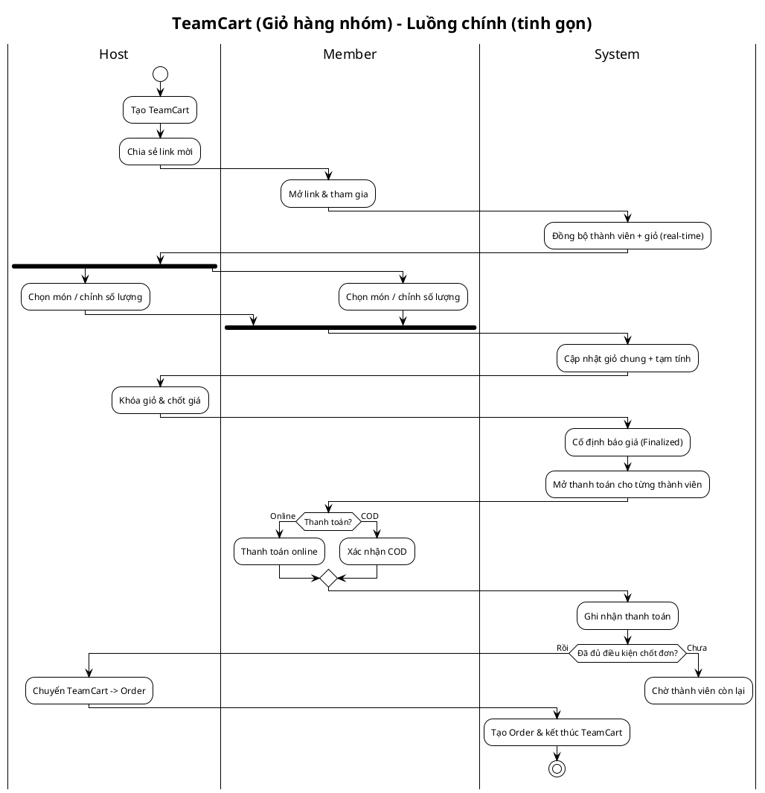
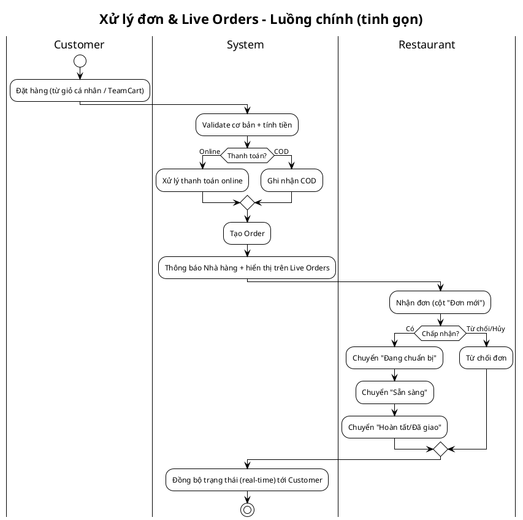

# Thiết kế slide & script thuyết trình dự án **YummyZoom**

Tài liệu này đề xuất bố cục slide và script thuyết trình dựa trên nội dung báo cáo trong `report/Chuong/*.tex`. Bố cục bám theo các chương của báo cáo, ưu tiên slide **gọn – trực quan – nhiều hình minh hoạ** (tận dụng hình/biểu đồ có sẵn trong `report/Hinhve/`).

---

## 1) Giả định nhanh (có thể điều chỉnh)

- Thời lượng: 12–15 phút + 3–5 phút Q&A.
- Đối tượng nghe: GVHD / Hội đồng (vừa quan tâm “giải quyết bài toán gì”, vừa quan tâm “thiết kế/kiến trúc ra sao”).
- Trọng tâm: **TeamCart (giỏ hàng nhóm)** + **real-time** + **tách thanh toán theo từng người** + **tính đúng nghiệp vụ**.

---

## 2) Phong cách slide (gọn gàng, trực quan)

- Tỉ lệ: 16:9.
- Quy tắc chữ: mỗi slide tối đa 3–5 gạch đầu dòng, mỗi gạch 1 dòng; ưu tiên “từ khoá” thay vì đoạn văn.
- Màu sắc gợi ý: nền sáng; điểm nhấn cam/đỏ (food theme) + xanh lá nhẹ cho “trạng thái/OK”; dùng icon nhất quán.
- Bố cục gợi ý:
  - Slide “giải thích”: 40% chữ – 60% hình.
  - Slide “demo UI”: 15% chữ – 85% hình (ảnh chụp màn hình).
  - Slide “số liệu”: dùng biểu đồ cột/điểm (p50/p95, pass/fail).

---

## 3) Kịch bản tổng thể (storyline)

1. **Bối cảnh** thị trường & thói quen đặt đồ ăn theo nhóm.
2. **Pain point**: một người trả trước rồi thu lại tiền → “ma sát” & dễ sai.
3. **Giải pháp**: TeamCart + đồng bộ real-time + mỗi người tự thanh toán.
4. **Phạm vi**: MVP nhưng đủ luồng cốt lõi (Customer/Restaurant/Admin).
5. **Thiết kế & công nghệ**: Clean Architecture + DDD + CQRS; .NET 9; Postgres/Redis; SignalR; Flutter/Angular.
6. **Kết quả**: demo UI + kiểm thử + độ trễ/triển khai.
7. **Đóng góp kỹ thuật**: kiến trúc, optimistic concurrency, realtime scale-out.
8. **Kết luận & hướng phát triển**.

---

## 4) Kế hoạch slide (đề xuất 15–16 slide)

> Ghi chú: “Hình minh hoạ” là ảnh có sẵn trong `report/Hinhve/`. Nếu dùng PowerPoint/Google Slides, nên crop/zoom để làm rõ phần quan trọng và thêm callout (mũi tên, highlight).

**Phân chia phần trình bày (để bám mạch nói):**
- **Phần A — Mở đầu:** Slide 1–2
- **Phần B — Bối cảnh, bài toán, mục tiêu/phạm vi:** Slide 3–5
- **Phần C — Khảo sát & yêu cầu (tổng quan chức năng, quy trình):** Slide 6–8
- **Phần D — Thiết kế & công nghệ & demo:** Slide 9–13
- **Phần E — Đánh giá, đóng góp, kết luận:** Slide 14–16

### Slide 1 — Trang bìa

- **Thuộc phần trình bày:** **Phần A — Mở đầu**
- **Tiêu đề:** YummyZoom – Nền tảng giao đồ ăn (MVP) với **TeamCart (Giỏ hàng nhóm)**
- **Hình minh hoạ:** `report/Hinhve/Bia.PNG` (hoặc tự thiết kế bìa: logo + tagline)
- **Nội dung trên slide (ít chữ):**
  - Tên đồ án + người thực hiện + GVHD + thời gian
  - Tagline: “Đặt chung – chọn món cùng lúc – **mỗi người tự thanh toán**”

**Script nói (30–40s):**
“Em xin chào thầy/cô. Hôm nay em trình bày đồ án **YummyZoom** – một hệ thống giao đồ ăn ở mức MVP, tập trung giải quyết một vấn đề rất đời thường: **đặt đồ ăn theo nhóm nhưng thanh toán luôn bị ‘vướng’**. Điểm nhấn của hệ thống là **TeamCart**, cho phép nhiều người cùng chọn món real-time và **tách thanh toán theo từng người**.”

---

### Slide 2 — Mục lục / Lộ trình trình bày

- **Thuộc phần trình bày:** **Phần A — Mở đầu**
- **Bố cục:** timeline 5 chặng (tương ứng Chương 1→5)
- **Nội dung trên slide:**
  1) Giới thiệu & mục tiêu  
  2) Khảo sát & yêu cầu  
  3) Công nghệ  
  4) Thiết kế – triển khai – đánh giá  
  5) Đóng góp – kết luận – hướng phát triển

**Script nói (20–30s):**
“Bài trình bày đi theo đúng bố cục báo cáo: đầu tiên là bối cảnh–mục tiêu, sau đó là khảo sát và yêu cầu, tiếp theo là công nghệ, rồi đến phần quan trọng nhất là thiết kế/triển khai/đánh giá, cuối cùng là các đóng góp kỹ thuật, kết luận và hướng phát triển.”

---

### Slide 3 — Bối cảnh & bài toán (Chương 1 + Chương 2)

- **Thuộc phần trình bày:** **Phần B — Bối cảnh, bài toán, mục tiêu/phạm vi**
- **Hình minh hoạ:** icon thị trường + con số; hoặc biểu đồ nhỏ (tự vẽ)
- **Nội dung trên slide:**
  - Thị trường giao đồ ăn tăng trưởng mạnh (Việt Nam ~ **1,2 tỷ USD (2023)**; dự báo **15–20%/năm**)
  - Nhóm mục tiêu: **sinh viên & nhân viên văn phòng**
  - Nhu cầu: nhanh – minh bạch – phối hợp nhóm

**Script nói (40–60s):**
“Thị trường giao đồ ăn online ở Việt Nam tăng trưởng rất mạnh; báo cáo trong phần khảo sát nêu quy mô khoảng **1,2 tỷ USD năm 2023** và dự báo tăng trưởng **15–20%/năm**. Với nhóm sinh viên và nhân viên văn phòng, việc đặt đồ ăn theo nhóm – nhất là giờ trưa – diễn ra thường xuyên, nên nhu cầu không chỉ là ‘đặt được’, mà còn là **đặt nhanh, rõ tiền, phối hợp tiện**.”

---

### Slide 4 — Pain point: Đặt nhóm nhưng thanh toán “kẹt” (Chương 1)

- **Thuộc phần trình bày:** **Phần B — Bối cảnh, bài toán, mục tiêu/phạm vi**
- **Hình minh hoạ:** sơ đồ 3 bước (1 người trả trước → thu tiền → dễ sai)
- **Nội dung trên slide:**
  - Một người thanh toán toàn bộ → phải thu lại tiền
  - Tốn thời gian, dễ thiếu/sai, “ma sát” trong nhóm
  - Cơ hội khác biệt: **tách thanh toán theo từng thành viên**

**Script nói (40–60s):**
“Các nền tảng lớn làm rất tốt phần tìm quán, đặt món, theo dõi đơn. Nhưng khi rơi vào kịch bản **đặt nhóm**, vấn đề nổi lên ở bước thanh toán: thường phải có **một người trả trước**, rồi sau đó đi thu lại từng người. Đó là thao tác ngoài ứng dụng: vừa mất thời gian, vừa dễ quên, dễ nhầm, và tạo ‘ma sát’ trong nhóm. Đây chính là điểm YummyZoom tập trung giải quyết.”

---

### Slide 5 — Mục tiêu & phạm vi MVP (Chương 1)

- **Thuộc phần trình bày:** **Phần B — Bối cảnh, bài toán, mục tiêu/phạm vi**
- **Hình minh hoạ:** 3 cột role (Customer / Restaurant / Admin)
- **Nội dung trên slide:**
  - MVP giao đồ ăn + điểm nhấn **TeamCart**
  - Customer: duyệt quán/món, đặt cá nhân, TeamCart, theo dõi, đánh giá
  - Restaurant: quản lý menu, live orders theo vòng đời
  - Admin: duyệt nhà hàng, giám sát/quản trị
  - Ngoài phạm vi: tài xế, thanh toán production, tài chính nhà hàng chuẩn, AI search

**Script nói (50–70s):**
“Mục tiêu của đồ án là xây dựng một MVP giao đồ ăn nhưng có điểm nhấn rõ ràng là **TeamCart**. Về phạm vi: phía khách hàng có đủ luồng duyệt quán–xem menu–đặt món, cả cá nhân lẫn theo nhóm, theo dõi trạng thái và đánh giá. Phía nhà hàng có cổng quản trị để quản lý thực đơn và xử lý đơn theo vòng đời. Phía admin có các chức năng quản trị nền tảng như duyệt đăng ký nhà hàng. Những phần ngoài phạm vi – như module tài xế, thanh toán mức production, tài chính nhà hàng đầy đủ hoặc tìm kiếm AI – được để dành cho hướng phát triển.”

---

### Slide 6 — Tổng quan chức năng (Use case overview) (Chương 2)

- **Thuộc phần trình bày:** **Phần C — Khảo sát & yêu cầu**
- **Hình minh hoạ:** `report/Hinhve/usecase_overview.drawio.png`
- **Nội dung trên slide (tóm tắt):**
  - 3 tác nhân: Customer / Restaurant / Admin
  - Nhóm use case chính: account, search/browse, order, payment, live orders, menu, coupons, approval

**Script nói (45–60s):**
“Slide này là bản đồ chức năng tổng quan. Hệ thống có 3 tác nhân chính: khách hàng, nhà hàng và admin. Nhìn vào use case, có thể thấy YummyZoom vẫn đáp ứng đầy đủ các nhóm chức năng cốt lõi: quản lý tài khoản, tìm kiếm/duyệt, đặt hàng và thanh toán, theo dõi trạng thái; phía nhà hàng có quản lý menu và xử lý đơn; phía admin có duyệt nhà hàng và quản trị dữ liệu.”

---

### Slide 7 — Quy trình nghiệp vụ TeamCart (Chương 2)

- **Thuộc phần trình bày:** **Phần C — Khảo sát & yêu cầu**
- **Hình minh hoạ:** `report/Hinhve/activity_teamcart_process.png`
- **Nội dung trên slide:**
  - Host tạo TeamCart → share link → member tham gia
  - Cùng thêm/bớt món **real-time**
  - Host “chốt giá” → mỗi người thanh toán phần mình → chốt đơn

**PlantUML (phiên bản tinh gọn để đưa lên slide)**  
Tham khảo bản gốc: `report/res/diagrams/activity_teamcart_process.puml`

**Script nói (60–90s):**
“Đây là luồng nghiệp vụ TeamCart – trọng tâm của dự án. Host tạo giỏ nhóm và chia sẻ link. Các thành viên tham gia, rồi cùng thao tác thêm/bớt món và thấy thay đổi **ngay lập tức**. Khi đã thống nhất, Host thực hiện bước **chốt giá** để khóa giỏ và cố định các khoản phí. Sau đó từng thành viên thanh toán phần của mình; khi đủ điều kiện, hệ thống mới chốt đơn và chuyển sang luồng xử lý đơn như bình thường. Mục tiêu là giảm tối đa bước trao đổi thủ công ngoài ứng dụng.”

---

### Slide 8 — Quy trình xử lý đơn & Live Orders (Chương 2 + Chương 4)

- **Thuộc phần trình bày:** **Phần C — Khảo sát & yêu cầu**
- **Hình minh hoạ:** `report/Hinhve/activity_order_processing.png` (hoặc demo Live Orders)
- **Nội dung trên slide:**
  - Order lifecycle: Mới → Đang chuẩn bị → Sẵn sàng → Hoàn tất (có huỷ)
  - Đồng bộ trạng thái tới khách hàng & nhà hàng
  - Dashboard kiểu Kanban cho nhà hàng

**PlantUML (phiên bản tinh gọn để đưa lên slide)**  
Tham khảo bản gốc: `report/res/diagrams/activity_order_processing.puml`

**Script nói (45–70s):**
“Sau khi đơn được tạo – từ đặt cá nhân hoặc từ TeamCart – hệ thống đi theo vòng đời xử lý đơn. Nhà hàng tiếp nhận đơn mới, chuyển qua các trạng thái như đang chuẩn bị, sẵn sàng, hoàn tất; đồng thời khách hàng nhận cập nhật trạng thái tương ứng. Phía nhà hàng có màn hình Live Orders dạng Kanban để vận hành trực quan trong giờ cao điểm.”

---

### Slide 9 — Kiến trúc tổng thể (Clean Architecture + DDD) (Chương 3 + Chương 4)

- **Thuộc phần trình bày:** **Phần D — Thiết kế & công nghệ & demo**
- **Hình minh hoạ:** `report/Hinhve/package_overview.png`
- **Nội dung trên slide:**
  - Monolithic Modular + Bounded Context
  - Clean Architecture: Domain / Application / Infrastructure / Presentation
  - CQRS ở Application; Domain “giàu hành vi” cho TeamCart/Order

**Script nói (60–90s):**
“Về kiến trúc, YummyZoom chọn hướng **Monolithic Modular** để tối ưu tốc độ phát triển nhưng vẫn giữ ranh giới nghiệp vụ rõ ràng. Hệ thống áp dụng **Clean Architecture**: Domain chứa luật nghiệp vụ bất biến; Application điều phối use case theo hướng CQRS; Infrastructure là nơi gắn công nghệ như EF Core, Postgres, Redis, Stripe; và Presentation là lớp API. Với TeamCart, cách làm này giúp ‘đưa luật’ vào Domain để kiểm soát nhất quán dữ liệu và dễ kiểm thử.”

---

### Slide 10 — Công nghệ & hạ tầng (Tech stack) (Chương 3)

- **Thuộc phần trình bày:** **Phần D — Thiết kế & công nghệ & demo**
- **Hình minh hoạ:** slide dạng “logo wall” + sơ đồ khối
- **Nội dung trên slide:**
  - Backend: .NET 9 / ASP.NET Core; Auth: JWT + Identity
  - Data: PostgreSQL; Cache/state: Redis; Media: Cloudinary
  - Realtime: SignalR; Push: FCM
  - Mobile: Flutter; Web admin: Angular + PrimeNG + Tailwind
  - Deploy: Azure (Container Apps + azd + Bicep), Vercel, GitHub Actions (OIDC)

**Script nói (45–75s):**
“Về công nghệ: backend dùng .NET 9 và ASP.NET Core; xác thực JWT kết hợp Identity. Dữ liệu bền vững lưu ở PostgreSQL; Redis dùng cho cache và đặc biệt là trạng thái real-time của TeamCart; SignalR đảm nhiệm đồng bộ thời gian thực; phía mobile là Flutter, phía web admin là Angular với PrimeNG/Tailwind. Triển khai backend trên Azure Container Apps bằng azd và Bicep; portal chạy trên Vercel; CI/CD qua GitHub Actions với OIDC.”

---

### Slide 11 — Thiết kế dữ liệu (ERD) (Chương 4)

- **Thuộc phần trình bày:** **Phần D — Thiết kế & công nghệ & demo**
- **Hình minh hoạ:** `report/Hinhve/erd-order-teamcart.png` (hoặc `report/Hinhve/erd.png` nếu muốn overview)
- **Nội dung trên slide:**
  - Aggregate → bảng chính (Orders, TeamCarts, Restaurants…)
  - TeamCartMembers, TeamCartItems; OrderItems, PaymentTransactions
  - Một số trường linh hoạt dùng JSONB

**Script nói (45–70s):**
“Ở lớp dữ liệu, thiết kế bám theo domain model: mỗi aggregate root ánh xạ ra bảng chính, các thành phần con tách thành bảng phụ với khóa ngoại. Với TeamCart có TeamCartMembers và TeamCartItems; với Order có OrderItems và các giao dịch thanh toán. Một số dữ liệu linh hoạt được lưu JSONB để giảm phức tạp lược đồ, nhưng vẫn giữ phần cốt lõi theo quan hệ để đảm bảo toàn vẹn.”

---

### Slide 12 — Demo UI (Mobile) (Chương 4)

- **Thuộc phần trình bày:** **Phần D — Thiết kế & công nghệ & demo**
- **Hình minh hoạ (ưu tiên 1 slide nhiều ảnh):**
  - `report/Hinhve/demo-mobile-home.png`
  - `report/Hinhve/demo-mobile-restaurant_details.png`
  - `report/Hinhve/demo-mobile-teamcart_lobby_host.png`
  - `report/Hinhve/demo-mobile-teamcart_lobby_member.png`
- **Nội dung trên slide (rất ít chữ):**
  - Home → Restaurant detail → TeamCart lobby (Host/Member, real-time)

**Script nói (60–90s):**
“Đây là giao diện mobile. Người dùng bắt đầu từ trang chủ để khám phá nhà hàng, vào chi tiết nhà hàng để xem món và thêm nhanh. Phần nổi bật là TeamCart lobby: host và member nhìn thấy cùng một giỏ, và khi bất kỳ ai thêm/bớt món thì danh sách và tổng tiền cập nhật **tức thời** trên các máy còn lại.”

---

### Slide 13 — Demo UI (Checkout nhóm + Web Admin) (Chương 4)

- **Thuộc phần trình bày:** **Phần D — Thiết kế & công nghệ & demo**
- **Hình minh hoạ:**
  - Checkout nhóm: `report/Hinhve/demo-mobile-teamcart_checkout_finalizing.png`, `report/Hinhve/demo-mobile-teamcart_checkout_payment.png`
  - Web admin: `report/Hinhve/demo-desktop-live_orders.png` (ưu tiên) + (tuỳ) `report/Hinhve/demo-desktop-menu_management.png`
- **Nội dung trên slide:**
  - Chốt giá (Host) → mỗi người thanh toán phần mình
  - Live Orders Kanban: đơn mới / đang làm / sẵn sàng

**Script nói (60–90s):**
“Ở TeamCart, quy trình checkout tách thành 2 giai đoạn: host chốt giá để khóa giỏ và cố định các khoản phí, sau đó từng thành viên thanh toán phần của mình; hệ thống có tích hợp Stripe ở mức demo cho luồng thanh toán thẻ. Ở phía nhà hàng, Live Orders hiển thị đơn theo cột trạng thái dạng Kanban, giúp thao tác chuyển trạng thái đơn nhanh trong giờ cao điểm.”

---

### Slide 14 — Kiểm thử & đánh giá (Chương 4)

- **Thuộc phần trình bày:** **Phần E — Đánh giá, đóng góp, kết luận**
- **Hình minh hoạ:** biểu đồ Pass/Fail + số liệu; (tuỳ chọn) thêm `report/Hinhve/test-coverage-report.png`
- **Nội dung trên slide:**
  - 45 test case (black-box), **Pass 42/45 = 93,3%**
  - Hiệu năng quan sát (triển khai thử nghiệm):
    - API đọc: p50 ~ 120–200ms; p95 < 400–600ms
    - API ghi: ~ 250–500ms; p95 < 900ms
    - TeamCart sync: ~ 150–350ms

**Script nói (60–90s):**
“Về kiểm thử, đồ án dùng kiểm thử hộp đen theo kịch bản, tập trung 3 luồng quan trọng: TeamCart, Live Orders và Search/Filter. Tổng cộng có **45 test case**, trong đó **42 case pass**, đạt **93,3%**. Ở triển khai thử nghiệm trên Azure, độ trễ API đọc phổ biến quan sát p50 khoảng 120–200ms và p95 dưới 400–600ms; các thao tác ghi cao hơn do giao dịch DB nhưng p95 vẫn dưới 900ms. Riêng đồng bộ TeamCart, một thay đổi thường lan tới các thành viên khác trong khoảng **150–350ms**, đáp ứng tiêu chí ‘gần như tức thời’.”

---

### Slide 15 — Đóng góp kỹ thuật chính (Chương 5)

- **Thuộc phần trình bày:** **Phần E — Đánh giá, đóng góp, kết luận**
- **Hình minh hoạ:** 3 thẻ (card) + icon
- **Nội dung trên slide:**
  1) Clean Architecture + DDD cho nghiệp vụ phức tạp  
  2) Optimistic Concurrency trên Redis (version + retry)  
  3) Realtime sync hiệu năng cao (SignalR + backplane, giảm polling)

**Script nói (60–90s):**
“Nếu tóm lại các đóng góp kỹ thuật, em tập trung vào 3 điểm: (1) dùng Clean Architecture kết hợp DDD để quản lý nghiệp vụ TeamCart/Order một cách rõ ràng và kiểm thử được; (2) giải bài toán nhiều người cùng sửa giỏ bằng **optimistic concurrency** trên Redis – có version và cơ chế retry để tránh mất cập nhật; và (3) kiến trúc đồng bộ real-time bằng SignalR để giảm polling, giảm tải và giữ trải nghiệm mượt.”

---

### Slide 16 — Kết luận & hướng phát triển (Chương 5) + Q&A

- **Thuộc phần trình bày:** **Phần E — Đánh giá, đóng góp, kết luận**
- **Hình minh hoạ:** checklist “đã làm được” + roadmap
- **Nội dung trên slide:**
  - YummyZoom giải quyết “nỗi đau” đặt nhóm bằng TeamCart + tách thanh toán
  - Hạn chế: payment production, driver module, finance module, AI search, load test
  - Roadmap: hoàn thiện webhook/idempotency, driver app, payout/đối soát, ML search, scale-out SignalR

**Script nói (45–75s):**
“Kết luận lại, YummyZoom tập trung giải quyết đúng một ‘nỗi đau’ cụ thể: đặt món theo nhóm nhưng không còn phải một người trả trước. Trong phạm vi đồ án, hệ thống đã có đầy đủ phân hệ khách hàng, nhà hàng và admin; TeamCart hoạt động real-time và đảm bảo tính nhất quán. Các hạn chế còn lại chủ yếu liên quan đến mức production của thanh toán, thiếu module tài xế và tài chính nhà hàng, cũng như chưa có tìm kiếm AI và kiểm thử tải lớn. Đây cũng là các hướng phát triển tiếp theo. Em xin cảm ơn và mong nhận câu hỏi.”

---

## 5) Câu hỏi cần làm rõ (để chốt phiên bản slide)

1. Bạn muốn bài thuyết trình dài **bao nhiêu phút** và ưu tiên **kỹ thuật** hay **sản phẩm**?
2. Có cần **demo live** (mở portal/Swagger/APK) hay chỉ dùng ảnh chụp màn hình?
3. Slide bìa cần hiển thị thông tin nào (tên SV thật, GVHD, trường/khoa, logo)?
4. Bạn muốn nhấn mạnh “khác biệt TeamCart” theo góc nào: **tách thanh toán**, **real-time**, hay **xử lý đồng thời**?
5. Có số liệu/ảnh nào **không nên công khai** (URL Azure/Vercel/Drive) khi thuyết trình trước hội đồng không?
