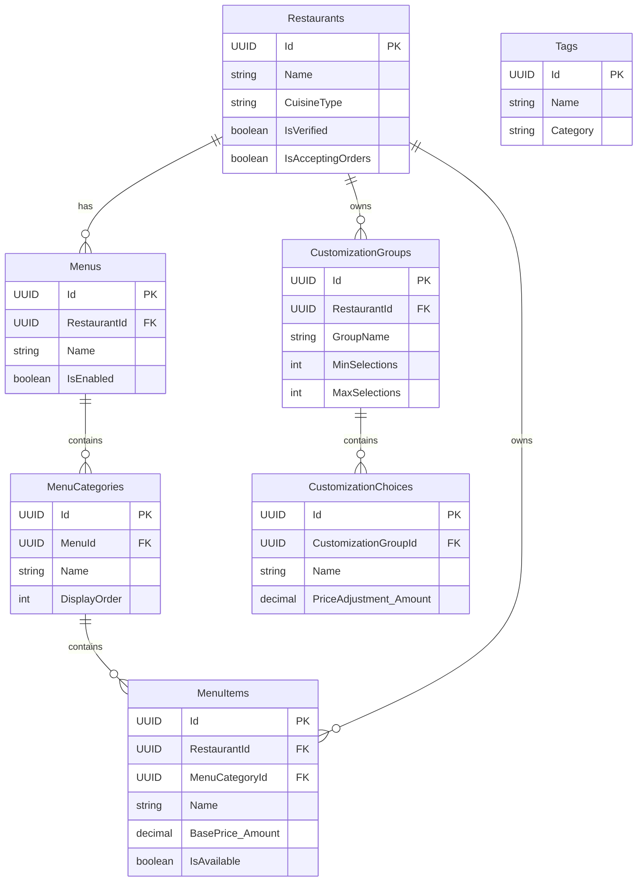
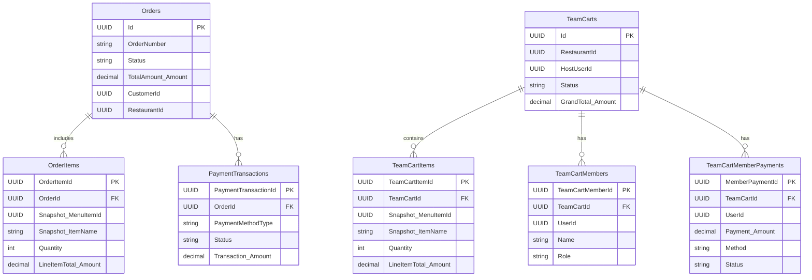
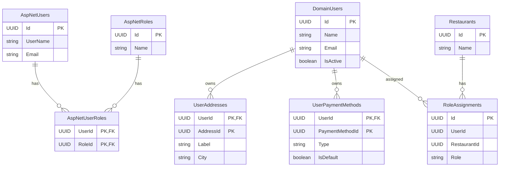

# Outline đề xuất - Thiết kế cơ sở dữ liệu (Chương 4)

Tài liệu này đề xuất hướng viết cho phần \subsection{Thiết kế cơ sở dữ liệu}, dựa trên schema thực tế trong `db_scripts/schema.sql`, sơ đồ tổng hợp ở `Docs/Architecture/Database_Schema.md`, và các cấu hình ánh xạ EF Core trong `src/Infrastructure/Persistence/EfCore/Configurations`.

## 1) Mục tiêu trình bày
- Trình bày ERD theo mô hình Chen để mô tả thế giới thực và các thực thể nghiệp vụ ở mức khái niệm.
- Giải thích nguyên tắc ánh xạ từ domain model sang database schema trong dự án (Clean Architecture + EF Core Fluent API).
- Bổ sung một số sơ đồ ERD “hiện đại” dạng bảng để minh họa thiết kế vật lý, có chọn lọc do số lượng bảng lớn.

## 2) ERD khái niệm theo Chen (Conceptual ERD)
**Phạm vi:** Chỉ mô tả thực thể nghiệp vụ chính và quan hệ phẳng, không bám chi tiết bảng. Dưới đây là mô tả cụ thể theo ký hiệu Chen để có thể vẽ trực tiếp.

### 2.1 Danh sách thực thể (hình chữ nhật) và thuộc tính (hình elip)
Chỉ giữ 3–6 thuộc tính cốt lõi cho mỗi thực thể:

- **User (Người dùng)**: UserId, Name, Email, PhoneNumber, Status.
- **Restaurant (Nhà hàng)**: RestaurantId, Name, CuisineType, Address, Status.
- **Menu (Thực đơn)**: MenuId, Name, Description, IsEnabled.
- **MenuCategory (Danh mục)**: CategoryId, Name, DisplayOrder.
- **MenuItem (Món ăn)**: ItemId, Name, BasePrice, IsAvailable.
- **Order (Đơn hàng)**: OrderId, OrderNumber, Status, TotalAmount, CreatedAt.
- **OrderItem (Mục đơn hàng)**: OrderItemId, Quantity, LineItemTotal.
- **TeamCart (Giỏ nhóm)**: TeamCartId, Status, Deadline, CreatedAt.
- **TeamCartMember (Thành viên giỏ)**: MemberId, MemberName, Role.
- **TeamCartMemberPayment (Thanh toán thành viên)**: PaymentId, Amount, Method, Status, PaidAt.
- **Coupon (Phiếu giảm giá)**: CouponId, Code, Type, Value, ValidFrom, ValidTo.
- **Review (Đánh giá)**: ReviewId, Rating, Content, CreatedAt.
- **RoleAssignment (Phân quyền)**: RoleAssignmentId, Role, AssignedAt.

### 2.2 Danh sách quan hệ (hình thoi) và bội số
Gợi ý ký hiệu bội số khi vẽ: 1–N, N–N (nếu có).

- **Restaurant –has– Menu**: 1 Restaurant có N Menu; mỗi Menu thuộc 1 Restaurant.
- **Menu –contains– MenuCategory**: 1 Menu có N MenuCategory; mỗi MenuCategory thuộc 1 Menu.
- **MenuCategory –contains– MenuItem**: 1 MenuCategory có N MenuItem; mỗi MenuItem thuộc 1 MenuCategory.
- **User –places– Order**: 1 User tạo N Order; mỗi Order thuộc 1 User.
- **Order –includes– OrderItem**: 1 Order có N OrderItem; mỗi OrderItem thuộc 1 Order.
- **OrderItem –refers_to– MenuItem**: N OrderItem tham chiếu 1 MenuItem (quan hệ nhiều–một).
- **User –hosts– TeamCart**: 1 User tạo/host N TeamCart; mỗi TeamCart có 1 Host.
- **TeamCart –has– TeamCartMember**: 1 TeamCart có N TeamCartMember; mỗi Member thuộc 1 TeamCart.
- **TeamCartMember –pays– TeamCartMemberPayment**: 1 Member có N Payment; mỗi Payment thuộc 1 Member.
- **TeamCart –contains– OrderItem** (mức khái niệm: mục giỏ nhóm): 1 TeamCart có N OrderItem/giỏ; mỗi mục thuộc 1 TeamCart.
- **Coupon –applies_to– Order**: 0..1 Coupon áp dụng cho N Order (mỗi Order tối đa 1 Coupon).
- **Coupon –applies_to– TeamCart**: 0..1 Coupon áp dụng cho N TeamCart (mỗi TeamCart tối đa 1 Coupon).
- **User –writes– Review –for– Restaurant**: 1 User có N Review; 1 Restaurant có N Review.
- **User –assigned_role– Restaurant** qua **RoleAssignment**: User và Restaurant liên kết N–N thông qua RoleAssignment.

### 2.3 Lưu ý khi vẽ Chen ERD
- Thực thể là hình chữ nhật; thuộc tính là hình elip nối vào thực thể; quan hệ là hình thoi nằm giữa các thực thể.
- Chỉ thể hiện thuộc tính cốt lõi như danh tính, trạng thái, giá trị tiền, thời gian.
- Không đưa các thực thể kỹ thuật (Outbox, Inbox, Read Models) vào Chen ERD.

report\Hinhve\erd.png

## 3) Quy tắc ánh xạ từ Domain Model sang Database Schema
**Nguồn áp dụng:** các file cấu hình Fluent API trong `src/Infrastructure/Persistence/EfCore/Configurations`.

**Nguyên tắc chính:**
- Aggregate root ánh xạ thành một bảng cùng tên nghiệp vụ (ví dụ Order → Orders, Restaurant → Restaurants, TeamCart → TeamCarts).
- Entity có danh tính trong aggregate (OwnsMany) ánh xạ thành bảng con với khóa ngoại trỏ về root (ví dụ OrderItems, PaymentTransactions; TeamCartItems, TeamCartMembers, TeamCartMemberPayments).
- Value object (không có danh tính) được ánh xạ thành các cột trong bảng của root/entity, với tiền tố tên thuộc tính (ví dụ DeliveryAddress_Street, TipAmount_Amount).
- Value object phức tạp hoặc danh sách được lưu dạng JSONB khi cần linh hoạt cấu trúc (SelectedCustomizations, DietaryTagIds, AppliedCustomizations, MemberTotals).
- Quan trọng: tham chiếu đến các bảng ngoài aggregate (ví dụ RestaurantId trong Order) sử dụng trường Id đơn giản, không sử dụng foreign key constraint. FK chỉ áp dụng giữa các bảng trong cùng một aggregate.
- Các enum và trạng thái được chuyển sang chuỗi để đọc hiểu trong cơ sở dữ liệu.
- Audit/soft-delete áp dụng nhất quán trên các bảng chính (Created, CreatedBy, LastModified, IsDeleted, v.v.).

**Ví dụ cấu hình tiêu biểu (nêu trong báo cáo):**
- Order: `OrderConfiguration` ánh xạ OrderItems và PaymentTransactions, Money VOs thành cặp Amount/Currency.
- TeamCart: `TeamCartConfiguration` lưu MemberTotals dạng JSONB và các item/payment theo bảng con.
- MenuItem: `MenuItemConfiguration` lưu DietaryTagIds và AppliedCustomizations dạng JSONB.
- Restaurant: `RestaurantConfiguration` ánh xạ Location, ContactInfo, BusinessHours, GeoCoordinates thành các cột trong bảng Restaurants.

## 4) Thiết kế cơ sở dữ liệu theo schema hiện có
**Gợi ý chia theo bounded context để trình bày ngắn gọn:**

1) **Identity & Access**
- Các bảng Identity chuẩn: AspNetUsers, AspNetRoles, AspNetUserRoles, AspNetUserClaims, AspNetUserLogins, AspNetUserTokens.
- DomainUsers và các bảng phụ: UserAddresses, UserPaymentMethods, UserDeviceSessions.

2) **Restaurant Catalog**
- Restaurants, Menus, MenuCategories, MenuItems.
- Các bảng liên quan: CustomizationGroups, CustomizationChoices, Tags.

3) **Order & Fulfillment (kèm TeamCart)**
- Orders, OrderItems, PaymentTransactions.
- TeamCarts, TeamCartMembers, TeamCartItems, TeamCartMemberPayments.

4) **Payouts & Monetization**
- Coupons, CouponUserUsages.
- RestaurantAccounts, AccountTransactions.

5) **Support & Governance**
- Reviews, RestaurantReviewSummaries.
- RestaurantRegistrations.
- RoleAssignments.

6) **Read Models & Integration**
- FullMenuViews, SearchIndexItems, MenuItemSalesSummaries, AdminPlatformMetricsSnapshots, AdminRestaurantHealthSummaries, AdminDailyPerformanceSeries.
- OutboxMessages, InboxMessages, ProcessedWebhookEvents.

## 5) Chiến lược trình bày ERD “hiện đại” (dạng bảng)
Do số lượng bảng lớn, không nên đưa toàn bộ schema vào một hình. Đề xuất:

- **Hình 1: ERD hiện đại cho Restaurant Catalog**
  - Restaurants, Menus, MenuCategories, MenuItems, CustomizationGroups, CustomizationChoices, Tags.

- **Hình 2: ERD hiện đại cho Order & TeamCart**
  - Orders, OrderItems, PaymentTransactions, TeamCarts, TeamCartMembers, TeamCartItems, TeamCartMemberPayments.

- **Hình 3: ERD hiện đại cho Identity & Access + RoleAssignment**
  - AspNetUsers/Role tables, DomainUsers, RoleAssignments, UserAddresses, UserPaymentMethods.

- **Phần bổ sung (nêu dạng bảng liệt kê, không vẽ ERD):**
  - Read Models và Integration tables, nêu mục đích và ví dụ sử dụng.

### 5.1 Mermaid ERD - Restaurant Catalog

report\Hinhve\erd-restaurant-calatog.png

### 5.2 Mermaid ERD - Order & TeamCart

report\Hinhve\erd-order-teamcart.png

### 5.3 Mermaid ERD - Identity & Access + RoleAssignment

report\Hinhve\erd-identity.png

## 6) Gợi ý cấu trúc viết trong báo cáo
- Mở đầu: mô tả mục tiêu của thiết kế dữ liệu và hệ quản trị sử dụng (PostgreSQL).
- Trình bày ERD Chen: giải thích thực thể và quan hệ chính.
- Trình bày quy tắc ánh xạ từ domain sang DB với ví dụ cụ thể (Order, TeamCart, MenuItem, Restaurant).
- Trình bày các ERD hiện đại theo từng nhóm chức năng; giải thích ngắn mỗi hình.
- Kết thúc: tổng kết tính nhất quán giữa mô hình miền và lược đồ dữ liệu, nhấn mạnh khả năng mở rộng.
