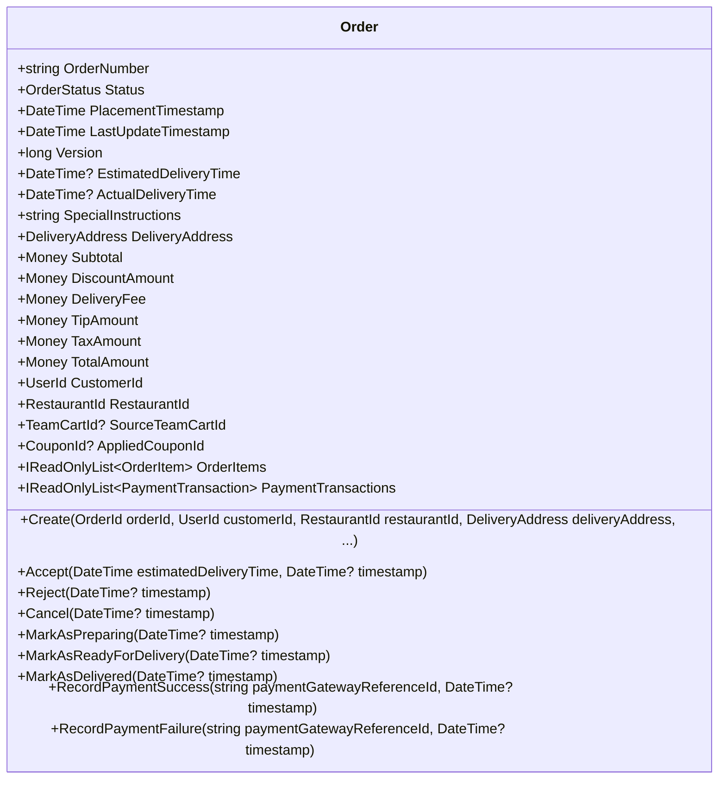
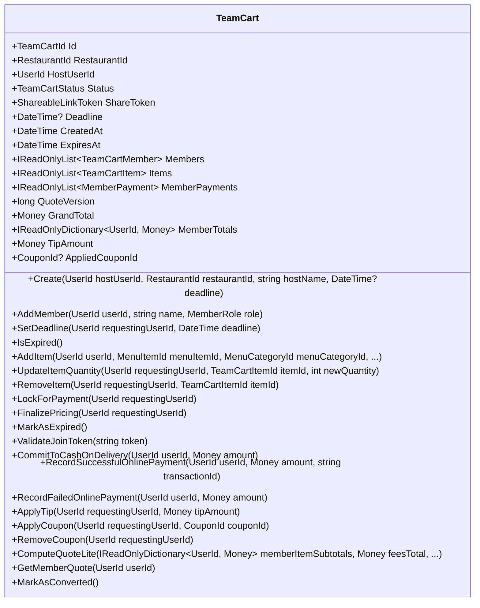
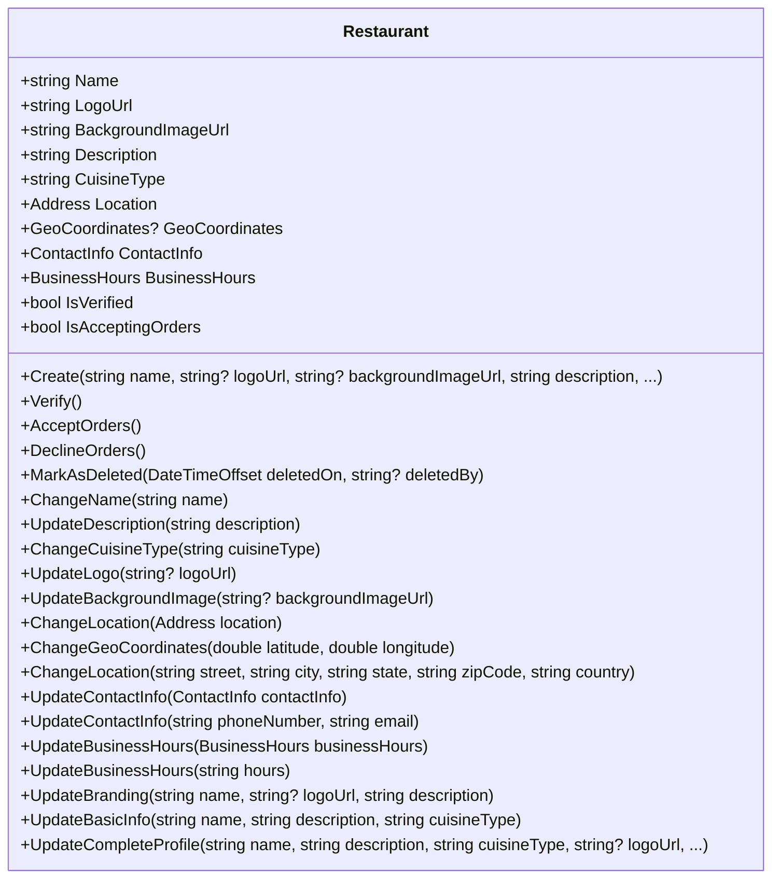
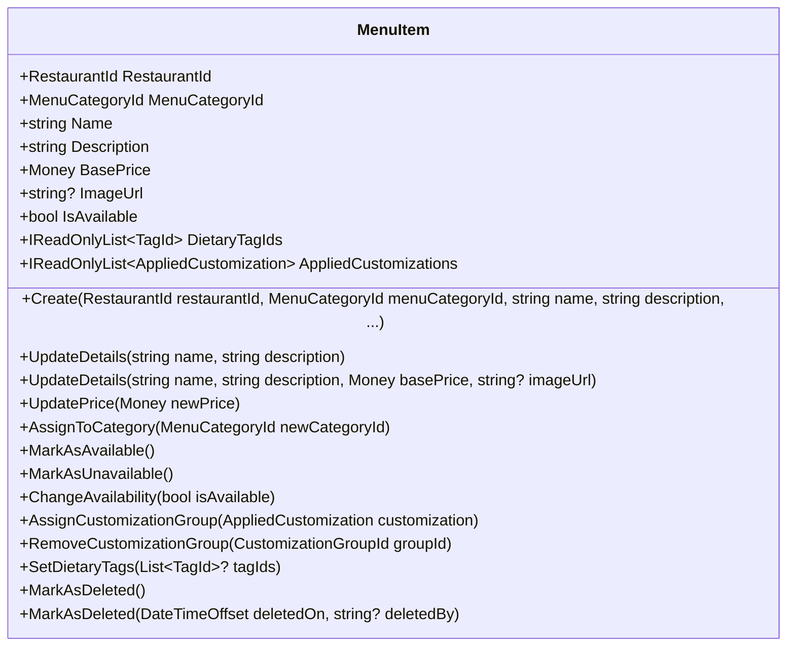
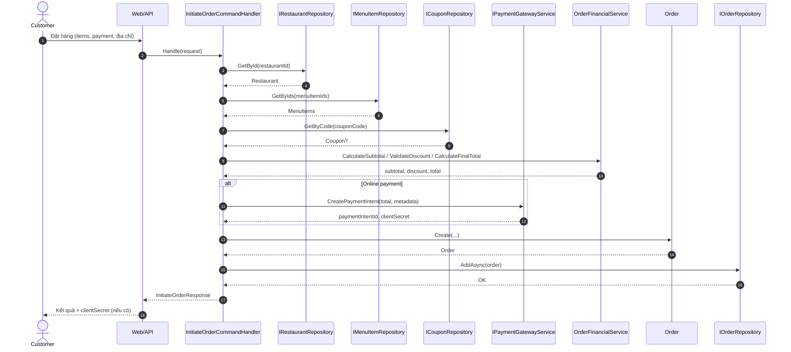
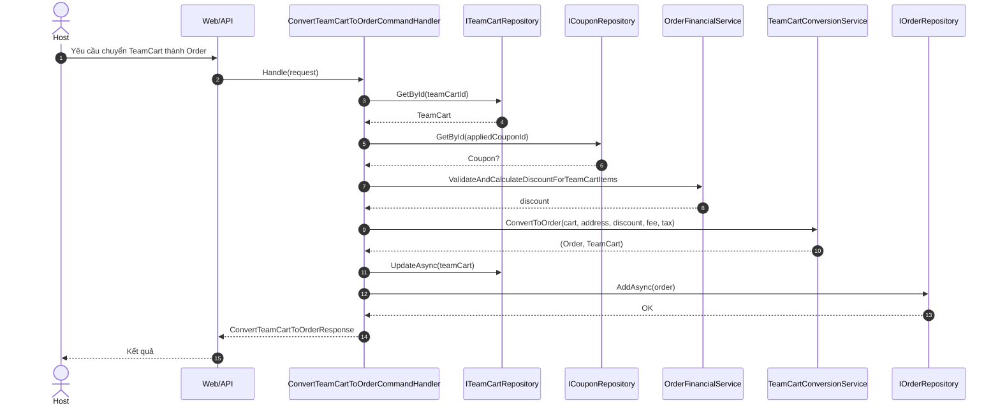
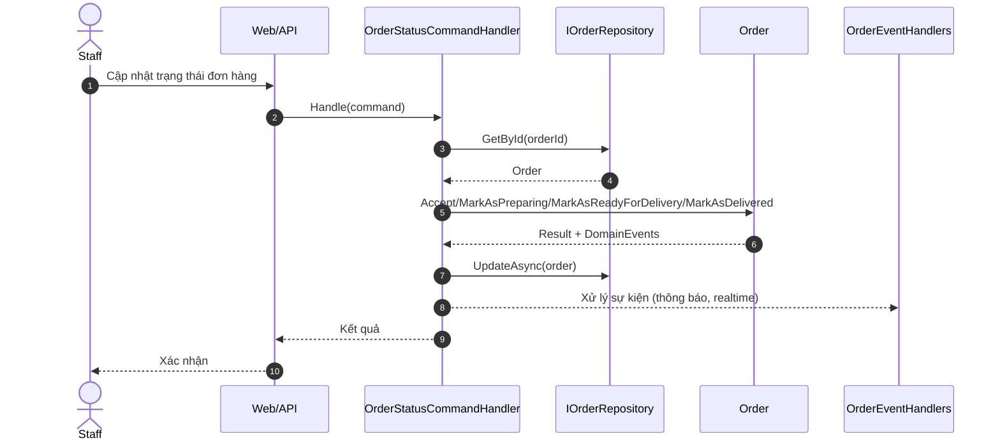

# Outline chi tiết - Thiết kế lớp (Chương 4)

Tài liệu này là outline chi tiết cho \subsection{Thiết kế lớp}, gồm danh sách lớp tiêu biểu cần đặc tả và các luồng nghiệp vụ để vẽ biểu đồ trình tự. Nội dung này dùng để chuẩn bị viết vào báo cáo.

## 1) Định hướng chung
- Tập trung vào lớp miền (Domain) theo Clean Architecture, ưu tiên các aggregate root có nhiều quy tắc nghiệp vụ.
- Chỉ mô tả ngắn gọn vai trò của một số lớp Application layer để làm rõ vai trò điều phối, không đặc tả quá sâu vì lớp mỏng.

## 2) Các lớp được lựa chọn để đặc tả chi tiết

### 2.1 Order (Aggregate root)
Nguồn: `src/Domain/OrderAggregate/Order.cs`

Vai trò: Quản lý vòng đời đơn hàng, tính nhất quán tổng tiền, trạng thái và sự kiện miền.

Thuộc tính chính:
- `OrderNumber`, `Status`, `PlacementTimestamp`, `LastUpdateTimestamp`, `Version`
- `EstimatedDeliveryTime`, `ActualDeliveryTime`, `SpecialInstructions`
- `DeliveryAddress`, `Subtotal`, `DiscountAmount`, `DeliveryFee`, `TipAmount`, `TaxAmount`, `TotalAmount`
- `CustomerId`, `RestaurantId`, `SourceTeamCartId`, `AppliedCouponId`
- `OrderItems`, `PaymentTransactions`

Phương thức nghiệp vụ chính:
- Tạo đơn: `Create(...)` (các overload, kiểm tra item, địa chỉ, tổng tiền, tạo giao dịch thanh toán)
- Chuyển trạng thái: `Accept`, `Reject`, `Cancel`, `MarkAsPreparing`, `MarkAsReadyForDelivery`, `MarkAsDelivered`
- Xác nhận thanh toán: `RecordPaymentSuccess`, `RecordPaymentFailure`

Sự kiện miền tiếp phát:
- `OrderCreated`, `OrderPlaced`, `OrderAccepted`, `OrderRejected`, `OrderPreparing`, `OrderReadyForDelivery`, `OrderDelivered`, `OrderPaymentSucceeded`, `OrderPaymentFailed`, `OrderCancelled`

Mermaid lớp:

### 2.2 TeamCart (Aggregate root)
Nguồn: `src/Domain/TeamCartAggregate/TeamCart.cs`

Vai trò: Quản lý giỏ hàng nhóm, thành viên, đồng bộ thanh toán từng thành viên, và chuyển đổi sang Order.

Thuộc tính chính:
- `RestaurantId`, `HostUserId`, `Status`, `ShareToken`, `Deadline`, `CreatedAt`, `ExpiresAt`
- `Members`, `Items`, `MemberPayments`
- `QuoteVersion`, `GrandTotal`, `MemberTotals`
- `TipAmount`, `AppliedCouponId`

Phương thức nghiệp vụ chính:
- Quản lý thành viên: `AddMember`, `SetDeadline`, `ValidateJoinToken`, `IsExpired`
- Quản lý item: `AddItem`, `UpdateItemQuantity`, `RemoveItem`
- Chuyển trạng thái: `LockForPayment`, `FinalizePricing`, `MarkAsExpired`, `MarkAsConverted`
- Thanh toán: `CommitToCashOnDelivery`, `RecordSuccessfulOnlinePayment`, `RecordFailedOnlinePayment`
- Tính toán: `ComputeQuoteLite`, `GetMemberQuote` (bao gồm chia phí/đóng góp)
- Áp dụng tài chính: `ApplyTip`, `ApplyCoupon`, `RemoveCoupon`

Sự kiện miền tiêu biểu:
- `TeamCartCreated`, `MemberJoined`, `ItemAddedToTeamCart`, `ItemQuantityUpdatedInTeamCart`, `ItemRemovedFromTeamCart`
- `TeamCartLockedForPayment`, `TeamCartPricingFinalized`, `TeamCartQuoteUpdated`, `TeamCartReadyForConfirmation`, `TeamCartConverted`
- `OnlinePaymentSucceeded`, `OnlinePaymentFailed`, `MemberCommittedToPayment`, `TipAppliedToTeamCart`, `CouponAppliedToTeamCart`, `CouponRemovedFromTeamCart`

Mermaid lớp:

### 2.3 Restaurant (Aggregate root)
Nguồn: `src/Domain/RestaurantAggregate/Restaurant.cs`

Vai trò: Quản lý hồ sơ nhà hàng và các quy tắc trạng thái (xác thực, mở/ đóng nhận đơn).

Thuộc tính chính:
- `Name`, `LogoUrl`, `BackgroundImageUrl`, `Description`, `CuisineType`
- `Location`, `GeoCoordinates`, `ContactInfo`, `BusinessHours`
- `IsVerified`, `IsAcceptingOrders`
- Thuộc tính audit và soft delete

Phương thức nghiệp vụ chính:
- Tạo mới: `Create(...)` (kiểm tra dữ liệu vào, tạo value object)
- Vòng đời: `Verify`, `AcceptOrders`, `DeclineOrders`, `MarkAsDeleted`
- Cập nhật chi tiết: `ChangeName`, `UpdateDescription`, `ChangeCuisineType`, `UpdateLogo`, `UpdateBackgroundImage`, `ChangeLocation`, `ChangeGeoCoordinates`, `UpdateContactInfo`, `UpdateBusinessHours`
- Cập nhật tổng hợp: `UpdateBranding`, `UpdateBasicInfo`, `UpdateCompleteProfile`

Sự kiện miền tiêu biểu:
- `RestaurantCreated`, `RestaurantVerified`, `RestaurantAcceptingOrders`, `RestaurantNotAcceptingOrders`, `RestaurantDeleted`
- `RestaurantNameChanged`, `RestaurantDescriptionChanged`, `RestaurantCuisineTypeChanged`, `RestaurantLocationChanged`, `RestaurantContactInfoChanged`, `RestaurantBusinessHoursChanged`, `RestaurantBrandingUpdated`, `RestaurantProfileUpdated`

Mermaid lớp:

### 2.4 MenuItem (Aggregate root)
Nguồn: `src/Domain/MenuItemAggregate/MenuItem.cs`

Vai trò: Quản lý món ăn thuộc nhà hàng, tình trạng sẵn sàng, giá, thông tin tùy chọn.

Thuộc tính chính:
- `RestaurantId`, `MenuCategoryId`, `Name`, `Description`, `BasePrice`, `ImageUrl`, `IsAvailable`
- `DietaryTagIds`, `AppliedCustomizations`
- Thuộc tính audit và soft delete

Phương thức nghiệp vụ chính:
- Tạo mới: `Create(...)`
- Cập nhật: `UpdateDetails(...)`, `UpdatePrice`, `AssignToCategory`
- Trạng thái: `MarkAsAvailable`, `MarkAsUnavailable`, `ChangeAvailability`
- Tùy chọn: `AssignCustomizationGroup`, `RemoveCustomizationGroup`, `SetDietaryTags`
- Xóa mềm: `MarkAsDeleted(...)`

Sự kiện miền tiêu biểu:
- `MenuItemCreated`, `MenuItemDetailsUpdated`, `MenuItemPriceChanged`, `MenuItemAvailabilityChanged`, `MenuItemAssignedToCategory`, `MenuItemCustomizationAssigned`, `MenuItemCustomizationRemoved`, `MenuItemDietaryTagsUpdated`, `MenuItemDeleted`

Mermaid lớp:

## 3) Sơ đồ trình tự cho các use case tiêu biểu

### 3.1 Khởi tạo đơn hàng (Initiate Order)
Nguồn chính: `src/Application/Orders/Commands/InitiateOrder/InitiateOrderCommandHandler.cs`, `src/Domain/OrderAggregate/Order.cs`

Tóm tắt luồng:
- Người dùng gửi yêu cầu đặt hàng.
- Application layer kiểm tra quyền, kiểm tra nhà hàng, lấy danh sách món, kiểm tra tùy chọn.
- Tính phí và thuế, tạo payment intent nếu thanh toán online.
- Tạo Order trong Domain, lưu vào kho dữ liệu.

Mermaid trình tự:

### 3.2 Chuyển TeamCart thành Order
Nguồn chính: `src/Application/TeamCarts/Commands/ConvertTeamCartToOrder/ConvertTeamCartToOrderCommandHandler.cs`, `src/Domain/Services/TeamCartConversionService.cs`

Tóm tắt luồng:
- Kiểm tra TeamCart ở trạng thái ReadyToConfirm, kiểm tra QuoteVersion.
- Tính phí, thuế, giảm giá (nếu có coupon).
- Domain service chuyển đổi TeamCart thành Order và cập nhật trạng thái TeamCart.
- Lưu Order và TeamCart.

Mermaid trình tự:

### 3.3 Cập nhật trạng thái đơn hàng (Accept -> Prepare -> Deliver)
Nguồn chính: `src/Domain/OrderAggregate/Order.cs` và các event handler liên quan.

Tóm tắt luồng:
- Nhân viên nhà hàng cập nhật trạng thái đơn hàng.
- Domain kiểm tra trạng thái hợp lệ, cập nhật và phát sự kiện miền.
- Application layer xử lý sự kiện (gửi realtime, thông báo, cập nhật read model).

Mermaid trình tự:

## 4) Gợi ý trình bày trong báo cáo
- Mỗi lớp nên trình bày theo cấu trúc: vai trò, thuộc tính chính, phương thức nghiệp vụ, ràng buộc và sự kiện miền.
- Mỗi biểu đồ cần có đoạn văn giải thích ngắn về mục tiêu và ý nghĩa.
